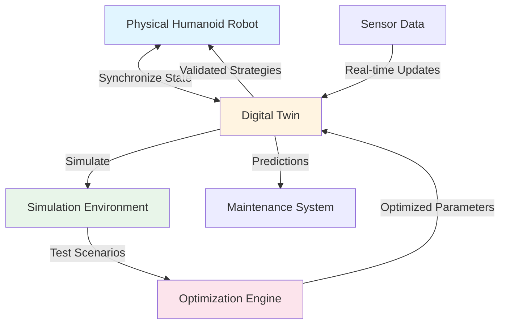

# Digital Twins

A **digital twin** is a virtual replica of a physical system that maintains a synchronized connection with its real-world counterpart. In humanoid robotics, digital twins enable developers to test, optimize, and validate robot behavior in a safe virtual environment before deploying to physical hardware.

## What is a Digital Twin?

A digital twin goes beyond a simple simulation. It is a comprehensive virtual representation that:

- **Synchronizes** with the physical system, maintaining state alignment
- **Models behavior** using physics-based and data-driven approaches
- **Enables prediction** of future states and outcomes
- **Supports optimization** through safe virtual experimentation
- **Provides insights** for decision-making and maintenance

### The Relationship to Physical Robots

A digital twin maintains a bidirectional relationship with its physical counterpart:

1. **Physical → Virtual**: Sensor data and state information flow from the physical robot to update the digital twin
2. **Virtual → Physical**: Optimized parameters, validated strategies, and predictions flow from the digital twin to inform physical robot configuration

This bidirectional flow enables the digital twin to both reflect reality and influence it.

## Digital Twins vs. Traditional Simulations

It's important to distinguish digital twins from traditional simulations:

| Aspect | Traditional Simulation | Digital Twin |
|--------|----------------------|--------------|
| **Connection** | Standalone, independent | Synchronized with physical system |
| **Purpose** | Test specific scenarios | Continuous monitoring and optimization |
| **Data Source** | Modeled or synthetic | Real sensor data from physical system |
| **Update Frequency** | On-demand or batch | Real-time or near-real-time |
| **Scope** | Specific use cases | Comprehensive system representation |
| **Lifecycle** | Project-based | Continuous, throughout system lifecycle |

### Key Distinction

A **simulation** is a tool for testing "what if" scenarios in isolation. A **digital twin** is a living, synchronized representation that evolves with the physical system and enables continuous optimization and predictive maintenance.

## Why Digital Twins Are Valuable for Humanoid Robotics

Digital twins provide several critical advantages for humanoid robotics development:

### 1. Safe Testing

Humanoid robots are expensive and complex. Testing new walking gaits, manipulation strategies, or safety protocols on physical hardware risks:

- **Hardware damage** from falls or collisions
- **Safety hazards** to operators and bystanders
- **High costs** of repairs and downtime

Digital twins enable thousands of tests in virtual environments with zero risk to physical hardware.

### 2. Rapid Iteration

Physical testing is slow. Each test cycle requires:

- Setting up the physical environment
- Configuring the robot
- Executing the test
- Analyzing results
- Making adjustments

Digital twins enable rapid iteration where tests can run in parallel, scenarios can be automated, and results are immediately available.

### 3. Optimization

Digital twins enable optimization strategies that would be impractical with physical testing:

- **Parameter sweeps**: Test thousands of parameter combinations automatically
- **Genetic algorithms**: Evolve optimal behaviors through generations of virtual testing
- **Reinforcement learning**: Train control policies safely in simulation
- **Multi-objective optimization**: Balance competing goals (speed, stability, energy efficiency)

### 4. Predictive Maintenance

By monitoring the digital twin's state and comparing it to physical sensor data, developers can:

- **Predict failures** before they occur
- **Identify wear patterns** in joints and actuators
- **Optimize maintenance schedules** based on actual usage
- **Reduce downtime** through proactive interventions

### 5. Cost Reduction

Digital twins reduce development costs by:

- Minimizing physical prototype iterations
- Reducing hardware damage from testing
- Enabling parallel development of multiple strategies
- Shortening time-to-deployment

## Digital Twin Architecture

*Figure 1: Digital twin architecture showing bidirectional synchronization between physical robot and virtual replica, with simulation environment and optimization capabilities. The digital twin receives real-time sensor data, simulates scenarios in a virtual environment, optimizes parameters, and provides validated strategies back to the physical robot.*

The architecture shows:

- **Physical Robot** (blue) - The real-world humanoid robot
- **Digital Twin** (yellow) - Virtual replica maintaining synchronized state
- **Simulation Environment** (green) - Virtual world for testing
- **Optimization Engine** (pink) - Algorithms for finding optimal solutions

## Applications in Humanoid Robotics

Digital twins enable several key applications:

### Gait Optimization

Testing walking patterns on a physical humanoid robot is risky and time-consuming. Digital twins enable:

- Testing thousands of gait parameters safely
- Optimizing for speed, stability, and energy efficiency
- Validating gaits across different terrains
- Refining movements before physical implementation

### Manipulation Planning

Grasping and manipulation require precise control. Digital twins enable:

- Testing manipulation strategies in virtual environments
- Optimizing grasp poses and trajectories
- Validating object handling before physical trials
- Training manipulation policies through simulation

### Safety Testing

Safety is paramount in humanoid robotics. Digital twins enable:

- Testing failure scenarios without risk
- Validating emergency stop behaviors
- Simulating collision scenarios
- Verifying safety protocols before deployment

## Summary

Digital twins are virtual replicas of physical systems that maintain synchronized connections with their real-world counterparts. They differ from traditional simulations by providing continuous synchronization, real-time updates, and comprehensive system representation. For humanoid robotics, digital twins enable safe testing, rapid iteration, optimization, predictive maintenance, and cost reduction.

## Next Steps

Now that you understand digital twins, proceed to [Simulation Fundamentals](./simulation-fundamentals.md) to learn how simulation environments work and how they enable digital twins to function effectively.

## Cross-References

For more information on ROS 2 communication patterns used by sensors, see [Module 1's communication patterns](../module-1-ros2-nervous-system/communication-patterns.md).
