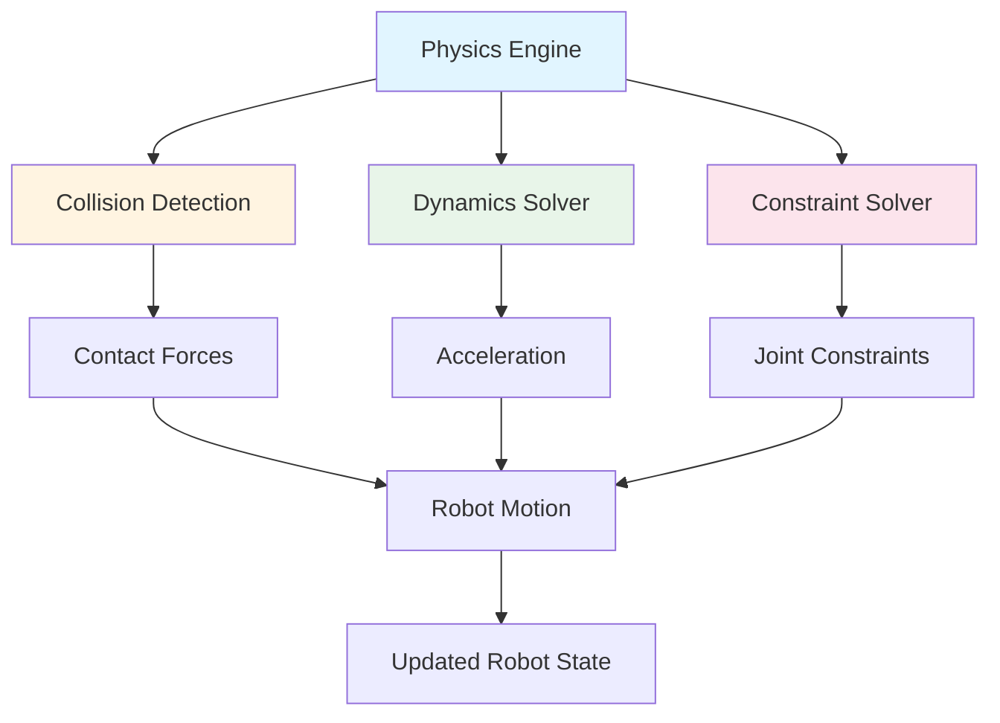
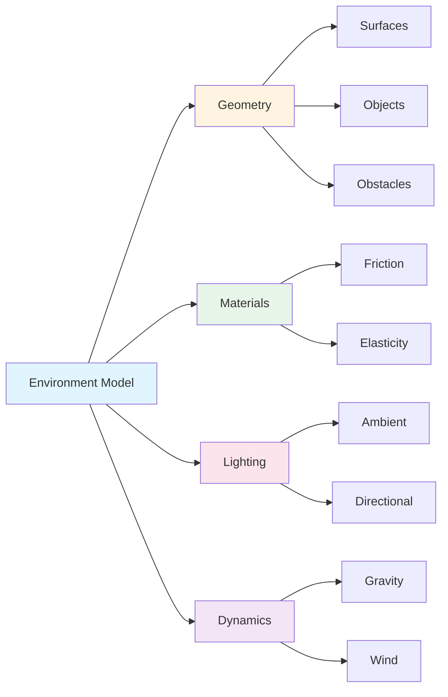

# Simulation Fundamentals

Simulation environments provide virtual worlds where humanoid robots can operate safely, enabling developers to test behaviors, validate algorithms, and optimize performance without physical hardware. Understanding how these environments work is essential for leveraging digital twins effectively.

## What is a Simulation Environment?

A **simulation environment** is a virtual world that replicates physical reality with sufficient fidelity for robotic testing. It consists of three core components:

1. **Physics Engine** - Simulates physical laws (gravity, collisions, dynamics)
2. **Sensor Models** - Virtual sensors that replicate physical sensor behavior
3. **Environment Geometry** - 3D models representing the world (surfaces, objects, obstacles)

Together, these components create a realistic virtual space where robots can operate, interact, and be tested.

## Physics Engines

A **physics engine** is the computational system that simulates physical laws in a virtual environment. It calculates how objects move, collide, and interact based on physics principles.

### How Physics Engines Model Robot Dynamics

Physics engines model robot dynamics by:

1. **Representing the robot** as a collection of rigid bodies (links) connected by joints
2. **Calculating forces** acting on each body (gravity, contact forces, joint torques)
3. **Solving equations of motion** to determine how bodies move over time
4. **Detecting collisions** between robot parts and the environment
5. **Resolving collisions** by applying appropriate forces

For humanoid robots, this means the physics engine:

- Simulates the robot's **mass distribution** across body segments
- Models **joint constraints** (how limbs can move relative to each other)
- Calculates **balance and stability** based on center of mass
- Handles **contact forces** when feet touch the ground
- Simulates **inertia and momentum** during movement

### Physics Engine Components



*Figure 1: Physics engine components showing collision detection, dynamics solver, and constraint solver working together to compute robot motion.*

The physics engine integrates these components at each simulation timestep to compute realistic robot behavior.

### Example: Basic Physics Simulation

```python
# Example: Conceptual physics simulation for humanoid robot
# This demonstrates how physics engines model robot dynamics

class PhysicsEngine:
    """Conceptual representation of a physics engine for humanoid robots"""
    
    def __init__(self, timestep=0.001):
        self.timestep = timestep  # Simulation time step (seconds)
        self.gravity = 9.81  # m/s²
        
    def compute_forces(self, robot_state, joint_torques):
        """Compute forces acting on robot based on current state"""
        # Gravity force on each body segment
        gravity_forces = self.compute_gravity(robot_state)
        
        # Contact forces from ground
        contact_forces = self.detect_contacts(robot_state)
        
        # Joint torques from actuators
        joint_forces = self.apply_torques(joint_torques)
        
        return gravity_forces + contact_forces + joint_forces
    
    def solve_dynamics(self, forces, robot_state):
        """Solve equations of motion to compute acceleration"""
        # F = ma → a = F/m
        acceleration = forces / robot_state.mass
        
        # Update velocity: v = v₀ + at
        new_velocity = robot_state.velocity + acceleration * self.timestep
        
        # Update position: x = x₀ + vt
        new_position = robot_state.position + new_velocity * self.timestep
        
        return new_position, new_velocity
    
    def step(self, robot_state, joint_torques):
        """Advance simulation by one timestep"""
        forces = self.compute_forces(robot_state, joint_torques)
        new_position, new_velocity = self.solve_dynamics(forces, robot_state)
        return RobotState(new_position, new_velocity)
```

This example shows how a physics engine conceptually computes robot motion by:
1. Calculating forces (gravity, contact, joint torques)
2. Solving dynamics equations to get acceleration
3. Integrating to update position and velocity
4. Repeating at each timestep

## Sensor Simulation

**Sensor simulation** involves creating virtual sensors that replicate the behavior of physical sensors. These virtual sensors generate realistic data that robots can use for perception and decision-making.

### How Virtual Sensors Replicate Physical Sensor Behavior

Virtual sensors model physical sensors by:

1. **Capturing virtual data** from the simulation environment
2. **Applying sensor characteristics** (noise, latency, resolution)
3. **Formatting data** to match physical sensor output
4. **Publishing data** at realistic update rates

### Types of Simulated Sensors

#### Vision Sensors (Cameras)

Virtual cameras capture images from the simulation environment:

- **Rendering** the 3D scene from the camera's viewpoint
- **Applying sensor noise** to simulate real camera imperfections
- **Formatting** as image messages (similar to physical cameras)
- **Publishing** at realistic frame rates (e.g., 30 FPS)

#### Proprioceptive Sensors (IMUs, Joint Encoders)

Virtual proprioceptive sensors measure robot internal state:

- **IMUs** measure orientation and acceleration from physics engine state
- **Joint encoders** read joint angles directly from simulation
- **Adding noise** to simulate sensor imperfections
- **Publishing** at high frequencies (e.g., 100-1000 Hz)

#### Tactile Sensors

Virtual tactile sensors detect contact:

- **Collision detection** identifies when robot touches objects
- **Force calculation** determines contact forces
- **Formatting** as tactile sensor messages
- **Publishing** when contact events occur

### Sensor Simulation Benefits

Virtual sensors enable:

- **Testing perception algorithms** without physical hardware
- **Generating training data** for machine learning
- **Validating sensor fusion** approaches
- **Testing edge cases** (extreme lighting, sensor failures)

## Environment Modeling

**Environment modeling** involves creating 3D representations of the world where robots operate. These models define surfaces, objects, obstacles, and environmental conditions.

### Representing Different Environments

Simulation environments can represent various real-world scenarios:

#### Indoor Environments

- **Structured spaces** with walls, floors, ceilings
- **Furniture and objects** (tables, chairs, obstacles)
- **Lighting conditions** (natural and artificial)
- **Floor surfaces** (carpet, tile, wood)

#### Outdoor Environments

- **Terrain** (grass, concrete, gravel, slopes)
- **Weather conditions** (rain, wind, fog)
- **Natural obstacles** (trees, rocks, uneven ground)
- **Lighting variations** (day, night, shadows)

#### Structured vs. Unstructured

- **Structured**: Predictable layouts (homes, offices, factories)
- **Unstructured**: Variable layouts (outdoor terrain, disaster zones)

### Environment Components



*Figure 2: Simulation environment components showing geometry, materials, lighting, and dynamics that create realistic virtual worlds.*

## How Simulations Enable Safe Testing and Rapid Iteration

Simulations provide two critical advantages for humanoid robotics development:

### Safe Testing

Physical testing of humanoid robots risks:

- **Hardware damage** from falls or collisions
- **Safety hazards** to operators and bystanders
- **High costs** of repairs and downtime
- **Limited test scenarios** due to safety constraints

Simulations eliminate these risks by:

- **Testing in virtual environments** with zero physical risk
- **Exploring edge cases** (extreme scenarios, failures) safely
- **Validating safety protocols** before physical deployment
- **Testing failure modes** without damaging hardware

### Rapid Iteration

Physical testing is slow. Each test cycle requires:

- Setting up physical environment
- Configuring robot hardware
- Executing test
- Analyzing results
- Making adjustments

Simulations enable rapid iteration by:

- **Running tests in parallel** (multiple scenarios simultaneously)
- **Automating test execution** (thousands of tests automatically)
- **Immediate feedback** (results available instantly)
- **Easy parameter sweeps** (testing many configurations quickly)
- **Replay and analysis** (reviewing any test scenario)

### Example: Testing Walking Gait

```python
# Example: Rapid iteration of walking gait testing in simulation

def test_walking_gait(simulation, gait_parameters):
    """Test a walking gait configuration in simulation"""
    # Reset simulation to starting state
    simulation.reset()
    
    # Configure gait parameters
    simulation.set_gait_parameters(gait_parameters)
    
    # Run simulation for 10 seconds
    for _ in range(10000):  # 10 seconds at 1ms timestep
        simulation.step()
        
        # Check for failure (fall, collision)
        if simulation.robot_fallen():
            return {"success": False, "reason": "robot_fallen"}
    
    # Analyze results
    distance = simulation.get_distance_traveled()
    stability = simulation.get_stability_metric()
    energy = simulation.get_energy_consumed()
    
    return {
        "success": True,
        "distance": distance,
        "stability": stability,
        "energy": energy
    }

# Test 1000 different gait parameter combinations
results = []
for params in generate_gait_parameters(1000):
    result = test_walking_gait(simulation, params)
    results.append(result)

# Find optimal gait
optimal_gait = max(results, key=lambda r: r["stability"] * r["distance"] / r["energy"])
```

This example shows how simulations enable:
- **Automated testing** of many configurations
- **Rapid evaluation** of each configuration
- **Objective comparison** of results
- **Finding optimal solutions** efficiently

## Summary

Simulation environments consist of three core components: physics engines (modeling physical laws), sensor models (replicating physical sensors), and environment geometry (representing the world). These components work together to create realistic virtual worlds where humanoid robots can be tested safely and iterated rapidly. Physics engines compute robot dynamics, virtual sensors generate realistic data, and environment models represent various real-world scenarios. Simulations enable safe testing without physical risk and rapid iteration through automated, parallel test execution.

## Next Steps

Now that you understand simulation fundamentals, proceed to [Sensor Integration](./sensor-integration.md) to learn how sensors connect to ROS 2 and provide data for robot perception.

## Cross-References

For more information on ROS 2 topics used for sensor data communication, see [Module 1's communication patterns](../module-1-ros2-nervous-system/communication-patterns.md).
