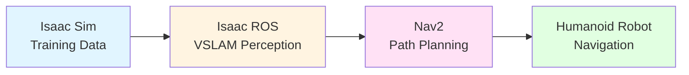

# AI-Robot Brain Concept

The **AI-robot brain** is the integrated system of capabilities that enable autonomous humanoid robots to learn, perceive, and navigate. Just as the human brain coordinates perception, decision-making, and movement, the AI-robot brain combines three critical capabilities: training through simulation, real-time perception, and intelligent path planning.

## The Three-Component Framework

The AI-robot brain consists of three interconnected components that form a complete workflow:

1. **Training** (NVIDIA Isaac Sim): Generating synthetic data to train perception algorithms
2. **Perception** (Isaac ROS): Real-time visual understanding and localization
3. **Planning** (Nav2): Computing safe paths for bipedal humanoid movement

This workflow represents the progression from learning to sensing to acting—enabling robots to understand their environment and move through it intelligently.

## Training → Perception → Planning Progression

### Training: Learning from Simulation

The AI-robot brain begins with **training**—teaching perception algorithms to understand visual information. Unlike traditional machine learning that requires collecting massive amounts of real-world data, the training component uses photorealistic simulation to generate synthetic training data.

**Key Capabilities**:
- Creating realistic virtual environments with proper lighting, textures, and physics
- Generating labeled training data (images, depth maps, annotations)
- Enabling algorithm training without physical data collection

This training phase prepares perception systems to recognize objects, understand spatial relationships, and process visual information accurately.

### Perception: Understanding the Environment

Once trained, perception systems enable robots to **understand their environment in real-time**. Using visual sensors (cameras), the perception component processes incoming visual information to:

- **Map the environment**: Build a representation of the space around the robot
- **Localize the robot**: Determine the robot's position and orientation within that map
- **Detect obstacles**: Identify objects, people, and barriers that affect navigation

This perception capability is computationally intensive, requiring hardware acceleration (GPUs) to process visual data fast enough for real-time robot operation.

### Planning: Navigating Intelligently

With perception providing environmental understanding, the planning component computes **safe and efficient paths** for the robot to move. For humanoid robots, this planning is particularly complex because it must account for:

- **Balance requirements**: Maintaining stability while walking
- **Foot placement constraints**: Ensuring each step lands on a stable, flat surface
- **Terrain adaptation**: Adjusting movement for slopes, obstacles, and uneven surfaces

The planning component uses the perception data to find paths that are both safe and achievable for a bipedal robot.

## How the Components Fit Together

Each component in the AI-robot brain serves a specific role:

- **NVIDIA Isaac Sim (Training)**: Generates the training data that enables perception algorithms to understand visual information
- **Isaac ROS (Perception)**: Uses trained algorithms to process real-world visual data and provide environmental understanding
- **Nav2 (Planning)**: Uses perception data to compute movement paths that account for humanoid-specific constraints

The workflow is sequential: training enables perception, and perception informs planning. However, in practice, these components work continuously and concurrently—perception constantly updates the environment map while planning continuously computes new paths as the robot moves.

## Real-World Application

Consider a humanoid robot navigating through an indoor environment to reach a goal location:

1. **Training phase** (before deployment): Isaac Sim generates thousands of synthetic images showing different indoor environments, lighting conditions, and obstacles. Perception algorithms train on this data to recognize walls, doors, furniture, and people.

2. **Perception phase** (during operation): Isaac ROS processes camera images in real-time, using the trained algorithms to build a map of the environment and determine the robot's position within it.

3. **Planning phase** (during operation): Nav2 uses the map and robot position from perception, along with the goal location, to compute a path. This path considers humanoid constraints: each step must land on a flat, stable surface, and the robot must maintain balance throughout the movement.

The AI-robot brain enables this complete autonomous navigation capability, demonstrating how training, perception, and planning work together as an integrated system.

## Why This Framework Matters

The AI-robot brain framework helps us understand:

- **How robots learn**: Through synthetic data generation in simulation
- **How robots see**: Through hardware-accelerated visual processing
- **How robots move**: Through intelligent path planning adapted for humanoids
- **How components integrate**: Each component builds upon and enables the next

This framework provides a mental model for understanding how modern humanoid robots achieve autonomous capabilities—not as isolated systems, but as an integrated brain that learns, perceives, and plans.

## Summary

The AI-robot brain is the integrated system that enables autonomous humanoid robots. It combines:

- **Training** (NVIDIA Isaac Sim): Synthetic data generation for algorithm training
- **Perception** (Isaac ROS): Real-time visual understanding and localization
- **Planning** (Nav2): Intelligent path planning for bipedal movement

These three components form a complete workflow: training enables perception, and perception informs planning. Together, they enable humanoid robots to navigate autonomously through complex environments.

## Next Steps

Now that you understand the AI-robot brain framework, explore each component in detail:

1. **NVIDIA Isaac Sim**: Learn how photorealistic simulation generates training data
2. **Isaac ROS**: Understand how hardware-accelerated VSLAM enables real-time perception
3. **Nav2**: Discover how path planning adapts for bipedal humanoid movement

Each component section will show you how these capabilities work and why they're essential for autonomous humanoid robots.

