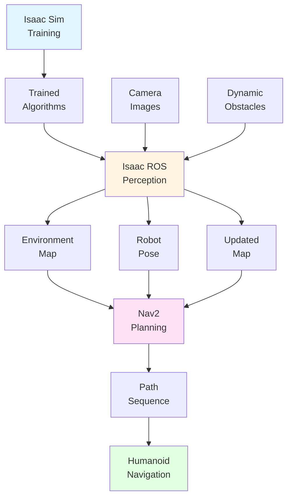

# Integrated Applications: The Complete AI-Robot Brain Workflow

Understanding individual tools is important, but the real power of the AI-robot brain comes from how **Isaac Sim, Isaac ROS, and Nav2 work together** as an integrated system. This section demonstrates the complete workflow: from training perception algorithms in simulation to real-time navigation in physical environments.

## The Complete Workflow

The AI-robot brain workflow follows a clear progression:

```
Training (Isaac Sim) → Perception (Isaac ROS) → Planning (Nav2) → Navigation
```

Each component builds upon the previous one, creating a complete system for autonomous humanoid robot navigation.

### Training Phase: Learning from Simulation

**NVIDIA Isaac Sim** generates synthetic training data:

1. Create photorealistic virtual environments
2. Render images with realistic lighting and materials
3. Generate ground truth labels automatically
4. Create diverse training datasets with variations

**Output**: Trained perception algorithms that understand visual information

### Perception Phase: Understanding in Real-Time

**Isaac ROS** deploys trained algorithms for real-time perception:

1. Process camera images using trained algorithms
2. Extract visual features and track movement
3. Build environment maps
4. Localize robot position within maps

**Output**: Real-time environmental understanding and robot localization

### Planning Phase: Computing Safe Paths

**Nav2** uses perception data for path planning:

1. Access environment maps from perception
2. Consider humanoid constraints (balance, foot placement)
3. Compute safe paths to goal locations
4. Generate step sequences for bipedal movement

**Output**: Safe, executable movement paths

### Navigation: Autonomous Movement

The robot executes planned paths while continuously:

1. Updating perception based on new visual information
2. Replanning paths as environment changes
3. Adapting to dynamic obstacles and terrain
4. Maintaining balance and stability throughout movement

**Output**: Autonomous navigation through complex environments

## Practical Application Scenario

Consider a humanoid robot navigating through an indoor office environment to reach a specific room:

### Scenario Setup

- **Goal**: Navigate from office entrance to conference room
- **Environment**: Indoor office with corridors, rooms, furniture, people
- **Challenges**: Dynamic obstacles (people moving), narrow passages, changing lighting

### Complete Workflow

#### 1. Pre-Deployment: Training (Isaac Sim)

Before the robot is deployed, perception algorithms are trained:

**Training Process**:
- Isaac Sim generates thousands of synthetic images of indoor office environments
- Images include variations: different lighting, furniture arrangements, people, obstacles
- Algorithms learn to recognize: walls, doors, furniture, people, walkable floors
- Training produces algorithms that understand indoor office environments

**Result**: Perception algorithms ready for deployment

#### 2. Deployment: Perception (Isaac ROS)

When the robot operates, Isaac ROS processes real-world visual data:

**Real-Time Perception**:
- Robot's cameras capture images of the office environment
- Isaac ROS processes images using trained algorithms
- VSLAM builds a map of the office as the robot moves
- Robot continuously localizes itself within the map
- Dynamic obstacles (people) are detected and tracked

**Result**: Real-time understanding of current environment and robot position

#### 3. Navigation: Planning (Nav2)

Nav2 uses perception data to plan movement:

**Path Planning**:
- Navigation goal: reach conference room
- Nav2 accesses office map from perception system
- Considers humanoid constraints: balance, foot placement, step size
- Computes path avoiding obstacles and maintaining stability
- Generates sequence of foot placements for bipedal movement
- Continuously replans as environment changes (people move, doors open/close)

**Result**: Safe, executable path to goal location

#### 4. Continuous Operation

The system runs continuously:

- **Perception updates**: New camera images update map and robot position
- **Path replanning**: Nav2 adjusts path based on latest perception data
- **Balance maintenance**: Robot maintains stability while following path
- **Goal achievement**: Robot reaches conference room autonomously

**Result**: Successful autonomous navigation through complex environment

## How Perception Informs Planning

The integration between perception (Isaac ROS) and planning (Nav2) is critical:

### Map Data Flow

**Perception → Planning**:
- Isaac ROS builds environment map through VSLAM
- Nav2 accesses this map to understand obstacle locations
- Map updates as robot explores new areas
- Planning adapts to map changes in real-time

### Robot Localization

**Perception → Planning**:
- Isaac ROS determines robot's current position
- Nav2 uses this position as starting point for path planning
- Continuous localization updates enable accurate path execution
- Planning adjusts when localization detects robot has deviated from expected path

### Dynamic Obstacle Detection

**Perception → Planning**:
- Isaac ROS detects moving obstacles (people, objects)
- Nav2 receives obstacle updates in real-time
- Planning recomputes paths to avoid dynamic obstacles
- Enables safe navigation in dynamic environments

This perception → planning integration enables responsive, adaptive navigation that reacts to changing environments.

## How Training Supports Perception

The connection between training (Isaac Sim) and perception (Isaac ROS) enables real-world deployment:

### Algorithm Transfer

**Training → Perception**:
- Algorithms trained on synthetic data from Isaac Sim
- Same algorithms deployed in real robot via Isaac ROS
- Training data variations help algorithms generalize to real-world conditions
- Hardware acceleration enables real-time operation of trained algorithms

### Domain Adaptation

**Training → Perception**:
- Synthetic training includes diverse scenarios (lighting, environments, objects)
- Real-world perception encounters similar scenarios
- Trained algorithms recognize real-world features learned from synthetic data
- Enables perception to work effectively without extensive real-world training data collection

This training → perception connection demonstrates how simulation enables real-world capabilities.

## The Integrated System

When all three components work together:



*Figure: Integrated AI-robot brain workflow showing how training, perception, and planning components work together for autonomous navigation.*

### System Characteristics

- **Continuous operation**: All components run simultaneously
- **Real-time updates**: Perception and planning update continuously
- **Adaptive behavior**: System responds to environmental changes
- **Integrated data flow**: Information flows seamlessly between components

## Real-World Value

The integrated AI-robot brain enables:

### Autonomous Operation

- Robots navigate without human guidance
- Adapt to changing environments automatically
- Handle unexpected situations safely

### Efficient Development

- Training in simulation reduces real-world data collection needs
- Hardware acceleration enables real-time performance
- Integrated workflow simplifies system development

### Scalable Deployment

- Trained algorithms work across different environments
- Perception adapts to new locations
- Planning handles various scenarios

## Summary

The AI-robot brain integrates three components into a complete autonomous navigation system:

- **Isaac Sim (Training)**: Generates synthetic data to train perception algorithms
- **Isaac ROS (Perception)**: Deploys trained algorithms for real-time environmental understanding
- **Nav2 (Planning)**: Uses perception data to compute safe paths for humanoid movement

Together, these tools enable the complete workflow: training → perception → planning → navigation. This integration demonstrates how modern humanoid robots achieve autonomous capabilities through the coordinated operation of advanced AI tools.

## Next Steps

You've now explored all components of the AI-robot brain. Review the [Glossary](./glossary.md) for key terminology definitions, or revisit any section to deepen your understanding of how these advanced tools enable autonomous humanoid robot navigation.

