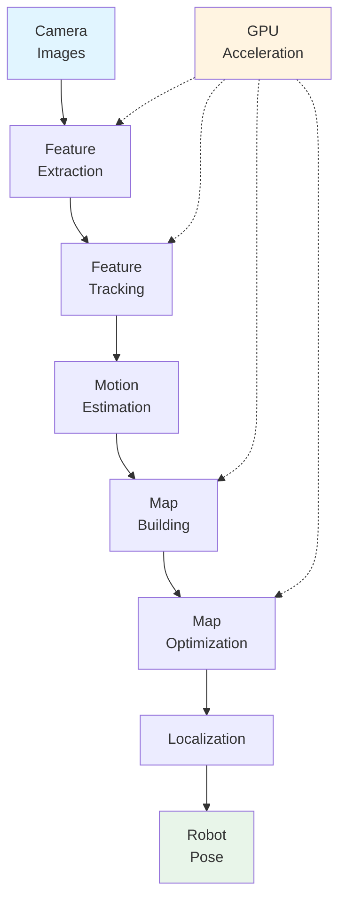

# Isaac ROS: Hardware-Accelerated Visual SLAM

While NVIDIA Isaac Sim provides training data for perception algorithms, **Isaac ROS** enables the real-time deployment of those trained algorithms. Isaac ROS provides hardware-accelerated Visual SLAM (VSLAM) capabilities that allow humanoid robots to understand their environment and navigate in real-time using visual sensors.

## What is Isaac ROS?

**Isaac ROS** is a collection of hardware-accelerated ROS 2 packages that leverage GPU computing to process perception and navigation tasks in real-time. For humanoid robots, Isaac ROS's most critical capability is **Visual SLAM (VSLAM)**—a system that simultaneously maps environments and localizes the robot using visual sensors.

### Hardware-Accelerated Processing

Isaac ROS is distinguished by its use of **hardware acceleration**—leveraging GPUs (Graphics Processing Units) to perform computationally intensive tasks much faster than traditional CPU-based processing. This acceleration is essential for real-time robot operation:

- **CPU processing**: Sequential computation, suitable for general tasks
- **GPU processing**: Parallel computation, ideal for image processing and perception algorithms

For VSLAM, which requires processing multiple camera images per second, GPU acceleration makes the difference between real-time operation and delays that prevent autonomous navigation.

## What is Visual SLAM (VSLAM)?

**Visual SLAM (Simultaneous Localization and Mapping)** is a perception technology that enables robots to:

1. **Map the environment**: Build a representation of the space around the robot
2. **Localize the robot**: Determine the robot's position and orientation within that map
3. **Do both simultaneously**: Create the map while determining position at the same time

SLAM solves the "chicken and egg" problem: to know where you are, you need a map; but to build a map, you need to know where you are. VSLAM uses visual sensors (cameras) to solve both problems at once.

### How VSLAM Works

VSLAM processes camera images through several steps:

#### 1. Feature Extraction

The system identifies distinctive visual features in images:
- **Corner detection**: Finding corners and edges that are stable across frames
- **Feature descriptors**: Creating mathematical representations of image regions
- **Feature matching**: Identifying the same features across different camera views

#### 2. Tracking

Features are tracked across multiple frames to understand movement:
- **Motion estimation**: Determining how features move between frames
- **Camera pose estimation**: Calculating camera (robot) movement and rotation
- **Temporal consistency**: Maintaining tracking across video sequences

#### 3. Mapping

The system builds a map of the environment:
- **3D reconstruction**: Creating 3D points from matched features
- **Map building**: Constructing a representation of the environment
- **Map optimization**: Refining the map as more information is collected

#### 4. Localization

The robot determines its position within the map:
- **Current view matching**: Matching current camera view to the map
- **Pose estimation**: Determining position and orientation
- **Loop closure**: Recognizing previously visited locations to correct drift

### VSLAM Workflow

The complete VSLAM process follows this workflow:

```
Camera Images → Feature Extraction → Feature Tracking → Motion Estimation
     ↓                                                           ↓
Localization ← Map Matching ← Map Optimization ← 3D Reconstruction
```

**Example: Conceptual VSLAM Workflow**

1. **Extract visual features** from current camera image (corners, edges, textures)
2. **Track features** across multiple frames to estimate robot movement
3. **Build map** of environment using tracked features and triangulation
4. **Localize robot** within the map using current camera view
5. **Optimize map** continuously as robot moves and collects more data

This workflow runs continuously in real-time, updating the map and robot position as the robot moves.

## Hardware Acceleration Benefits

Hardware acceleration (GPU processing) dramatically improves VSLAM performance:

### Speed Improvement

VSLAM requires processing:
- **Multiple images per second**: Camera feeds at 30-60 frames per second
- **Large image resolutions**: High-resolution images for accurate feature detection
- **Complex algorithms**: Feature extraction, matching, and optimization are computationally intensive

**CPU processing**: Sequential computation limits speed, making real-time VSLAM challenging
**GPU processing**: Parallel computation enables processing multiple images simultaneously, achieving real-time performance

### Real-Time Navigation

Without hardware acceleration:
- Processing delays create lag between sensor input and navigation decisions
- Robot movement becomes jerky or unsafe
- Real-time navigation is impossible

With hardware acceleration:
- Processing keeps pace with camera frame rates
- Navigation decisions are made in real-time
- Smooth, responsive robot movement is possible

This real-time capability is essential for autonomous humanoid robots that must navigate dynamically through environments.

## VSLAM System Components

A complete VSLAM system consists of several interconnected components:



*Figure: VSLAM system components showing how hardware acceleration accelerates key processing steps to enable real-time operation.*

### Key Components

- **Feature Extraction**: Identifies stable visual features in images (accelerated by GPU)
- **Feature Tracking**: Matches features across frames to understand movement
- **Motion Estimation**: Calculates robot movement from feature tracking
- **Map Building**: Creates 3D representation of environment (accelerated by GPU)
- **Map Optimization**: Refines map accuracy (accelerated by GPU)
- **Localization**: Determines robot position within map

GPU acceleration is applied to the most computationally intensive components (feature extraction, map building, optimization) to achieve real-time performance.

## VSLAM Integration with ROS 2

Isaac ROS integrates VSLAM capabilities with ROS 2, enabling seamless integration with robot systems:

### ROS 2 Topics

VSLAM systems use ROS 2 topics to communicate:
- **Input**: Camera images published to topics (e.g., `/camera/image_raw`)
- **Output**: Map data, robot pose published to topics (e.g., `/map`, `/robot_pose`)

This follows the ROS 2 communication patterns from [Module 1](../../module-1-ros2-nervous-system/communication-patterns.md): publish-subscribe messaging enables distributed perception processing.

### ROS 2 Services

VSLAM systems may provide services for:
- **Map queries**: Requesting specific map information
- **Relocalization**: Manually setting robot position in map
- **System status**: Checking VSLAM system health

These services follow the request-response pattern from [Module 1](../../module-1-ros2-nervous-system/communication-patterns.md).

### Navigation Integration

VSLAM output feeds into navigation systems:
- **Map data** → Used by path planning algorithms
- **Robot pose** → Used to track progress along planned paths
- **Obstacle updates** → Used to avoid dynamic obstacles

This integration demonstrates how perception (VSLAM) enables navigation, connecting to path planning systems like Nav2.

## Connection to Module 2: Sensor Concepts

VSLAM uses visual sensors (cameras) to understand the environment. This builds on sensor integration concepts from [Module 2](../../module-2-digital-twins-simulation/sensor-integration.md):

- **Vision sensors**: Cameras provide the visual data that VSLAM processes
- **Sensor data flow**: Camera images flow through ROS 2 topics to VSLAM processing
- **Sensor fusion**: VSLAM can combine data from multiple cameras for better accuracy

However, VSLAM adds sophisticated processing: rather than just reading sensor data, VSLAM interprets that data to build environmental understanding and determine robot position.

## Benefits for Humanoid Robotics

Hardware-accelerated VSLAM provides critical capabilities for humanoid robots:

### Real-Time Navigation

Humanoid robots require real-time perception for safe navigation:
- **Dynamic environments**: Environments change as robot moves
- **Safety requirements**: Delayed perception creates safety risks
- **Smooth movement**: Real-time updates enable fluid robot motion

Hardware acceleration makes real-time VSLAM feasible for humanoid robots.

### Visual-Only Navigation

Unlike wheeled robots that might use wheel odometry, humanoid robots benefit from visual-only navigation:
- **No wheel encoders**: Humanoid locomotion doesn't provide reliable odometry
- **Visual information**: Cameras provide rich environmental information
- **Self-contained**: Visual sensors don't require external infrastructure

VSLAM enables humanoid robots to navigate using only visual information.

### Spatial Understanding

VSLAM provides comprehensive spatial understanding:
- **3D mapping**: Creates full 3D representation of environment
- **Obstacle awareness**: Identifies objects and barriers
- **Route planning**: Enables path planning algorithms to compute safe routes

This spatial understanding is essential for autonomous navigation.

## Summary

Isaac ROS provides hardware-accelerated Visual SLAM (VSLAM) that enables humanoid robots to understand their environment and navigate in real-time. Key points:

- **Visual SLAM** enables simultaneous mapping and localization using cameras
- **Hardware acceleration** (GPU) makes real-time VSLAM performance possible
- **VSLAM workflow** extracts features, tracks movement, builds maps, and localizes the robot
- **ROS 2 integration** enables VSLAM to communicate with navigation systems
- **Real-time capability** is essential for autonomous humanoid robot navigation

Isaac ROS bridges the gap between trained perception algorithms (from Isaac Sim) and real-time robot operation, enabling robots to use their trained capabilities for actual navigation.

## Next Steps

Now that you understand how Isaac ROS enables real-time perception through hardware-accelerated VSLAM, explore how that perception information feeds into **Nav2 path planning** in the next section. Nav2 uses the maps and robot pose from VSLAM to compute safe paths for bipedal humanoid movement.

