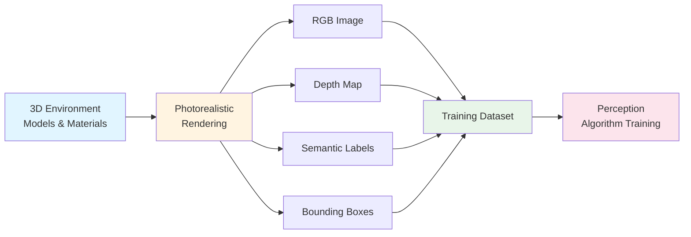

# NVIDIA Isaac Sim: Photorealistic Simulation

NVIDIA Isaac Sim represents a leap beyond general physics simulation. While Module 2 introduced simulation fundamentals for testing robot behavior, Isaac Sim focuses on **photorealistic rendering** that generates realistic visual data for training AI perception algorithms. This capability bridges simulation and AI development, enabling robots to learn from synthetic data rather than requiring massive real-world data collection.

## What is NVIDIA Isaac Sim?

**NVIDIA Isaac Sim** is a photorealistic simulation platform that creates highly realistic virtual environments with accurate lighting, textures, materials, and physics. Unlike general physics simulators that focus on dynamics and collision detection, Isaac Sim emphasizes **visual fidelity**—creating images that are visually indistinguishable from real-world photographs.

### Key Capabilities

Isaac Sim enables:

- **Photorealistic rendering**: Environments with realistic lighting, shadows, reflections, and materials
- **Synthetic data generation**: Automated creation of labeled training datasets (images, depth maps, annotations)
- **Programmatic control**: Python APIs for scripting simulation scenarios and generating diverse training data
- **Domain randomization**: Automatic variation of lighting, textures, object positions, and camera angles

These capabilities make Isaac Sim particularly valuable for training perception algorithms—systems that process visual information to understand the environment.

## Photorealistic Simulation vs. General Simulation

Understanding the difference between Isaac Sim's photorealistic simulation and general simulation (from Module 2) is important:

| Aspect | General Simulation (Module 2) | Photorealistic Simulation (Isaac Sim) |
|--------|-------------------------------|--------------------------------------|
| **Primary Focus** | Physics accuracy, dynamics, collisions | Visual realism, lighting, textures |
| **Use Case** | Testing robot behavior, validating dynamics | Training AI algorithms, generating datasets |
| **Output** | Robot state, joint angles, forces | Images, depth maps, semantic labels |
| **Fidelity** | Sufficient for physics validation | Photorealistic for visual perception |

While both types of simulation are valuable, photorealistic simulation serves a different purpose: creating visual training data that matches real-world appearance.

## Synthetic Data Generation

The core value of Isaac Sim lies in its ability to generate **synthetic training data** for perception algorithms. This process involves:

1. **Creating photorealistic environments**: Virtual worlds with realistic lighting, materials, and objects
2. **Rendering images**: Capturing camera views from different angles and positions
3. **Generating ground truth**: Automatically creating labels (object boundaries, depth maps, semantic segmentation)
4. **Automating variation**: Randomizing lighting, textures, and object configurations to create diverse datasets

### Why Synthetic Data Matters

Training perception algorithms traditionally requires:

- **Massive data collection**: Thousands or millions of real-world images
- **Manual labeling**: Human annotators marking objects, boundaries, depths
- **Controlled conditions**: Setting up specific scenarios to capture needed data
- **Time and cost**: Significant resources for data collection and annotation

Isaac Sim enables generating this data **programmatically in simulation**, eliminating the need for physical data collection while providing perfect ground truth labels automatically.

## How Isaac Sim Generates Training Data

Isaac Sim generates training data through a systematic process:

### 1. Environment Setup

First, create a photorealistic virtual environment:

```python
# Conceptual example: Isaac Sim synthetic data generation
# Demonstrates how photorealistic simulation generates training data

import isaac_sim  # Conceptual import - tool not required for understanding

# Create photorealistic scene with realistic lighting
scene = isaac_sim.create_scene(
    lighting="physically_based",  # Realistic light behavior
    materials="photorealistic",    # Realistic surface properties
    environment="indoor_office"    # Specific environment type
)

# Add objects with realistic textures and materials
scene.add_object("table", position=[1.0, 0.5, 0.8], material="wood")
scene.add_object("chair", position=[1.5, 0.0, 0.8], material="fabric")
```

### 2. Camera Configuration

Set up virtual cameras to capture images:

```python
# Configure camera with realistic parameters
camera = scene.add_camera(
    position=[2.0, 1.5, 1.2],  # Camera location
    resolution=(1920, 1080),    # Image resolution
    fov=60                      # Field of view
)
```

### 3. Data Generation Loop

Generate multiple images with automatic variation:

```python
# Generate synthetic training data
training_data = []

for i in range(1000):  # Generate 1000 training images
    # Randomize lighting conditions
    scene.randomize_lighting()
    
    # Randomize object positions
    scene.randomize_object_positions()
    
    # Render image with annotations
    image_data = camera.render(
        annotations=[
            "rgb",              # Color image
            "depth",            # Depth map
            "semantic",         # Object labels
            "bounding_boxes"    # Object boundaries
        ]
    )
    
    training_data.append(image_data)
```

This process creates a diverse dataset automatically, with perfect ground truth labels included.

## The Synthetic Data Generation Pipeline

The complete pipeline for generating training data follows these steps:



*Figure: Synthetic data generation pipeline showing how Isaac Sim creates multiple data types simultaneously for training perception algorithms.*

### Data Types Generated

Isaac Sim can generate multiple types of training data simultaneously:

- **RGB Images**: Color images matching real-world appearance
- **Depth Maps**: Distance information for every pixel
- **Semantic Segmentation**: Object labels for each pixel
- **Instance Segmentation**: Individual object identification
- **Bounding Boxes**: Object boundaries and classifications
- **Surface Normals**: Surface orientation information

All this data comes with perfect ground truth labels automatically—no manual annotation required.

## Training Perception Algorithms

Once synthetic data is generated, it's used to train perception algorithms:

1. **Dataset Creation**: Thousands of synthetic images with variations
2. **Algorithm Training**: Neural networks learn to recognize objects, estimate depth, segment images
3. **Validation**: Algorithms tested on both synthetic and real-world data
4. **Deployment**: Trained algorithms deployed to real robots

This workflow demonstrates the value of synthetic data: algorithms learn from simulation, then apply that knowledge to real-world perception tasks.

## Connection to Module 2 Simulation

Isaac Sim extends the simulation concepts from Module 2:

- **Module 2 (General Simulation)**: Focuses on physics accuracy for testing robot behavior and validating dynamics
- **Isaac Sim (Photorealistic Simulation)**: Focuses on visual realism for training AI algorithms and generating datasets

Both types of simulation are valuable, but serve different purposes. General simulation validates that robots can move correctly; photorealistic simulation ensures perception algorithms can understand what they see.

### Key Differences

- **General simulation** answers: "Can the robot walk safely on this terrain?"
- **Photorealistic simulation** answers: "Can the robot recognize and understand objects in this environment?"

Both questions are important for autonomous robots, but require different simulation approaches.

## Benefits for Humanoid Robotics

Isaac Sim's photorealistic simulation provides several advantages for humanoid robotics development:

### 1. Safe Training Data Generation

Unlike collecting real-world data which might require:
- Operating expensive robots in various environments
- Handling safety concerns
- Dealing with unpredictable conditions

Synthetic data generation is completely safe and controlled.

### 2. Perfect Ground Truth

Manual annotation of real-world images is:
- Time-consuming
- Error-prone
- Expensive

Synthetic data provides perfect, automatic labels—every pixel is correctly identified.

### 3. Unlimited Variation

Real-world data collection is limited by:
- Available environments
- Time and resources
- Safety constraints

Simulation can generate unlimited variations of scenarios, lighting conditions, and object configurations.

### 4. Domain Adaptation

Synthetic data can include scenarios that are:
- Difficult to capture in real-world (extreme lighting, rare objects)
- Dangerous to test (obstacle avoidance, emergency situations)
- Expensive to recreate (multiple environments, weather conditions)

## Summary

NVIDIA Isaac Sim enables photorealistic simulation that generates synthetic training data for perception algorithms. Key points:

- **Photorealistic rendering** creates visually realistic virtual environments
- **Synthetic data generation** automates creation of labeled training datasets
- **Python APIs** enable programmatic control and automation
- **Perfect ground truth** eliminates need for manual annotation
- **Unlimited variation** enables diverse training scenarios

Isaac Sim bridges the gap between simulation and AI development, enabling robots to learn perception capabilities from synthetic data rather than requiring massive real-world data collection.

## Next Steps

Now that you understand how Isaac Sim enables training through synthetic data generation, explore how that trained perception is deployed in real-time through **Isaac ROS** in the next section. Isaac ROS uses hardware acceleration to process visual information fast enough for real-time robot navigation.

