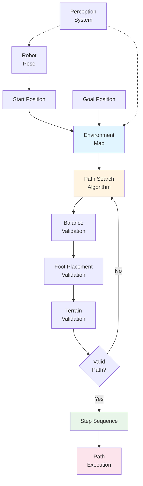

# Nav2: Path Planning for Bipedal Humanoids

Path planning determines how a robot moves from one location to another. While navigation algorithms for wheeled robots can assume continuous motion and simple constraints, **bipedal humanoid robots** require path planning that accounts for unique challenges: maintaining balance, placing feet on stable surfaces, and adapting to terrain. Nav2 (Navigation2) provides path planning capabilities specifically adapted for these humanoid-specific requirements.

## What is Nav2?

**Nav2 (Navigation2)** is a ROS 2 navigation framework that provides path planning, obstacle avoidance, and navigation capabilities. While Nav2 can work with various robot types, it includes specific adaptations for bipedal humanoid robots that account for their unique movement constraints.

### Path Planning Basics

Path planning involves:
1. **Start and goal**: Defining where the robot is and where it wants to go
2. **Environment representation**: Understanding obstacles, terrain, and constraints
3. **Path computation**: Finding a safe and efficient route
4. **Path execution**: Following the computed path while adapting to changes

For humanoid robots, path planning must also consider how the robot moves—one step at a time, maintaining balance throughout.

## Bipedal Humanoid Movement Constraints

Humanoid robots have unique constraints that affect path planning:

### Balance Requirements

Unlike wheeled robots that are always stable, bipedal robots must maintain balance:
- **Center of mass**: Must stay within the support polygon (area covered by feet)
- **Stability margin**: Sufficient stability to handle disturbances
- **Dynamic balance**: Maintaining balance while moving requires forward momentum

Path planning must compute paths that keep the robot balanced throughout movement.

### Foot Placement Constraints

Humanoid robots move by placing feet one at a time:
- **Step size limits**: Maximum distance each step can cover
- **Surface requirements**: Each foot must land on a flat, stable surface
- **Clearance**: Feet must clear obstacles during swing phase
- **Terrain adaptation**: Adjusting step height and angle for uneven terrain

Path planning must identify valid foot placement locations along the path.

### Terrain Adaptation

Humanoid robots must adapt to different terrain types:
- **Slope limits**: Maximum incline the robot can walk on
- **Surface detection**: Identifying walkable vs. non-walkable surfaces
- **Obstacle clearance**: Stepping over or around obstacles
- **Uneven surfaces**: Adapting to bumps, dips, and irregular terrain

Path planning must account for terrain characteristics when computing paths.

## Humanoid-Specific Path Planning Considerations

Nav2 adapts general path planning algorithms to account for humanoid constraints:

### Balance-Aware Planning

Path planning considers balance throughout the path:
- **Support polygon analysis**: Ensuring each step maintains stability
- **Center of mass trajectory**: Planning movement that keeps center of mass stable
- **Recovery strategies**: Identifying recovery steps if balance is compromised

### Foot Placement Planning

Path planning identifies valid foot placement locations:
- **Surface analysis**: Evaluating terrain for flat, stable foot placement
- **Step sequence**: Planning the sequence of left-right foot placements
- **Clearance planning**: Ensuring feet clear obstacles during swing phase

### Terrain-Aware Routing

Path planning considers terrain characteristics:
- **Slope analysis**: Avoiding paths that exceed maximum slope limits
- **Surface quality**: Preferring stable surfaces over unstable ones
- **Obstacle negotiation**: Planning paths that navigate around or over obstacles

## Nav2 Path Planning Configuration

Nav2 uses configuration files to specify humanoid-specific constraints:

```yaml
# Conceptual Nav2 configuration for humanoid constraints
# Demonstrates how humanoid-specific parameters are configured

humanoid_navigation:
  balance_requirements:
    center_of_mass_limits:
      x_min: -0.1  # meters
      x_max: 0.1
      y_min: -0.08
      y_max: 0.08
    support_polygon_stability: required
    stability_margin: 0.05  # meters
  
  foot_placement:
    step_size_max: 0.3  # meters - maximum step length
    step_size_min: 0.1  # meters - minimum step length
    surface_flatness: required  # feet must land on flat surfaces
    obstacle_clearance: 0.1  # meters - clearance above obstacles
    step_height_max: 0.15  # meters - maximum step up height
  
  terrain_adaptation:
    max_slope: 15  # degrees - maximum slope angle
    surface_detection: required  # detect walkable surfaces
    uneven_surface_tolerance: 0.02  # meters - acceptable surface variation
  
  path_planning:
    safety_margin: 0.15  # meters - minimum distance from obstacles
    replan_frequency: 2.0  # Hz - how often to recompute path
    dynamic_obstacle_handling: enabled
```

This configuration example shows how humanoid constraints are specified in Nav2, enabling path planning algorithms to account for balance, foot placement, and terrain requirements.

## Integration with Perception Systems

Nav2 integrates with perception systems (like Isaac ROS) to obtain environmental information:

### Map Input

Nav2 uses maps from perception systems:
- **Environment map**: 2D or 3D representation of the environment
- **Occupancy grid**: Shows which areas are walkable vs. obstacles
- **Terrain information**: Surface characteristics and elevation data

### Robot Localization

Nav2 uses robot pose from perception:
- **Current position**: Where the robot is now (from VSLAM or other localization)
- **Goal position**: Where the robot wants to go
- **Pose tracking**: Continuous updates as robot moves

### Dynamic Updates

Nav2 adapts to changing perception data:
- **Obstacle updates**: Adjusting path when new obstacles detected
- **Map updates**: Incorporating new areas as robot explores
- **Terrain changes**: Adapting to discovered terrain characteristics

This integration demonstrates how perception (from Isaac ROS) informs planning (Nav2), completing the perception → planning connection.

## Humanoid Path Planning Workflow

Nav2's path planning for humanoids follows this workflow:



*Figure: Humanoid path planning workflow showing how Nav2 considers balance, foot placement, and terrain constraints when computing paths.*

### Planning Steps

1. **Receive goal**: Navigation system receives target location
2. **Access map**: Obtain environment map from perception system
3. **Search path**: Compute candidate path from current to goal position
4. **Validate constraints**: Check path against balance, foot placement, terrain requirements
5. **Generate steps**: Create sequence of foot placements along path
6. **Execute path**: Robot follows path, adapting to dynamic changes

This workflow continuously runs, replanning as the robot moves and the environment changes.

## Humanoid vs. Wheeled Robot Path Planning

Understanding how humanoid path planning differs from wheeled robot planning clarifies the unique challenges:

| Aspect | Wheeled Robots | Bipedal Humanoids |
|--------|----------------|-------------------|
| **Movement** | Continuous rolling motion | Discrete foot placements |
| **Stability** | Always stable (low center of mass) | Must maintain balance dynamically |
| **Constraints** | Avoid obstacles, respect speed limits | Balance, foot placement, terrain adaptation |
| **Path Representation** | Continuous curves | Sequence of foot placements |
| **Replanning** | Adjust for obstacles | Adjust for balance, obstacles, terrain |

These differences demonstrate why humanoid-specific path planning is necessary and why Nav2 includes adaptations for bipedal movement.

## Connection to Perception (Isaac ROS)

Nav2 depends on perception systems like Isaac ROS for environmental understanding:

- **Map data**: VSLAM builds the environment map that Nav2 uses for path planning
- **Robot localization**: VSLAM determines robot position needed for path computation
- **Dynamic obstacles**: Perception systems detect moving obstacles that Nav2 must avoid

This connection completes the perception → planning workflow: perception provides environmental understanding, and planning uses that understanding to compute movement paths.

## Benefits for Humanoid Robotics

Nav2's humanoid-adapted path planning provides:

### Safe Navigation

Humanoid-specific constraints ensure:
- **Balance maintenance**: Paths keep robot stable throughout movement
- **Safe foot placement**: Each step lands on stable, flat surfaces
- **Terrain adaptation**: Paths account for slopes and uneven surfaces

### Efficient Movement

Path planning optimizes for:
- **Energy efficiency**: Minimizing unnecessary movement
- **Time efficiency**: Finding efficient routes to goals
- **Smooth motion**: Generating paths that enable fluid robot movement

### Autonomous Operation

Integration with perception enables:
- **Real-time adaptation**: Adjusting paths based on current perception
- **Dynamic obstacle avoidance**: Reacting to moving obstacles
- **Exploration**: Navigating in previously unknown environments

## Summary

Nav2 provides path planning capabilities specifically adapted for bipedal humanoid movement. Key points:

- **Humanoid constraints** include balance, foot placement, and terrain adaptation requirements
- **Balance-aware planning** ensures robot maintains stability throughout movement
- **Foot placement planning** identifies valid locations for each step
- **Terrain adaptation** accounts for slopes, obstacles, and uneven surfaces
- **Perception integration** uses maps and robot pose from systems like Isaac ROS

Nav2 completes the AI-robot brain workflow: using perception data (from Isaac ROS) to compute safe, efficient paths for bipedal humanoid movement.

## Next Steps

Now that you understand how Nav2 plans paths for humanoid robots, explore how all three tools work together in **Integrated Applications** to enable complete autonomous navigation capabilities.

