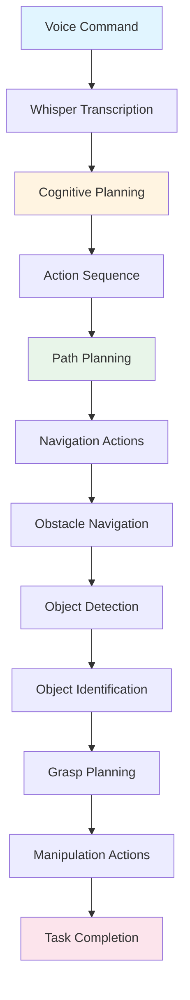

# Capstone Project: The Autonomous Humanoid

This capstone project demonstrates the complete Vision-Language-Action (VLA) pipeline in action. You'll see how a simulated humanoid robot receives a voice command, uses cognitive planning to generate a path, navigates obstacles using perception, identifies objects using computer vision, and manipulates them—all integrated into a cohesive autonomous behavior.

## Project Overview

The capstone project integrates all VLA concepts into a single demonstration:

- **Voice input**: A spoken command initiates the autonomous behavior
- **Cognitive planning**: Natural language is translated into an action plan
- **Path planning**: A navigation path is generated to reach the goal
- **Obstacle navigation**: The robot navigates around obstacles using perception
- **Object identification**: Computer vision identifies target objects
- **Object manipulation**: The robot grasps and manipulates objects

This project shows how voice-to-action, cognitive planning, perception, navigation, and manipulation work together in a complete VLA system.

## The Complete VLA Pipeline

The capstone demonstrates the end-to-end flow:

```
Voice Command → Speech Recognition → Cognitive Planning → 
Path Planning → Obstacle Navigation → Object Identification → 
Object Manipulation → Task Completion
```

Each stage builds upon the previous, creating a seamless autonomous behavior.

## Step-by-Step Flow

### Step 1: Voice Command

The user speaks a command: **"Pick up the red cup from the table"**

- **Audio capture**: Microphones capture the spoken command
- **Speech recognition**: OpenAI Whisper transcribes speech to text
- **Text output**: "Pick up the red cup from the table"

### Step 2: Cognitive Planning

The transcribed text is processed by cognitive planning:

- **Intent understanding**: The robot understands it needs to pick up a specific object
- **Goal decomposition**: The task is broken into sub-goals:
  1. Navigate to the table
  2. Identify the red cup
  3. Pick up the cup
  4. Verify successful grasp
- **Action sequence generation**: ROS 2 actions are generated for each sub-goal

### Step 3: Path Planning

The cognitive plan includes navigation to the table:

- **Target location**: The table location is identified
- **Path generation**: A path is planned from current position to table
- **Obstacle consideration**: Known obstacles are considered in path planning
- **Path validation**: The path is checked for feasibility

### Step 4: Obstacle Navigation

The robot navigates to the table:

- **Perception**: Sensors detect obstacles in the environment
- **Path adjustment**: The path is adjusted to avoid obstacles
- **Navigation execution**: ROS 2 navigation actions move the robot
- **Progress monitoring**: Navigation progress is monitored and adjusted

### Step 5: Object Identification

At the table, computer vision identifies the target:

- **Visual perception**: Cameras capture images of the table
- **Object detection**: Computer vision detects objects on the table
- **Object classification**: Objects are classified (cup, bottle, etc.)
- **Target selection**: The red cup is identified and selected

### Step 6: Object Manipulation

The robot manipulates the identified object:

- **Grasp planning**: A grasp pose is planned for the cup
- **Arm movement**: The robot's arm moves to the grasp pose
- **Grasp execution**: The robot grasps the cup
- **Verification**: Successful grasp is verified

## Integration of VLA Components

This capstone demonstrates how all VLA components integrate:

### Voice Input Integration

Voice commands initiate the entire pipeline:

```python
# Whisper Integration Pattern in Capstone Context
# This demonstrates how voice input initiates the capstone project

import whisper
import rclpy
from rclpy.node import Node
from std_msgs.msg import String

class CapstoneVoiceInput(Node):
    """
    Voice input component for capstone project.
    Demonstrates Whisper integration in complete VLA pipeline.
    """
    
    def __init__(self):
        super().__init__('capstone_voice_input')
        
        # Initialize Whisper (conceptual pattern)
        self.whisper_model = whisper.load_model("base")
        
        # Publisher for sending commands to cognitive planning
        self.command_publisher = self.create_publisher(
            String,
            'voice_command',
            10
        )
    
    def process_voice_command(self, audio_data):
        """
        Process voice command and publish to cognitive planning.
        This initiates the complete VLA pipeline.
        """
        # Transcribe audio to text using Whisper
        result = self.whisper_model.transcribe(audio_data)
        command_text = result["text"]
        
        # Publish command to cognitive planning system
        msg = String()
        msg.data = command_text
        self.command_publisher.publish(msg)
        
        self.get_logger().info(f'Voice command received: {command_text}')
        return command_text
```

### Cognitive Planning Integration

Cognitive planning translates commands to action sequences:

```python
# LLM Cognitive Planning Integration Pattern in Capstone Context
# This demonstrates how cognitive planning generates action sequences

class CapstoneCognitivePlanner:
    """
    Cognitive planning component for capstone project.
    Demonstrates LLM integration in complete VLA pipeline.
    """
    
    def __init__(self, llm_client):
        self.llm_client = llm_client
    
    def plan_capstone_task(self, voice_command, robot_context):
        """
        Generate action plan for capstone task.
        This demonstrates cognitive planning in complete VLA pipeline.
        """
        # Create planning prompt
        prompt = f"""
        Translate this voice command into a robot action plan:
        Command: "{voice_command}"
        
        Robot context: {robot_context}
        
        Generate a sequence of actions:
        1. Navigation to target location
        2. Object identification
        3. Object manipulation
        
        Output the action sequence in ROS 2 action format.
        """
        
        # Generate plan using LLM
        response = self.llm_client.generate(prompt)
        
        # Parse response into action sequence
        action_sequence = self.parse_plan(response)
        
        return action_sequence
    
    def parse_plan(self, llm_response):
        """
        Parse LLM response into ROS 2 action sequence.
        This demonstrates how cognitive plans become executable actions.
        """
        # Parse structured response
        # Extract navigation, perception, and manipulation actions
        actions = []
        # ... parsing logic ...
        return actions
```

### ROS 2 Action Generation Integration

ROS 2 actions execute the cognitive plan:

```python
# ROS 2 Action Generation Integration Pattern in Capstone Context
# This demonstrates how cognitive plans become ROS 2 actions

from rclpy.action import ActionClient
from navigation_msgs.action import NavigateToPose
from manipulation_msgs.action import PickPlace
from perception_msgs.action import DetectObjects

class CapstoneActionExecutor(Node):
    """
    Action execution component for capstone project.
    Demonstrates ROS 2 action generation in complete VLA pipeline.
    """
    
    def __init__(self):
        super().__init__('capstone_action_executor')
        
        # Action clients for different capabilities
        self.nav_client = ActionClient(self, NavigateToPose, 'navigate_to_pose')
        self.manip_client = ActionClient(self, PickPlace, 'pick_place')
        self.perception_client = ActionClient(self, DetectObjects, 'detect_objects')
    
    def execute_capstone_plan(self, cognitive_plan):
        """
        Execute complete capstone plan.
        This demonstrates ROS 2 action execution in complete VLA pipeline.
        """
        # Execute navigation actions
        for nav_action in cognitive_plan.navigation_actions:
            self.execute_navigation(nav_action)
        
        # Execute perception actions
        for perception_action in cognitive_plan.perception_actions:
            self.execute_perception(perception_action)
        
        # Execute manipulation actions
        for manip_action in cognitive_plan.manipulation_actions:
            self.execute_manipulation(manip_action)
    
    def execute_navigation(self, action):
        """Execute navigation action."""
        goal = NavigateToPose.Goal()
        goal.pose = action.target_pose
        self.nav_client.send_goal_async(goal)
    
    def execute_manipulation(self, action):
        """Execute manipulation action."""
        goal = PickPlace.Goal()
        goal.object_id = action.object_id
        goal.pick_pose = action.pick_pose
        self.manip_client.send_goal_async(goal)
```

## Cross-References to Previous Modules

This capstone project builds upon concepts from previous modules:

### Module 2: Simulation

The capstone project runs in a simulated environment, demonstrating how [Module 2: Digital Twins - Simulation & Sensors](/modules/module-2-digital-twins-simulation/simulation-fundamentals) enables safe testing and development of VLA systems. Simulation allows:

- **Safe testing**: Testing VLA systems without physical risk
- **Rapid iteration**: Quickly testing different scenarios
- **Environment control**: Creating consistent test conditions

### Module 3: Perception and Navigation

The capstone project uses perception and navigation capabilities from [Module 3: The AI-Robot Brain (NVIDIA Isaac™)](/modules/module-3-ai-robot-brain/nav2-path-planning), including:

- **Computer vision**: Object identification and classification
- **Path planning**: Navigation path generation
- **Obstacle avoidance**: Dynamic obstacle navigation
- **Sensor integration**: Using cameras and sensors for perception

## Complete Integration Flow Diagram

The following diagram illustrates the complete capstone project flow:



This diagram shows how all VLA components integrate in the complete autonomous behavior.

## Summary

The capstone project demonstrates the complete VLA pipeline, integrating voice input, cognitive planning, path planning, obstacle navigation, object identification, and manipulation into a cohesive autonomous behavior. This project shows how all VLA concepts work together, from a simple voice command to complex robot behavior. Understanding this integration is essential for comprehending how VLA systems enable natural language robot control.

## Next Steps

Now that you understand the complete VLA pipeline through the capstone project, proceed to [Module Integration](./module-integration.md) to learn how VLA concepts connect to and build upon previous modules.

