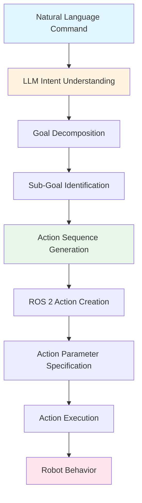

# Cognitive Planning with LLMs

Cognitive planning is the intelligence layer of VLA systems, where Large Language Models translate natural language commands into executable robot action sequences. This section explores how LLMs perform this transformation and how high-level instructions become robot behaviors.

## How LLMs Perform Cognitive Planning

Large Language Models excel at understanding natural language and generating structured outputs. In cognitive planning, LLMs:

1. **Interpret intent**: Understand what the user wants the robot to accomplish
2. **Decompose goals**: Break complex commands into manageable sub-tasks
3. **Generate actions**: Create sequences of robot actions that achieve the goal
4. **Structure output**: Format actions in a way that robots can execute

### Provider-Agnostic Cognitive Planning

Cognitive planning patterns are provider-agnostic, meaning the concepts apply regardless of which LLM provider or model is used. The key principles are:

- **Natural language understanding**: Interpreting user commands
- **Goal decomposition**: Breaking complex tasks into steps
- **Action sequence generation**: Creating executable robot behaviors
- **Context awareness**: Understanding robot capabilities and constraints

## Natural Language to ROS 2 Action Translation

The cognitive planning process translates natural language commands into ROS 2 action sequences through several stages:

### Stage 1: Intent Understanding

The LLM analyzes the natural language command to understand:
- **Primary goal**: What the user wants accomplished
- **Implicit requirements**: Unstated but necessary steps
- **Constraints**: Limitations or preferences mentioned

### Stage 2: Goal Decomposition

Complex commands are broken down into sub-goals:

- **Task identification**: Identifying all required tasks
- **Dependency analysis**: Understanding which tasks depend on others
- **Sequencing**: Determining the order of execution

### Stage 3: Action Generation

Each sub-goal is translated into ROS 2 actions:

- **Action selection**: Choosing appropriate ROS 2 actions
- **Parameter specification**: Setting action parameters
- **Sequence construction**: Ordering actions correctly

## High-Level Command Decomposition

Let's examine how a high-level command like "Clean the room" is decomposed:

### Example: "Clean the room"

This command requires multiple steps:

1. **Navigate to room**: Move to the target location
2. **Identify objects**: Find items that need to be cleaned or organized
3. **Pick up objects**: Grasp and manipulate items
4. **Place objects**: Put items in appropriate locations
5. **Verify completion**: Check that the task is complete

Each step becomes one or more ROS 2 actions:

- Navigation actions for movement
- Perception actions for object identification
- Manipulation actions for picking and placing
- Verification actions for task completion

### The Decomposition Process

The LLM performs decomposition by:

- **Understanding context**: What "clean" means in this context
- **Identifying sub-tasks**: Breaking the goal into actionable steps
- **Considering dependencies**: Some steps must happen before others
- **Handling ambiguity**: Making reasonable assumptions when commands are vague

## Natural Language Intent to Action Plan Relationship

The relationship between natural language intent and action plans follows this structure:

### Intent Layer

The user's natural language command expresses:
- **Goal**: What should be accomplished
- **Context**: The situation or environment
- **Constraints**: Limitations or preferences

### Planning Layer

The LLM generates a cognitive plan containing:
- **High-level plan**: The overall strategy
- **Sub-goals**: Individual tasks to accomplish
- **Action sequence**: Ordered list of robot actions
- **Execution parameters**: Settings for each action

### Execution Layer

ROS 2 actions execute the plan:
- **Action messages**: Standard ROS 2 action format
- **Parameter values**: Specific values for each action
- **Feedback handling**: Monitoring action progress
- **Error recovery**: Handling failures gracefully

## Python Code Example: Provider-Agnostic LLM Prompt Structure

The following example demonstrates a provider-agnostic pattern for cognitive planning. This shows the structure of prompts and responses, not specific LLM provider APIs:

```python
# Provider-Agnostic Cognitive Planning Pattern
# This example shows the structure of LLM prompts for cognitive planning

class CognitivePlanner:
    """
    Cognitive planning system that uses LLMs to translate natural language
    to ROS 2 action sequences. This demonstrates provider-agnostic patterns.
    """
    
    def __init__(self, llm_client):
        """
        Initialize with an LLM client (provider-agnostic interface).
        The actual client could be from any LLM provider.
        """
        self.llm_client = llm_client
    
    def create_planning_prompt(self, natural_language_command, robot_context):
        """
        Create a prompt for cognitive planning.
        This pattern works with any LLM provider.
        """
        prompt = f"""
        You are a cognitive planning system for a humanoid robot.
        
        User Command: "{natural_language_command}"
        
        Robot Context:
        - Current location: {robot_context['location']}
        - Available capabilities: {robot_context['capabilities']}
        - Environment: {robot_context['environment']}
        
        Task: Translate this command into a sequence of ROS 2 actions.
        
        Output format:
        1. Decompose the command into sub-goals
        2. For each sub-goal, specify:
           - Action type (navigation, manipulation, perception)
           - Action parameters
           - Dependencies on other actions
        
        Generate the action sequence:
        """
        return prompt
    
    def plan_actions(self, command, context):
        """
        Generate ROS 2 action sequence from natural language command.
        This demonstrates the cognitive planning process.
        """
        # Create planning prompt
        prompt = self.create_planning_prompt(command, context)
        
        # Call LLM (provider-agnostic - works with any LLM)
        response = self.llm_client.generate(prompt)
        
        # Parse response into action sequence
        action_sequence = self.parse_llm_response(response)
        
        return action_sequence
    
    def parse_llm_response(self, llm_response):
        """
        Parse LLM response into structured action sequence.
        This converts natural language output to ROS 2 actions.
        """
        # Parse the LLM's structured response
        # Extract action types, parameters, and sequence
        # This is a simplified example
        actions = []
        
        # In practice, you would parse the LLM's structured output
        # and convert it to ROS 2 action format
        
        return actions
```

### Key Pattern Elements

This example demonstrates:

1. **Provider-agnostic interface**: Works with any LLM provider
2. **Prompt structure**: How to structure prompts for cognitive planning
3. **Context integration**: Including robot state and capabilities
4. **Response parsing**: Converting LLM output to action sequences

## Python Code Example: ROS 2 Action Generation

The following example shows how cognitive plans are converted to ROS 2 actions:

```python
# ROS 2 Action Generation from Cognitive Plans
# This example shows how cognitive plans become executable ROS 2 actions

import rclpy
from rclpy.node import Node
from rclpy.action import ActionClient
from geometry_msgs.msg import PoseStamped
from manipulation_msgs.action import PickPlace  # Example action type

class ActionExecutor(Node):
    """
    ROS 2 node that executes action sequences generated by cognitive planning.
    This demonstrates how cognitive plans become ROS 2 actions.
    """
    
    def __init__(self):
        super().__init__('action_executor')
        
        # Action clients for different robot capabilities
        self.navigation_client = ActionClient(self, NavigateToPose, 'navigate_to_pose')
        self.manipulation_client = ActionClient(self, PickPlace, 'pick_place')
        self.perception_client = ActionClient(self, DetectObjects, 'detect_objects')
    
    def execute_cognitive_plan(self, cognitive_plan):
        """
        Execute a cognitive plan by converting it to ROS 2 actions.
        This demonstrates the translation from cognitive plan to execution.
        """
        action_sequence = []
        
        # Convert each step in the cognitive plan to ROS 2 actions
        for step in cognitive_plan.steps:
            if step.action_type == 'navigate':
                action = self.create_navigation_action(step)
            elif step.action_type == 'manipulate':
                action = self.create_manipulation_action(step)
            elif step.action_type == 'perceive':
                action = self.create_perception_action(step)
            
            action_sequence.append(action)
        
        # Execute actions in sequence
        for action in action_sequence:
            self.execute_action(action)
    
    def create_navigation_action(self, step):
        """
        Create a ROS 2 navigation action from cognitive plan step.
        """
        goal_msg = NavigateToPose.Goal()
        goal_msg.pose = step.target_pose
        goal_msg.behavior_tree = step.behavior_tree
        
        return {
            'client': self.navigation_client,
            'goal': goal_msg,
            'action_type': 'navigate'
        }
    
    def create_manipulation_action(self, step):
        """
        Create a ROS 2 manipulation action from cognitive plan step.
        """
        goal_msg = PickPlace.Goal()
        goal_msg.object_id = step.object_id
        goal_msg.pick_pose = step.pick_pose
        goal_msg.place_pose = step.place_pose
        
        return {
            'client': self.manipulation_client,
            'goal': goal_msg,
            'action_type': 'manipulate'
        }
    
    def execute_action(self, action):
        """
        Execute a single ROS 2 action.
        This demonstrates action execution from cognitive plans.
        """
        client = action['client']
        goal = action['goal']
        
        # Send goal and wait for result
        client.wait_for_server()
        send_goal_future = client.send_goal_async(goal)
        # Handle feedback and completion...
```

### Key Integration Points

This example demonstrates:

1. **Action client setup**: ROS 2 action clients for different capabilities
2. **Plan conversion**: Converting cognitive plan steps to ROS 2 actions
3. **Action execution**: Executing actions in the correct sequence
4. **Feedback handling**: Monitoring action progress (simplified in example)

## Cross-Reference: Module 1 ROS 2 Actions

Cognitive planning generates ROS 2 actions that follow the patterns established in [Module 1: The Robotic Nervous System (ROS 2)](/modules/module-1-ros2-nervous-system/ros2-fundamentals). The actions generated by cognitive planning use:

- **ROS 2 action format**: Standard action message types
- **Action clients**: ROS 2 action client patterns
- **Feedback mechanisms**: Action feedback for monitoring progress
- **Result handling**: Processing action completion and results

Understanding ROS 2 actions from Module 1 is essential for comprehending how cognitive plans become executable robot behaviors.

## Cognitive Planning Process Diagram

The following diagram illustrates the complete cognitive planning process:



This diagram shows how natural language flows through cognitive planning to become robot actions.

## Summary

Cognitive planning enables LLMs to translate natural language commands into ROS 2 action sequences. The process involves intent understanding, goal decomposition, and action generation. High-level commands like "Clean the room" are decomposed into executable robot behaviors through provider-agnostic LLM patterns. Understanding cognitive planning is essential for comprehending how VLA systems enable natural language robot control.

## Next Steps

Now that you understand cognitive planning, proceed to [Safety & Validation](./safety-validation.md) to learn how LLM-generated action plans are validated and executed safely.

