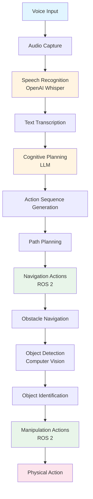

# LLM-Robotics Convergence

The convergence of Large Language Models (LLMs) and robotics represents one of the most significant developments in modern robotics. This integration enables robots to understand and respond to natural language commands, transforming how humans interact with robotic systems.

## What is Vision-Language-Action (VLA)?

**Vision-Language-Action (VLA)** is a unified framework that combines three critical capabilities:

1. **Vision**: The robot's ability to perceive and understand its environment through visual sensors
2. **Language**: The robot's ability to process and understand natural language commands
3. **Action**: The robot's ability to execute physical behaviors based on language instructions

VLA systems enable end-to-end natural language robot control, where a simple spoken command like "Clean the room" can be translated into a complete sequence of robot actions.

### The Significance of VLA in Humanoid Robotics

Humanoid robots are uniquely positioned to benefit from VLA systems because:

- **Natural interaction**: Humans naturally communicate through language, making VLA systems intuitive
- **Complex task decomposition**: Humanoid robots perform complex, multi-step tasks that benefit from language-driven planning
- **Contextual understanding**: VLA systems can understand context and adapt to different scenarios
- **Reduced programming burden**: Instead of programming every possible behavior, robots can understand and execute natural language instructions

## The Convergence of LLMs and Robotics

Large Language Models have revolutionized natural language processing, demonstrating remarkable capabilities in understanding, generating, and reasoning about language. When integrated with robotics, LLMs enable:

### Natural Language Understanding

LLMs can interpret spoken or written commands, understanding:
- **Intent**: What the user wants the robot to accomplish
- **Context**: The situation and environment in which the command is given
- **Constraints**: Implicit or explicit limitations on how the task should be performed

### Cognitive Planning

LLMs can decompose high-level instructions into executable action sequences:

- **Goal decomposition**: Breaking complex tasks into manageable sub-tasks
- **Action sequencing**: Determining the order in which actions should be executed
- **Dependency management**: Understanding which actions depend on others

### Contextual Reasoning

LLMs can reason about:
- **Robot capabilities**: What the robot can and cannot do
- **Environmental constraints**: Physical limitations and obstacles
- **Task feasibility**: Whether a command is possible given current conditions

## How VLA Transforms Robot Interaction Paradigms

Traditional robot programming requires:
- Explicit code for every behavior
- Detailed specification of every action
- Programming expertise to modify robot behavior
- Recompilation and redeployment for changes

VLA systems enable:
- **Natural language commands**: "Clean the room" instead of writing navigation and manipulation code
- **Dynamic behavior generation**: Robots can understand and execute new commands without reprogramming
- **Intuitive interaction**: Non-programmers can control robots through natural language
- **Adaptive behavior**: Robots can adapt to new scenarios based on language understanding

### Key Benefits

1. **Accessibility**: Non-technical users can interact with robots naturally
2. **Flexibility**: Robots can handle new tasks without explicit programming
3. **Efficiency**: Complex behaviors can be specified concisely through language
4. **Scalability**: New capabilities can be added through language understanding rather than code

## Applications of LLM-Robotics Integration

VLA systems enable numerous applications in humanoid robotics:

- **Domestic assistance**: Robots that understand commands like "Set the table" or "Help me cook"
- **Healthcare support**: Robots that can follow instructions like "Check on the patient" or "Bring medication"
- **Educational robots**: Robots that can understand and respond to student questions
- **Industrial assistance**: Robots that can understand complex assembly instructions

## The Foundation for Voice-to-Action and Cognitive Planning

Understanding LLM-robotics convergence provides the foundation for:

- **Voice-to-action systems**: How speech recognition connects to robot control
- **Cognitive planning**: How natural language becomes executable robot behaviors
- **Complete VLA pipelines**: How all components work together

This convergence is not just a technical integration—it represents a fundamental shift toward more intuitive, accessible, and capable robotic systems.

## VLA Pipeline Overview

The following diagram illustrates the complete VLA pipeline, showing how vision, language, and action integrate:

This diagram shows the complete flow from voice input to physical action, demonstrating how LLM-robotics convergence enables end-to-end natural language robot control.

## Summary

Vision-Language-Action (VLA) systems represent the convergence of LLMs and robotics, enabling natural language interaction with humanoid robots. This convergence transforms robot interaction from explicit programming to intuitive, conversational control. Understanding this foundation is essential for comprehending how voice-to-action and cognitive planning enable complete VLA pipelines.

## Next Steps

Now that you understand how LLMs and robotics converge, proceed to [Voice-to-Action](./voice-to-action.md) to learn how speech recognition technology enables natural language input for robots.

