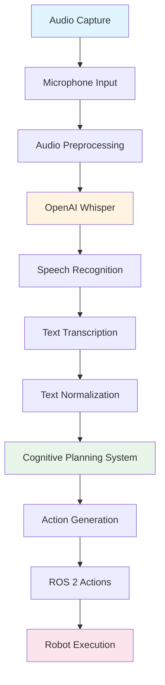

# Voice-to-Action Using OpenAI Whisper

Voice-to-action systems enable humans to control robots through natural speech, making robot interaction as intuitive as talking to another person. This section explores how OpenAI Whisper enables this capability and the complete pipeline from voice input to robot action.

## How OpenAI Whisper Enables Voice-to-Action

**OpenAI Whisper** is a state-of-the-art speech recognition system that converts spoken language into text. For humanoid robots, Whisper serves as the bridge between human speech and robot understanding, enabling:

- **High-accuracy transcription**: Converting speech to text with remarkable accuracy across languages and accents
- **Real-time processing**: Processing audio streams quickly enough for interactive robot control
- **Robust performance**: Handling noisy environments and varying audio quality
- **Language flexibility**: Supporting multiple languages and dialects

### Whisper's Role in VLA Systems

In VLA systems, Whisper performs the critical first step of converting audio input into text that can be processed by language models:

1. **Audio capture**: Microphones capture spoken commands
2. **Speech recognition**: Whisper transcribes audio to text
3. **Text processing**: The transcribed text becomes input for cognitive planning
4. **Action generation**: Cognitive planning translates text to robot actions

## The Voice-to-Action Pipeline

The complete voice-to-action pipeline consists of four main stages:

### Stage 1: Audio Capture

The robot's microphones capture spoken commands as audio waveforms. This stage involves:

- **Audio acquisition**: Capturing sound waves through microphones
- **Preprocessing**: Filtering noise and normalizing audio levels
- **Format conversion**: Preparing audio in a format suitable for speech recognition

### Stage 2: Speech Recognition

OpenAI Whisper processes the audio and converts it to text:

- **Audio analysis**: Analyzing the audio waveform for speech patterns
- **Language detection**: Identifying the language being spoken
- **Text transcription**: Converting speech to written text
- **Confidence scoring**: Providing confidence levels for transcription accuracy

### Stage 3: Text Transcription

The transcribed text is prepared for further processing:

- **Text normalization**: Standardizing formatting and punctuation
- **Intent extraction**: Identifying the core command or request
- **Context preservation**: Maintaining relevant context from the conversation

### Stage 4: Action Generation

The transcribed text is passed to cognitive planning systems:

- **Intent understanding**: Determining what the user wants the robot to do
- **Plan generation**: Creating a sequence of robot actions
- **Action execution**: Executing the generated actions through ROS 2

## Python Code Example: Whisper Integration Pattern

The following example demonstrates how Whisper might be integrated into a voice-to-action system. This is a conceptual pattern showing the key integration points:

```python
# Voice-to-Action Integration Pattern
# This example shows how Whisper API calls integrate with VLA systems

import whisper
import rclpy
from rclpy.node import Node
from std_msgs.msg import String

class VoiceToActionNode(Node):
    """
    ROS 2 node that integrates Whisper for voice-to-action capabilities.
    This demonstrates the integration pattern, not a full implementation.
    """
    
    def __init__(self):
        super().__init__('voice_to_action_node')
        
        # Initialize Whisper model (conceptual - actual initialization varies)
        # In practice, you would load the Whisper model or connect to API
        self.whisper_model = whisper.load_model("base")  # Example model loading
        
        # ROS 2 publisher for sending transcribed text to cognitive planning
        self.text_publisher = self.create_publisher(
            String, 
            'voice_transcription', 
            10
        )
        
        # ROS 2 subscriber for receiving audio data
        self.audio_subscriber = self.create_subscription(
            AudioData,  # Audio message type (conceptual)
            'audio_input',
            self.process_audio_callback,
            10
        )
    
    def process_audio_callback(self, audio_msg):
        """
        Process incoming audio and transcribe using Whisper.
        This demonstrates the voice-to-action pipeline integration.
        """
        # Stage 1: Audio capture (already received via ROS 2)
        audio_data = audio_msg.data
        
        # Stage 2: Speech recognition using Whisper
        # Whisper transcribes audio to text
        result = self.whisper_model.transcribe(audio_data)
        transcribed_text = result["text"]
        
        # Stage 3: Text transcription (normalization)
        normalized_text = self.normalize_text(transcribed_text)
        
        # Stage 4: Publish to cognitive planning system
        # The cognitive planning node will receive this and generate actions
        text_msg = String()
        text_msg.data = normalized_text
        self.text_publisher.publish(text_msg)
        
        self.get_logger().info(f'Transcribed: {transcribed_text}')
    
    def normalize_text(self, text):
        """
        Normalize transcribed text for cognitive planning.
        This is a simplified example of text preprocessing.
        """
        # Remove extra whitespace, normalize capitalization, etc.
        normalized = text.strip().lower()
        return normalized

def main():
    rclpy.init()
    node = VoiceToActionNode()
    rclpy.spin(node)
    rclpy.shutdown()

if __name__ == '__main__':
    main()
```

### Key Integration Points

This example demonstrates:

1. **Whisper model loading**: How Whisper is initialized (conceptual pattern)
2. **Audio processing**: How audio flows through the system
3. **Text transcription**: How Whisper converts speech to text
4. **ROS 2 integration**: How transcribed text is published for cognitive planning
5. **Pipeline flow**: How all stages connect in the voice-to-action pipeline

## Connecting Voice-to-Action to Cognitive Planning

The voice-to-action pipeline connects seamlessly to cognitive planning:

- **Text output**: Whisper's transcribed text becomes input for cognitive planning
- **Intent preservation**: The meaning and intent of spoken commands are preserved in text
- **Context continuity**: Conversation context can be maintained across multiple voice commands
- **Error handling**: Transcription errors can be detected and handled before cognitive planning

This connection enables the complete flow: **Voice → Text → Cognitive Plan → Robot Actions**.

## Voice-to-Action Pipeline Diagram

The following diagram illustrates the complete voice-to-action pipeline:



This diagram shows how audio flows through the system, from capture to robot execution, with Whisper performing the critical speech-to-text conversion.

## Summary

OpenAI Whisper enables voice-to-action capabilities by converting spoken commands into text that cognitive planning systems can process. The complete pipeline flows from audio capture through speech recognition, text transcription, and action generation. Understanding this pipeline is essential for comprehending how natural language input becomes robot behavior.

## Next Steps

Now that you understand voice-to-action systems, proceed to [Cognitive Planning](./cognitive-planning.md) to learn how LLMs translate natural language commands into ROS 2 action sequences.

