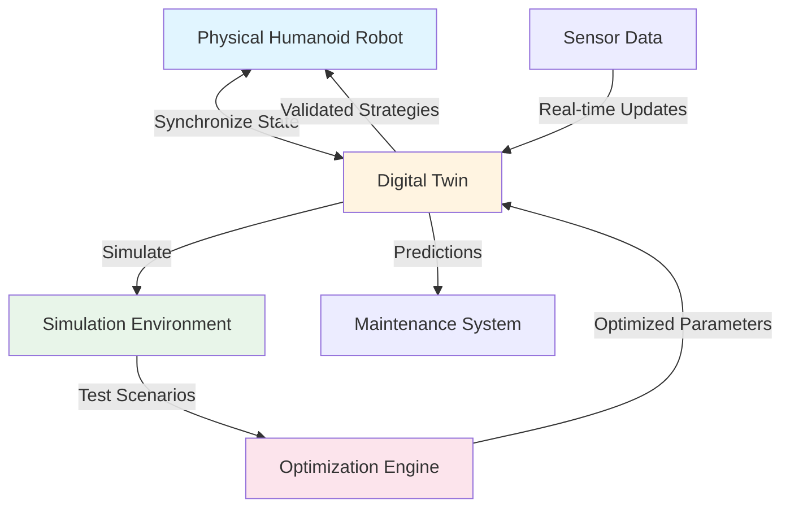

# Digital Twins

ایک **digital twin** ایک physical system کا virtual replica ہے جو اپنے real-world counterpart کے ساتھ synchronized connection برقرار رکھتا ہے۔ Humanoid robotics میں، digital twins developers کو test، optimize، اور validate کرنے کے قابل بناتے ہیں robot behavior کو safe virtual environment میں physical hardware پر deploy کرنے سے پہلے۔

## Digital Twin کیا ہے؟

ایک digital twin simple simulation سے آگے جاتا ہے۔ یہ comprehensive virtual representation ہے جو:

- **Synchronize** کرتا ہے physical system کے ساتھ، state alignment برقرار رکھتے ہوئے
- **Behavior model** کرتا ہے physics-based اور data-driven approaches استعمال کرتے ہوئے
- **Prediction enable** کرتا ہے future states اور outcomes کا
- **Optimization support** کرتا ہے safe virtual experimentation کے ذریعے
- **Insights فراہم** کرتا ہے decision-making اور maintenance کے لیے

### Physical Robots کے ساتھ Relationship

ایک digital twin اپنے physical counterpart کے ساتھ bidirectional relationship برقرار رکھتا ہے:

1. **Physical → Virtual**: Sensor data اور state information physical robot سے flow کرتی ہے digital twin کو update کرنے کے لیے
2. **Virtual → Physical**: Optimized parameters، validated strategies، اور predictions digital twin سے flow کرتے ہیں physical robot configuration کو inform کرنے کے لیے

یہ bidirectional flow digital twin کو دونوں reality reflect کرنے اور اسے influence کرنے کے قابل بناتا ہے۔

## Digital Twins vs. Traditional Simulations

Digital twins کو traditional simulations سے distinguish کرنا important ہے:

| Aspect | Traditional Simulation | Digital Twin |
|--------|----------------------|--------------|
| **Connection** | Standalone، independent | Physical system کے ساتھ synchronized |
| **Purpose** | Specific scenarios test کریں | Continuous monitoring اور optimization |
| **Data Source** | Modeled یا synthetic | Physical system سے real sensor data |
| **Update Frequency** | On-demand یا batch | Real-time یا near-real-time |
| **Scope** | Specific use cases | Comprehensive system representation |
| **Lifecycle** | Project-based | Continuous، system lifecycle کے دوران |

### Key Distinction

ایک **simulation** isolation میں "what if" scenarios test کرنے کا tool ہے۔ ایک **digital twin** ایک living، synchronized representation ہے جو physical system کے ساتھ evolve ہوتا ہے اور continuous optimization اور predictive maintenance کو ممکن بناتا ہے۔

## Humanoid Robotics کے لیے Digital Twins کیوں Valuable ہیں

Digital twins humanoid robotics development کے لیے several critical advantages فراہم کرتے ہیں:

### 1. Safe Testing

Humanoid robots expensive اور complex ہیں۔ Physical hardware پر نئے walking gaits، manipulation strategies، یا safety protocols test کرنا risks شامل کرتا ہے:

- **Hardware damage** falls یا collisions سے
- **Safety hazards** operators اور bystanders کے لیے
- **High costs** repairs اور downtime کے

Digital twins virtual environments میں thousands of tests کو ممکن بناتے ہیں physical hardware کو zero risk کے ساتھ۔

### 2. Rapid Iteration

Physical testing slow ہے۔ ہر test cycle درکار ہے:

- Physical environment set up کرنا
- Robot configure کرنا
- Test execute کرنا
- Results analyze کرنا
- Adjustments کرنا

Digital twins rapid iteration کو ممکن بناتے ہیں جہاں tests parallel میں چل سکتے ہیں، scenarios automated ہو سکتے ہیں، اور results immediately available ہوتے ہیں۔

### 3. Optimization

Digital twins optimization strategies کو ممکن بناتے ہیں جو physical testing کے ساتھ impractical ہوں گی:

- **Parameter sweeps**: Thousands of parameter combinations automatically test کریں
- **Genetic algorithms**: Generations of virtual testing کے ذریعے optimal behaviors evolve کریں
- **Reinforcement learning**: Control policies safely train کریں simulation میں
- **Multi-objective optimization**: Competing goals balance کریں (speed، stability، energy efficiency)

### 4. Predictive Maintenance

Digital twin کی state monitor کر کے اور اس کا physical sensor data سے comparison کر کے، developers کر سکتے ہیں:

- **Failures predict** کریں وہ occur ہونے سے پہلے
- **Wear patterns identify** کریں joints اور actuators میں
- **Maintenance schedules optimize** کریں actual usage کی بنیاد پر
- **Downtime reduce** کریں proactive interventions کے ذریعے

### 5. Cost Reduction

Digital twins development costs reduce کرتے ہیں:

- Physical prototype iterations minimize کر کے
- Testing سے hardware damage reduce کر کے
- Multiple strategies کی parallel development enable کر کے
- Time-to-deployment shorten کر کے

## Digital Twin Architecture

*Figure 1: Digital twin architecture bidirectional synchronization دکھاتا ہے physical robot اور virtual replica کے درمیان، simulation environment اور optimization capabilities کے ساتھ۔ Digital twin real-time sensor data receive کرتا ہے، virtual environment میں scenarios simulate کرتا ہے، parameters optimize کرتا ہے، اور validated strategies physical robot کو واپس فراہم کرتا ہے۔*

Architecture دکھاتی ہے:

- **Physical Robot** (blue) - Real-world humanoid robot
- **Digital Twin** (yellow) - Virtual replica synchronized state برقرار رکھتے ہوئے
- **Simulation Environment** (green) - Testing کے لیے virtual world
- **Optimization Engine** (pink) - Optimal solutions تلاش کرنے کے لیے algorithms

## Humanoid Robotics میں Applications

Digital twins several key applications کو ممکن بناتے ہیں:

### Gait Optimization

Physical humanoid robot پر walking patterns test کرنا risky اور time-consuming ہے۔ Digital twins enable کرتے ہیں:

- Thousands of gait parameters safely test کرنا
- Speed، stability، اور energy efficiency کے لیے optimize کرنا
- Different terrains پر gaits validate کرنا
- Physical implementation سے پہلے movements refine کرنا

### Manipulation Planning

Grasping اور manipulation precise control درکار کرتے ہیں۔ Digital twins enable کرتے ہیں:

- Virtual environments میں manipulation strategies test کرنا
- Grasp poses اور trajectories optimize کرنا
- Physical trials سے پہلے object handling validate کرنا
- Simulation کے ذریعے manipulation policies train کرنا

### Safety Testing

Safety humanoid robotics میں paramount ہے۔ Digital twins enable کرتے ہیں:

- Risk کے بغیر failure scenarios test کرنا
- Emergency stop behaviors validate کرنا
- Collision scenarios simulate کرنا
- Deployment سے پہلے safety protocols verify کرنا

## Summary

Digital twins physical systems کے virtual replicas ہیں جو اپنے real-world counterparts کے ساتھ synchronized connections برقرار رکھتے ہیں۔ وہ traditional simulations سے مختلف ہیں continuous synchronization، real-time updates، اور comprehensive system representation فراہم کر کے۔ Humanoid robotics کے لیے، digital twins safe testing، rapid iteration، optimization، predictive maintenance، اور cost reduction کو ممکن بناتے ہیں۔

## Next Steps

اب جب کہ آپ digital twins کو سمجھ گئے ہیں، [Simulation Fundamentals](/ur/modules/module-2-digital-twins-simulation/simulation-fundamentals) پر جائیں تاکہ سیکھیں کہ simulation environments کیسے کام کرتے ہیں اور یہ digital twins کو effectively function کرنے کے قابل کیسے بناتے ہیں۔

## Cross-References

Sensors کی طرف سے استعمال ہونے والے ROS 2 communication patterns کے بارے میں مزید معلومات کے لیے، [ماڈیول 1 کے communication patterns](/ur/modules/module-1-ros2-nervous-system/communication-patterns) دیکھیں۔
