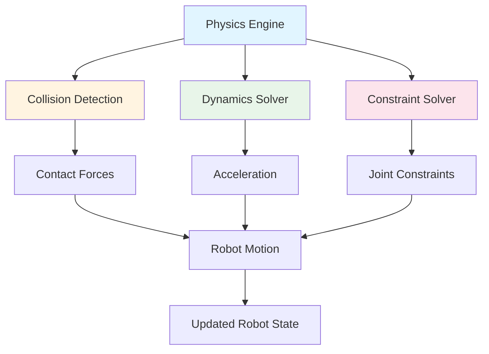
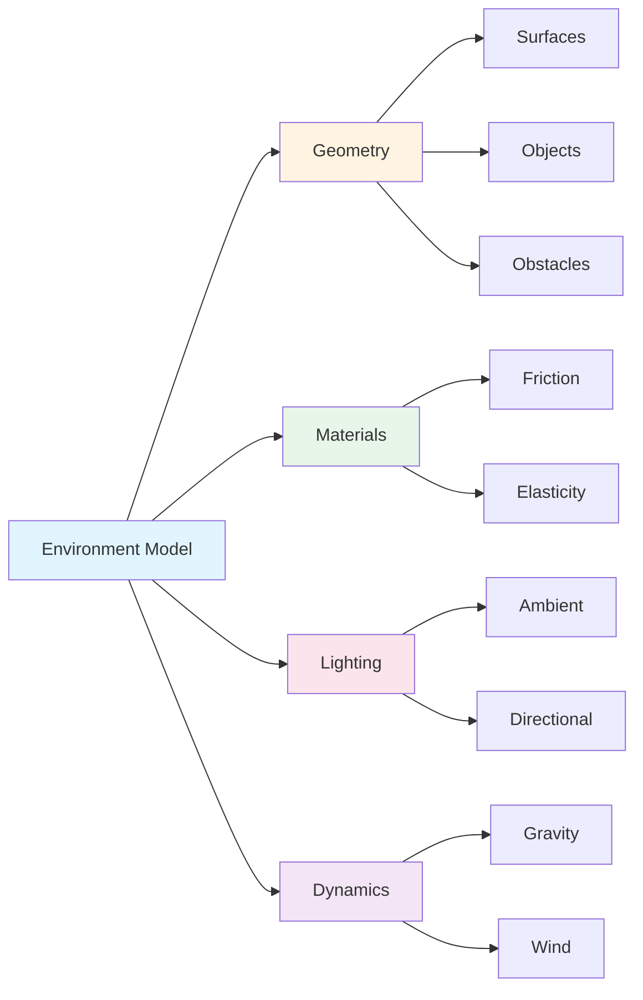

# Simulation Fundamentals

Simulation environments virtual worlds فراہم کرتے ہیں جہاں humanoid robots safely operate کر سکتے ہیں، developers کو test کرنے، validate کرنے، اور optimize کرنے کے قابل بناتے ہوئے behaviors، algorithms، اور performance کو physical hardware کے بغیر۔ یہ سمجھنا کہ یہ environments کیسے کام کرتے ہیں essential ہے digital twins کو effectively leverage کرنے کے لیے۔

## Simulation Environment کیا ہے؟

ایک **simulation environment** ایک virtual world ہے جو physical reality کو replicate کرتا ہے sufficient fidelity کے ساتھ robotic testing کے لیے۔ یہ تین core components پر مشتمل ہے:

1. **Physics Engine** - Physical laws simulate کرتا ہے (gravity، collisions، dynamics)
2. **Sensor Models** - Virtual sensors جو physical sensor behavior replicate کرتے ہیں
3. **Environment Geometry** - 3D models دنیا represent کرتے ہیں (surfaces، objects، obstacles)

مل کر، یہ components realistic virtual space بناتے ہیں جہاں robots operate، interact، اور test کیے جا سکتے ہیں۔

## Physics Engines

ایک **physics engine** computational system ہے جو virtual environment میں physical laws simulate کرتا ہے۔ یہ calculate کرتا ہے کہ objects کیسے move، collide، اور interact کرتے ہیں physics principles کی بنیاد پر۔

### Physics Engines Robot Dynamics کو کیسے Model کرتے ہیں

Physics engines robot dynamics کو model کرتے ہیں:

1. **Robot represent** کرتے ہیں rigid bodies (links) کے collection کے طور پر joints سے connected
2. **Forces calculate** کرتے ہیں ہر body پر acting (gravity، contact forces، joint torques)
3. **Equations of motion solve** کرتے ہیں determine کرنے کے لیے کہ bodies وقت کے ساتھ کیسے move کرتے ہیں
4. **Collisions detect** کرتے ہیں robot parts اور environment کے درمیان
5. **Collisions resolve** کرتے ہیں appropriate forces apply کر کے

Humanoid robots کے لیے، اس کا مطلب ہے کہ physics engine:

- Robot کی **mass distribution** simulate کرتا ہے body segments میں
- **Joint constraints** model کرتا ہے (limbs ایک دوسرے کے relative کیسے move کر سکتے ہیں)
- **Balance اور stability** calculate کرتا ہے center of mass کی بنیاد پر
- **Contact forces** handle کرتا ہے جب feet ground کو touch کرتے ہیں
- **Inertia اور momentum** simulate کرتا ہے movement کے دوران

### Physics Engine Components



*Figure 1: Physics engine components collision detection، dynamics solver، اور constraint solver دکھاتے ہیں مل کر robot motion compute کرتے ہوئے۔*

Physics engine ہر simulation timestep پر ان components کو integrate کرتا ہے realistic robot behavior compute کرنے کے لیے۔

### Example: Basic Physics Simulation

```python
# Example: Conceptual physics simulation for humanoid robot
# This demonstrates how physics engines model robot dynamics

class PhysicsEngine:
    """Conceptual representation of a physics engine for humanoid robots"""
    
    def __init__(self, timestep=0.001):
        self.timestep = timestep  # Simulation time step (seconds)
        self.gravity = 9.81  # m/s²
        
    def compute_forces(self, robot_state, joint_torques):
        """Compute forces acting on robot based on current state"""
        # Gravity force on each body segment
        gravity_forces = self.compute_gravity(robot_state)
        
        # Contact forces from ground
        contact_forces = self.detect_contacts(robot_state)
        
        # Joint torques from actuators
        joint_forces = self.apply_torques(joint_torques)
        
        return gravity_forces + contact_forces + joint_forces
    
    def solve_dynamics(self, forces, robot_state):
        """Solve equations of motion to compute acceleration"""
        # F = ma → a = F/m
        acceleration = forces / robot_state.mass
        
        # Update velocity: v = v₀ + at
        new_velocity = robot_state.velocity + acceleration * self.timestep
        
        # Update position: x = x₀ + vt
        new_position = robot_state.position + new_velocity * self.timestep
        
        return new_position, new_velocity
    
    def step(self, robot_state, joint_torques):
        """Advance simulation by one timestep"""
        forces = self.compute_forces(robot_state, joint_torques)
        new_position, new_velocity = self.solve_dynamics(forces, robot_state)
        return RobotState(new_position, new_velocity)
```

یہ example دکھاتا ہے کہ physics engine conceptually کیسے robot motion compute کرتا ہے:

1. Forces calculate کرتے ہوئے (gravity، contact، joint torques)
2. Dynamics equations solve کرتے ہوئے acceleration حاصل کرنے کے لیے
3. Integrating position اور velocity update کرنے کے لیے
4. ہر timestep پر repeating

## Sensor Simulation

**Sensor simulation** virtual sensors بنانے کا شامل ہے جو physical sensors کے behavior کو replicate کرتے ہیں۔ یہ virtual sensors realistic data generate کرتے ہیں جو robots perception اور decision-making کے لیے استعمال کر سکتے ہیں۔

### Virtual Sensors Physical Sensor Behavior کو کیسے Replicate کرتے ہیں

Virtual sensors physical sensors کو model کرتے ہیں:

1. **Virtual data capture** کرتے ہوئے simulation environment سے
2. **Sensor characteristics apply** کرتے ہوئے (noise، latency، resolution)
3. **Data format** کرتے ہوئے physical sensor output سے match کرنے کے لیے
4. **Data publish** کرتے ہوئے realistic update rates پر

### Simulated Sensors کی Types

#### Vision Sensors (Cameras)

Virtual cameras simulation environment سے images capture کرتے ہیں:

- **Rendering** 3D scene camera کے viewpoint سے
- **Sensor noise apply** کرتے ہوئے real camera imperfections simulate کرنے کے لیے
- **Formatting** image messages کے طور پر (physical cameras کی طرح)
- **Publishing** realistic frame rates پر (مثلاً، 30 FPS)

#### Proprioceptive Sensors (IMUs، Joint Encoders)

Virtual proprioceptive sensors robot internal state measure کرتے ہیں:

- **IMUs** orientation اور acceleration measure کرتے ہیں physics engine state سے
- **Joint encoders** joint angles directly read کرتے ہیں simulation سے
- **Noise adding** sensor imperfections simulate کرنے کے لیے
- **Publishing** high frequencies پر (مثلاً، 100-1000 Hz)

#### Tactile Sensors

Virtual tactile sensors contact detect کرتے ہیں:

- **Collision detection** identify کرتا ہے جب robot objects کو touch کرتا ہے
- **Force calculation** contact forces determine کرتا ہے
- **Formatting** tactile sensor messages کے طور پر
- **Publishing** جب contact events occur ہوتے ہیں

### Sensor Simulation Benefits

Virtual sensors enable کرتے ہیں:

- **Perception algorithms test** کرنا physical hardware کے بغیر
- **Training data generate** کرنا machine learning کے لیے
- **Sensor fusion validate** کرنا approaches
- **Edge cases test** کرنا (extreme lighting، sensor failures)

## Environment Modeling

**Environment modeling** دنیا کی 3D representations بنانے کا شامل ہے جہاں robots operate کرتے ہیں۔ یہ models surfaces، objects، obstacles، اور environmental conditions define کرتے ہیں۔

### Different Environments Represent کرنا

Simulation environments مختلف real-world scenarios represent کر سکتے ہیں:

#### Indoor Environments

- **Structured spaces** walls، floors، ceilings کے ساتھ
- **Furniture اور objects** (tables، chairs، obstacles)
- **Lighting conditions** (natural اور artificial)
- **Floor surfaces** (carpet، tile، wood)

#### Outdoor Environments

- **Terrain** (grass، concrete، gravel، slopes)
- **Weather conditions** (rain، wind، fog)
- **Natural obstacles** (trees، rocks، uneven ground)
- **Lighting variations** (day، night، shadows)

#### Structured vs. Unstructured

- **Structured**: Predictable layouts (homes، offices، factories)
- **Unstructured**: Variable layouts (outdoor terrain، disaster zones)

### Environment Components



*Figure 2: Simulation environment components geometry، materials، lighting، اور dynamics دکھاتے ہیں جو realistic virtual worlds بناتے ہیں۔*

## Simulations Safe Testing اور Rapid Iteration کو کیسے Enable کرتے ہیں

Simulations humanoid robotics development کے لیے دو critical advantages فراہم کرتے ہیں:

### Safe Testing

Humanoid robots کی physical testing risks شامل کرتی ہے:

- **Hardware damage** falls یا collisions سے
- **Safety hazards** operators اور bystanders کے لیے
- **High costs** repairs اور downtime کے
- **Limited test scenarios** safety constraints کی وجہ سے

Simulations ان risks کو eliminate کرتے ہیں:

- **Virtual environments میں testing** zero physical risk کے ساتھ
- **Edge cases explore** کرنا (extreme scenarios، failures) safely
- **Safety protocols validate** کرنا physical deployment سے پہلے
- **Failure modes test** کرنا hardware damage کیے بغیر

### Rapid Iteration

Physical testing slow ہے۔ ہر test cycle درکار ہے:

- Physical environment set up کرنا
- Robot hardware configure کرنا
- Test execute کرنا
- Results analyze کرنا
- Adjustments کرنا

Simulations rapid iteration enable کرتے ہیں:

- **Tests parallel میں run** کرنا (multiple scenarios simultaneously)
- **Test execution automate** کرنا (thousands of tests automatically)
- **Immediate feedback** (results instantly available)
- **Easy parameter sweeps** (many configurations quickly test کرنا)
- **Replay اور analysis** (کسی بھی test scenario review کرنا)

### Example: Testing Walking Gait

```python
# Example: Rapid iteration of walking gait testing in simulation

def test_walking_gait(simulation, gait_parameters):
    """Test a walking gait configuration in simulation"""
    # Reset simulation to starting state
    simulation.reset()
    
    # Configure gait parameters
    simulation.set_gait_parameters(gait_parameters)
    
    # Run simulation for 10 seconds
    for _ in range(10000):  # 10 seconds at 1ms timestep
        simulation.step()
        
        # Check for failure (fall, collision)
        if simulation.robot_fallen():
            return {"success": False, "reason": "robot_fallen"}
    
    # Analyze results
    distance = simulation.get_distance_traveled()
    stability = simulation.get_stability_metric()
    energy = simulation.get_energy_consumed()
    
    return {
        "success": True,
        "distance": distance,
        "stability": stability,
        "energy": energy
    }

# Test 1000 different gait parameter combinations
results = []
for params in generate_gait_parameters(1000):
    result = test_walking_gait(simulation, params)
    results.append(result)

# Find optimal gait
optimal_gait = max(results, key=lambda r: r["stability"] * r["distance"] / r["energy"])
```

یہ example دکھاتا ہے کہ simulations کیسے enable کرتے ہیں:
- **Automated testing** many configurations کا
- **Rapid evaluation** ہر configuration کا
- **Objective comparison** results کا
- **Optimal solutions تلاش** efficiently

## Summary

Simulation environments تین core components پر مشتمل ہیں: physics engines (physical laws modeling)، sensor models (physical sensors replicating)، اور environment geometry (دنیا represent کرنا)۔ یہ components مل کر realistic virtual worlds بناتے ہیں جہاں humanoid robots safely test کیے جا سکتے ہیں اور rapidly iterated ہو سکتے ہیں۔ Physics engines robot dynamics compute کرتے ہیں، virtual sensors realistic data generate کرتے ہیں، اور environment models مختلف real-world scenarios represent کرتے ہیں۔ Simulations safe testing کو ممکن بناتے ہیں physical risk کے بغیر اور rapid iteration automated، parallel test execution کے ذریعے۔

## Next Steps

اب جب کہ آپ simulation fundamentals کو سمجھ گئے ہیں، [Sensor Integration](/ur/modules/module-2-digital-twins-simulation/sensor-integration) پر جائیں تاکہ سیکھیں کہ sensors کیسے ROS 2 سے connect ہوتے ہیں اور robot perception کے لیے data فراہم کرتے ہیں۔

## Cross-References

Sensor data communication کے لیے استعمال ہونے والے ROS 2 topics کے بارے میں مزید معلومات کے لیے، [ماڈیول 1 کے communication patterns](/ur/modules/module-1-ros2-nervous-system/communication-patterns) دیکھیں۔
