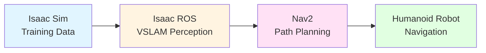

# AI-Robot Brain Concept

**AI-robot brain** capabilities کا integrated system ہے جو autonomous humanoid robots کو learn، perceive، اور navigate کرنے کے قابل بناتا ہے۔ جیسا کہ human brain perception، decision-making، اور movement coordinate کرتا ہے، AI-robot brain تین critical capabilities combine کرتا ہے: simulation کے ذریعے training، real-time perception، اور intelligent path planning۔

## Three-Component Framework

AI-robot brain تین interconnected components پر مشتمل ہے جو complete workflow بناتے ہیں:

1. **Training** (NVIDIA Isaac Sim): Synthetic data generate کرنا perception algorithms train کرنے کے لیے
2. **Perception** (Isaac ROS): Real-time visual understanding اور localization
3. **Planning** (Nav2): Safe paths compute کرنا bipedal humanoid movement کے لیے

یہ workflow progression represent کرتا ہے learning سے sensing سے acting تک—robots کو اپنے environment سمجھنے اور intelligently اس کے ذریعے move کرنے کے قابل بناتے ہوئے۔

## Training → Perception → Planning Progression

### Training: Simulation سے Learning

AI-robot brain **training** سے شروع ہوتا ہے—perception algorithms سکھانا visual information سمجھنے کے لیے۔ Traditional machine learning کے برعکس جو massive amounts of real-world data collect کرنے کی ضرورت کرتی ہے، training component photorealistic simulation استعمال کرتا ہے synthetic training data generate کرنے کے لیے۔

**Key Capabilities**:
- Realistic virtual environments بنانا proper lighting، textures، اور physics کے ساتھ
- Labeled training data generate کرنا (images، depth maps، annotations)
- Algorithm training enable کرنا physical data collection کے بغیر

یہ training phase perception systems کو prepare کرتی ہے objects recognize کرنے، spatial relationships سمجھنے، اور visual information accurately process کرنے کے لیے۔

### Perception: Environment سمجھنا

ایک بار trained ہونے کے بعد، perception systems robots کو enable کرتے ہیں **real-time میں اپنے environment سمجھنے** کے لیے۔ Visual sensors (cameras) استعمال کرتے ہوئے، perception component incoming visual information process کرتا ہے:

- **Environment map** کریں: Robot کے اردگرد space کی representation build کریں
- **Robot localize** کریں: Robot کی position اور orientation determine کریں اس map میں
- **Obstacles detect** کریں: Objects، people، اور barriers identify کریں جو navigation affect کرتے ہیں

یہ perception capability computationally intensive ہے، hardware acceleration (GPUs) درکار کرتی ہے visual data process کرنے کے لیے fast enough real-time robot operation کے لیے۔

### Planning: Intelligently Navigating

Perception environmental understanding فراہم کرتے ہوئے، planning component **safe اور efficient paths** compute کرتا ہے robot کے move کرنے کے لیے۔ Humanoid robots کے لیے، یہ planning particularly complex ہے کیونکہ اسے account کرنا چاہیے:

- **Balance requirements**: Walking کے دوران stability برقرار رکھنا
- **Foot placement constraints**: یقینی بنانا کہ ہر step stable، flat surface پر land ہو
- **Terrain adaptation**: Slopes، obstacles، اور uneven surfaces کے لیے movement adjust کرنا

Planning component perception data استعمال کرتا ہے paths تلاش کرنے کے لیے جو safe اور achievable دونوں ہیں bipedal robot کے لیے۔

## Components کیسے مل کر Fit ہوتے ہیں

AI-robot brain میں ہر component ایک specific role serve کرتا ہے:

- **NVIDIA Isaac Sim (Training)**: Training data generate کرتا ہے جو perception algorithms کو enable کرتا ہے visual information سمجھنے کے لیے
- **Isaac ROS (Perception)**: Trained algorithms استعمال کرتا ہے real-world visual data process کرنے اور environmental understanding فراہم کرنے کے لیے
- **Nav2 (Planning)**: Perception data استعمال کرتا ہے movement paths compute کرنے کے لیے جو humanoid-specific constraints account کرتے ہیں

Workflow sequential ہے: training perception کو enable کرتا ہے، اور perception planning کو inform کرتا ہے۔ تاہم، practice میں، یہ components continuously اور concurrently کام کرتے ہیں—perception constantly environment map update کرتا ہے جبکہ planning continuously نئے paths compute کرتا ہے جیسے robot move کرتا ہے۔

## Real-World Application

ایک humanoid robot consider کریں جو indoor environment کے ذریعے navigate کر رہا ہے goal location تک پہنچنے کے لیے:

1. **Training phase** (deployment سے پہلے): Isaac Sim thousands of synthetic images generate کرتا ہے different indoor environments، lighting conditions، اور obstacles دکھاتے ہوئے۔ Perception algorithms اس data پر train ہوتے ہیں walls، doors، furniture، اور people recognize کرنے کے لیے۔

2. **Perception phase** (operation کے دوران): Isaac ROS camera images process کرتا ہے real-time میں، trained algorithms استعمال کرتے ہوئے environment کا map build کرنے اور robot کی position determine کرنے کے لیے اس میں۔

3. **Planning phase** (operation کے دوران): Nav2 perception سے map اور robot position استعمال کرتا ہے، goal location کے ساتھ، path compute کرنے کے لیے۔ یہ path humanoid constraints consider کرتا ہے: ہر step flat، stable surface پر land ہونا چاہیے، اور robot movement کے دوران balance برقرار رکھنا چاہیے۔

AI-robot brain یہ complete autonomous navigation capability enable کرتا ہے، demonstrating کرتے ہوئے کہ training، perception، اور planning کیسے مل کر کام کرتے ہیں integrated system کے طور پر۔

## یہ Framework کیوں اہم ہے

AI-robot brain framework ہمیں سمجھنے میں مدد کرتا ہے:

- **Robots کیسے سیکھتے ہیں**: Simulation میں synthetic data generation کے ذریعے
- **Robots کیسے دیکھتے ہیں**: Hardware-accelerated visual processing کے ذریعے
- **Robots کیسے move کرتے ہیں**: Intelligent path planning adapted humanoids کے لیے
- **Components کیسے integrate ہوتے ہیں**: ہر component اگلے پر build کرتا ہے اور اسے enable کرتا ہے

یہ framework mental model فراہم کرتا ہے سمجھنے کے لیے کہ modern humanoid robots کیسے autonomous capabilities achieve کرتے ہیں—isolated systems کے طور پر نہیں، بلکہ integrated brain کے طور پر جو learn، perceive، اور plan کرتا ہے۔

## Summary

AI-robot brain integrated system ہے جو autonomous humanoid robots کو enable کرتا ہے۔ یہ combine کرتا ہے:

- **Training** (NVIDIA Isaac Sim): Algorithm training کے لیے synthetic data generation
- **Perception** (Isaac ROS): Real-time visual understanding اور localization
- **Planning** (Nav2): Bipedal movement کے لیے intelligent path planning

یہ تین components complete workflow بناتے ہیں: training perception کو enable کرتا ہے، اور perception planning کو inform کرتا ہے۔ مل کر، وہ humanoid robots کو enable کرتے ہیں autonomously navigate کرنے کے لیے complex environments کے ذریعے۔

## Next Steps

اب جب کہ آپ AI-robot brain framework کو سمجھ گئے ہیں، ہر component explore کریں detail میں:

1. **NVIDIA Isaac Sim**: سیکھیں کہ photorealistic simulation کیسے training data generate کرتا ہے
2. **Isaac ROS**: سمجھیں کہ hardware-accelerated VSLAM کیسے real-time perception enable کرتا ہے
3. **Nav2**: دریافت کریں کہ path planning کیسے adapt ہوتا ہے bipedal humanoid movement کے لیے

ہر component section آپ کو دکھائے گا کہ یہ capabilities کیسے کام کرتی ہیں اور کیوں وہ essential ہیں autonomous humanoid robots کے لیے۔
