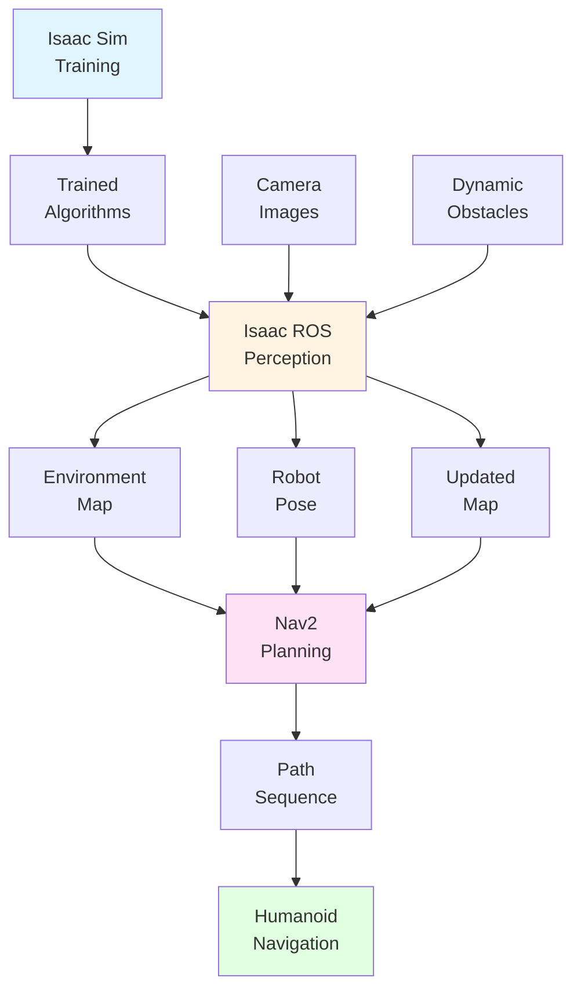

# Integrated Applications: Complete AI-Robot Brain Workflow

Individual tools سمجھنا important ہے، لیکن AI-robot brain کی real power اس سے آتی ہے کہ **Isaac Sim، Isaac ROS، اور Nav2 کیسے مل کر کام کرتے ہیں** integrated system کے طور پر۔ یہ section complete workflow demonstrate کرتا ہے: simulation میں perception algorithms train کرنے سے physical environments میں real-time navigation تک۔

## Complete Workflow

AI-robot brain workflow clear progression follow کرتا ہے:

```
Training (Isaac Sim) → Perception (Isaac ROS) → Planning (Nav2) → Navigation
```

ہر component previous one پر build کرتا ہے، complete system بناتے ہوئے autonomous humanoid robot navigation کے لیے۔

### Training Phase: Simulation سے Learning

**NVIDIA Isaac Sim** synthetic training data generate کرتا ہے:

1. Photorealistic virtual environments create کریں
2. Images render کریں realistic lighting اور materials کے ساتھ
3. Ground truth labels automatically generate کریں
4. Diverse training datasets create کریں variations کے ساتھ

**Output**: Trained perception algorithms جو visual information سمجھتے ہیں

### Perception Phase: Real-Time میں Understanding

**Isaac ROS** trained algorithms deploy کرتا ہے real-time perception کے لیے:

1. Camera images process کریں trained algorithms استعمال کرتے ہوئے
2. Visual features extract کریں اور movement track کریں
3. Environment maps build کریں
4. Robot position localize کریں maps میں

**Output**: Real-time environmental understanding اور robot localization

### Planning Phase: Safe Paths Computing

**Nav2** perception data استعمال کرتا ہے path planning کے لیے:

1. Perception سے environment maps access کریں
2. Humanoid constraints consider کریں (balance، foot placement)
3. Goal locations تک safe paths compute کریں
4. Bipedal movement کے لیے step sequences generate کریں

**Output**: Safe، executable movement paths

### Navigation: Autonomous Movement

Robot planned paths execute کرتا ہے جبکہ continuously:

1. New visual information کی بنیاد پر perception update کرنا
2. Environment changes کے ساتھ paths replan کرنا
3. Dynamic obstacles اور terrain adapt کرنا
4. Movement کے دوران balance اور stability برقرار رکھنا

**Output**: Autonomous navigation complex environments کے ذریعے

## Practical Application Scenario

ایک humanoid robot consider کریں جو indoor office environment کے ذریعے navigate کر رہا ہے specific room تک پہنچنے کے لیے:

### Scenario Setup

- **Goal**: Office entrance سے conference room navigate کرنا
- **Environment**: Indoor office corridors، rooms، furniture، people کے ساتھ
- **Challenges**: Dynamic obstacles (people moving)، narrow passages، changing lighting

### Complete Workflow

#### 1. Pre-Deployment: Training (Isaac Sim)

Robot deploy ہونے سے پہلے، perception algorithms trained ہوتے ہیں:

**Training Process**:
- Isaac Sim thousands of synthetic images generate کرتا ہے indoor office environments کی
- Images variations شامل کرتے ہیں: different lighting، furniture arrangements، people، obstacles
- Algorithms سیکھتے ہیں recognize کرنا: walls، doors، furniture، people، walkable floors
- Training algorithms produce کرتی ہے جو indoor office environments سمجھتے ہیں

**Result**: Perception algorithms deployment کے لیے ready

#### 2. Deployment: Perception (Isaac ROS)

جب robot operate کرتا ہے، Isaac ROS real-world visual data process کرتا ہے:

**Real-Time Perception**:
- Robot کی cameras office environment کی images capture کرتی ہیں
- Isaac ROS images process کرتا ہے trained algorithms استعمال کرتے ہوئے
- VSLAM office کا map build کرتا ہے جیسے robot move کرتا ہے
- Robot continuously اپنے آپ کو localize کرتا ہے map میں
- Dynamic obstacles (people) detected اور tracked ہوتے ہیں

**Result**: Current environment اور robot position کی real-time understanding

#### 3. Navigation: Planning (Nav2)

Nav2 perception data استعمال کرتا ہے movement plan کرنے کے لیے:

**Path Planning**:
- Navigation goal: conference room reach کرنا
- Nav2 perception system سے office map access کرتا ہے
- Humanoid constraints consider کرتا ہے: balance، foot placement، step size
- Path compute کرتا ہے obstacles avoid کرتے اور stability برقرار رکھتے ہوئے
- Bipedal movement کے لیے foot placements کی sequence generate کرتا ہے
- Continuously replan کرتا ہے جیسے environment changes (people move، doors open/close)

**Result**: Goal location تک safe، executable path

#### 4. Continuous Operation

System continuously run کرتا ہے:

- **Perception updates**: New camera images map اور robot position update کرتے ہیں
- **Path replanning**: Nav2 latest perception data کی بنیاد پر path adjust کرتا ہے
- **Balance maintenance**: Robot stability برقرار رکھتا ہے path follow کرتے ہوئے
- **Goal achievement**: Robot conference room autonomously reach کرتا ہے

**Result**: Complex environment کے ذریعے successful autonomous navigation

## Perception کیسے Planning کو Inform کرتا ہے

Perception (Isaac ROS) اور planning (Nav2) کے درمیان integration critical ہے:

### Map Data Flow

**Perception → Planning**:
- Isaac ROS VSLAM کے ذریعے environment map build کرتا ہے
- Nav2 اس map access کرتا ہے obstacle locations سمجھنے کے لیے
- Map update ہوتا ہے جیسے robot new areas explore کرتا ہے
- Planning map changes adapt کرتا ہے real-time میں

### Robot Localization

**Perception → Planning**:
- Isaac ROS robot کی current position determine کرتا ہے
- Nav2 اس position استعمال کرتا ہے path planning کے لیے starting point کے طور پر
- Continuous localization updates accurate path execution enable کرتے ہیں
- Planning adjust کرتا ہے جب localization detect کرتا ہے کہ robot expected path سے deviate ہو گیا ہے

### Dynamic Obstacle Detection

**Perception → Planning**:
- Isaac ROS moving obstacles detect کرتا ہے (people، objects)
- Nav2 obstacle updates receive کرتا ہے real-time میں
- Planning paths recompute کرتا ہے dynamic obstacles avoid کرنے کے لیے
- Dynamic environments میں safe navigation enable کرتا ہے

یہ perception → planning integration responsive، adaptive navigation enable کرتا ہے جو changing environments react کرتا ہے۔

## Training کیسے Perception کو Support کرتا ہے

Training (Isaac Sim) اور perception (Isaac ROS) کے درمیان connection real-world deployment enable کرتا ہے:

### Algorithm Transfer

**Training → Perception**:
- Algorithms synthetic data پر trained Isaac Sim سے
- Same algorithms real robot میں deployed Isaac ROS کے ذریعے
- Training data variations algorithms کو help کرتے ہیں real-world conditions generalize کرنے کے لیے
- Hardware acceleration trained algorithms کی real-time operation enable کرتا ہے

### Domain Adaptation

**Training → Perception**:
- Synthetic training diverse scenarios شامل کرتی ہے (lighting، environments، objects)
- Real-world perception similar scenarios encounter کرتا ہے
- Trained algorithms real-world features recognize کرتے ہیں synthetic data سے learned
- Perception کو enable کرتا ہے effectively کام کرنے کے لیے extensive real-world training data collection کے بغیر

یہ training → perception connection demonstrate کرتا ہے کہ simulation کیسے real-world capabilities enable کرتا ہے۔

## Integrated System

جب تمام تین components مل کر کام کرتے ہیں:



*Figure: Integrated AI-robot brain workflow دکھاتا ہے کہ training، perception، اور planning components کیسے مل کر کام کرتے ہیں autonomous navigation کے لیے۔*

### System Characteristics

- **Continuous operation**: تمام components simultaneously run کرتے ہیں
- **Real-time updates**: Perception اور planning continuously update ہوتے ہیں
- **Adaptive behavior**: System environmental changes respond کرتا ہے
- **Integrated data flow**: Information seamlessly flow کرتا ہے components کے درمیان

## Real-World Value

Integrated AI-robot brain enable کرتا ہے:

### Autonomous Operation

- Robots navigate کرتے ہیں human guidance کے بغیر
- Changing environments automatically adapt کرتے ہیں
- Unexpected situations safely handle کرتے ہیں

### Efficient Development

- Simulation میں training real-world data collection needs reduce کرتی ہے
- Hardware acceleration real-time performance enable کرتا ہے
- Integrated workflow system development simplify کرتا ہے

### Scalable Deployment

- Trained algorithms different environments میں کام کرتے ہیں
- Perception new locations adapt کرتا ہے
- Planning various scenarios handle کرتا ہے

## Summary

AI-robot brain تین components integrate کرتا ہے complete autonomous navigation system میں:

- **Isaac Sim (Training)**: Synthetic data generate کرتا ہے perception algorithms train کرنے کے لیے
- **Isaac ROS (Perception)**: Trained algorithms deploy کرتا ہے real-time environmental understanding کے لیے
- **Nav2 (Planning)**: Perception data استعمال کرتا ہے safe paths compute کرنے کے لیے humanoid movement کے لیے

مل کر، یہ tools complete workflow enable کرتے ہیں: training → perception → planning → navigation۔ یہ integration demonstrate کرتا ہے کہ modern humanoid robots کیسے autonomous capabilities achieve کرتے ہیں advanced AI tools کی coordinated operation کے ذریعے۔

## Next Steps

آپ نے اب AI-robot brain کے تمام components explore کر لیے ہیں۔ کلیدی اصطلاحات کی تعریفوں کے لیے [Glossary](/ur/modules/module-3-ai-robot-brain/glossary) review کریں، یا کسی بھی section پر واپس جائیں اپنی understanding deepen کرنے کے لیے کہ یہ advanced tools کیسے autonomous humanoid robot navigation enable کرتے ہیں۔
