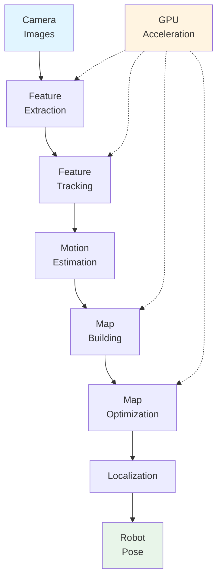

# Isaac ROS: Hardware-Accelerated Visual SLAM

جبکہ NVIDIA Isaac Sim perception algorithms کے لیے training data فراہم کرتا ہے، **Isaac ROS** ان trained algorithms کی real-time deployment enable کرتا ہے۔ Isaac ROS hardware-accelerated Visual SLAM (VSLAM) capabilities فراہم کرتا ہے جو humanoid robots کو اپنے environment سمجھنے اور real-time میں navigate کرنے کے قابل بناتے ہیں visual sensors استعمال کرتے ہوئے۔

## Isaac ROS کیا ہے؟

**Isaac ROS** hardware-accelerated ROS 2 packages کا collection ہے جو GPU computing leverage کرتا ہے perception اور navigation tasks process کرنے کے لیے real-time میں۔ Humanoid robots کے لیے، Isaac ROS کی most critical capability **Visual SLAM (VSLAM)** ہے—ایک system جو simultaneously environments map کرتا ہے اور robot localize کرتا ہے visual sensors استعمال کرتے ہوئے۔

### Hardware-Accelerated Processing

Isaac ROS **hardware acceleration** کے استعمال سے distinguished ہے—GPUs (Graphics Processing Units) leverage کرتے ہوئے computationally intensive tasks perform کرنے کے لیے much faster traditional CPU-based processing سے۔ یہ acceleration essential ہے real-time robot operation کے لیے:

- **CPU processing**: Sequential computation، suitable general tasks کے لیے
- **GPU processing**: Parallel computation، ideal image processing اور perception algorithms کے لیے

VSLAM کے لیے، جو multiple camera images per second process کرنے کی ضرورت کرتا ہے، GPU acceleration difference بناتا ہے real-time operation اور delays کے درمیان جو autonomous navigation prevent کرتے ہیں۔

## Visual SLAM (VSLAM) کیا ہے؟

**Visual SLAM (Simultaneous Localization and Mapping)** ایک perception technology ہے جو robots کو enable کرتی ہے:

1. **Environment map** کریں: Robot کے اردگرد space کی representation build کریں
2. **Robot localize** کریں: Robot کی position اور orientation determine کریں اس map میں
3. **دونوں simultaneously** کریں: Map create کریں جبکہ position determine کریں same time میں

SLAM "chicken and egg" problem solve کرتا ہے: یہ جاننے کے لیے کہ آپ کہاں ہیں، آپ کو map درکار ہے؛ لیکن map build کرنے کے لیے، آپ کو یہ جاننا درکار ہے کہ آپ کہاں ہیں۔ VSLAM visual sensors (cameras) استعمال کرتا ہے دونوں problems solve کرنے کے لیے at once۔

### VSLAM کیسے کام کرتا ہے

VSLAM camera images process کرتا ہے several steps کے ذریعے:

#### 1. Feature Extraction

System distinctive visual features identify کرتا ہے images میں:
- **Corner detection**: Corners اور edges تلاش کرنا جو stable ہیں frames میں
- **Feature descriptors**: Image regions کی mathematical representations create کرنا
- **Feature matching**: Same features identify کرنا different camera views میں

#### 2. Tracking

Features track کیے جاتے ہیں multiple frames میں movement سمجھنے کے لیے:
- **Motion estimation**: Determine کرنا کہ features کیسے move کرتے ہیں frames کے درمیان
- **Camera pose estimation**: Camera (robot) movement اور rotation calculate کرنا
- **Temporal consistency**: Tracking برقرار رکھنا video sequences میں

#### 3. Mapping

System environment کا map build کرتا ہے:
- **3D reconstruction**: 3D points create کرنا matched features سے
- **Map building**: Environment کی representation construct کرنا
- **Map optimization**: Map refine کرنا جیسے more information collect ہوتی ہے

#### 4. Localization

Robot اپنی position determine کرتا ہے map میں:
- **Current view matching**: Current camera view کو map سے match کرنا
- **Pose estimation**: Position اور orientation determine کرنا
- **Loop closure**: Previously visited locations recognize کرنا drift correct کرنے کے لیے

### VSLAM Workflow

Complete VSLAM process یہ workflow follow کرتا ہے:

```
Camera Images → Feature Extraction → Feature Tracking → Motion Estimation
     ↓                                                           ↓
Localization ← Map Matching ← Map Optimization ← 3D Reconstruction
```

**Example: Conceptual VSLAM Workflow**

1. **Visual features extract** کریں current camera image سے (corners، edges، textures)
2. **Features track** کریں multiple frames میں robot movement estimate کرنے کے لیے
3. **Map build** کریں environment کا tracked features اور triangulation استعمال کرتے ہوئے
4. **Robot localize** کریں map میں current camera view استعمال کرتے ہوئے
5. **Map optimize** کریں continuously جیسے robot move کرتا ہے اور more data collect کرتا ہے

یہ workflow continuously real-time میں run کرتا ہے، map اور robot position update کرتے ہوئے جیسے robot move کرتا ہے۔

## Hardware Acceleration Benefits

Hardware acceleration (GPU processing) dramatically VSLAM performance improve کرتا ہے:

### Speed Improvement

VSLAM درکار کرتا ہے processing:

- **Multiple images per second**: Camera feeds 30-60 frames per second پر
- **Large image resolutions**: High-resolution images accurate feature detection کے لیے
- **Complex algorithms**: Feature extraction، matching، اور optimization computationally intensive ہیں

**CPU processing**: Sequential computation speed limit کرتا ہے، real-time VSLAM challenging بناتے ہوئے
**GPU processing**: Parallel computation multiple images simultaneously process کرنے کو ممکن بناتا ہے، real-time performance achieve کرتے ہوئے

### Real-Time Navigation

Hardware acceleration کے بغیر:
- Processing delays lag create کرتے ہیں sensor input اور navigation decisions کے درمیان
- Robot movement jerky یا unsafe بن جاتی ہے
- Real-time navigation impossible ہے

Hardware acceleration کے ساتھ:
- Processing camera frame rates کے ساتھ pace رکھتا ہے
- Navigation decisions real-time میں بنتے ہیں
- Smooth، responsive robot movement possible ہے

یہ real-time capability essential ہے autonomous humanoid robots کے لیے جو dynamically navigate کرنا چاہیے environments کے ذریعے۔

## VSLAM System Components

Complete VSLAM system several interconnected components پر مشتمل ہے:



*Figure: VSLAM system components دکھاتا ہے کہ hardware acceleration کیسے key processing steps accelerate کرتا ہے real-time operation enable کرنے کے لیے۔*

### Key Components

- **Feature Extraction**: Stable visual features identify کرتا ہے images میں (GPU سے accelerated)
- **Feature Tracking**: Features match کرتا ہے frames میں movement سمجھنے کے لیے
- **Motion Estimation**: Robot movement calculate کرتا ہے feature tracking سے
- **Map Building**: Environment کی 3D representation create کرتا ہے (GPU سے accelerated)
- **Map Optimization**: Map accuracy refine کرتا ہے (GPU سے accelerated)
- **Localization**: Robot position determine کرتا ہے map میں

GPU acceleration most computationally intensive components پر apply ہوتا ہے (feature extraction، map building، optimization) real-time performance achieve کرنے کے لیے۔

## ROS 2 کے ساتھ VSLAM Integration

Isaac ROS VSLAM capabilities کو ROS 2 کے ساتھ integrate کرتا ہے، seamless integration enable کرتے ہوئے robot systems کے ساتھ:

### ROS 2 Topics

VSLAM systems ROS 2 topics استعمال کرتے ہیں communicate کرنے کے لیے:
- **Input**: Camera images topics پر published (مثلاً، `/camera/image_raw`)
- **Output**: Map data، robot pose topics پر published (مثلاً، `/map`، `/robot_pose`)

یہ ROS 2 communication patterns follow کرتا ہے [ماڈیول 1](/ur/modules/module-1-ros2-nervous-system/communication-patterns) سے: publish-subscribe messaging distributed perception processing enable کرتا ہے۔

### ROS 2 Services

VSLAM systems services فراہم کر سکتے ہیں:

- **Map queries**: Specific map information request کرنا
- **Relocalization**: Manually robot position set کرنا map میں
- **System status**: VSLAM system health check کرنا

یہ services request-response pattern follow کرتے ہیں [ماڈیول 1](/ur/modules/module-1-ros2-nervous-system/communication-patterns) سے۔

### Navigation Integration

VSLAM output navigation systems میں feed ہوتا ہے:
- **Map data** → Path planning algorithms کی طرف سے استعمال ہوتا ہے
- **Robot pose** → Planned paths کے ساتھ progress track کرنے کے لیے استعمال ہوتا ہے
- **Obstacle updates** → Dynamic obstacles avoid کرنے کے لیے استعمال ہوتا ہے

یہ integration demonstrate کرتا ہے کہ perception (VSLAM) کیسے navigation enable کرتا ہے، path planning systems سے connect کرتے ہوئے جیسے Nav2۔

## ماڈیول 2 سے Connection: Sensor Concepts

VSLAM visual sensors (cameras) استعمال کرتا ہے environment سمجھنے کے لیے۔ یہ sensor integration concepts پر build کرتا ہے [ماڈیول 2](/ur/modules/module-2-digital-twins-simulation/sensor-integration) سے:

- **Vision sensors**: Cameras visual data فراہم کرتے ہیں جو VSLAM process کرتا ہے
- **Sensor data flow**: Camera images ROS 2 topics کے ذریعے flow کرتے ہیں VSLAM processing تک
- **Sensor fusion**: VSLAM multiple cameras سے data combine کر سکتا ہے better accuracy کے لیے

تاہم، VSLAM sophisticated processing add کرتا ہے: صرف sensor data read کرنے کے بجائے، VSLAM اس data interpret کرتا ہے environmental understanding build کرنے اور robot position determine کرنے کے لیے۔

## Humanoid Robotics کے لیے Benefits

Hardware-accelerated VSLAM critical capabilities فراہم کرتا ہے humanoid robots کے لیے:

### Real-Time Navigation

Humanoid robots real-time perception درکار کرتے ہیں safe navigation کے لیے:
- **Dynamic environments**: Environments change کرتے ہیں جیسے robot move کرتا ہے
- **Safety requirements**: Delayed perception safety risks create کرتا ہے
- **Smooth movement**: Real-time updates fluid robot motion enable کرتے ہیں

Hardware acceleration real-time VSLAM feasible بناتا ہے humanoid robots کے لیے۔

### Visual-Only Navigation

Wheeled robots کے برعکس جو wheel odometry استعمال کر سکتے ہیں، humanoid robots visual-only navigation سے benefit کرتے ہیں:
- **No wheel encoders**: Humanoid locomotion reliable odometry فراہم نہیں کرتا
- **Visual information**: Cameras rich environmental information فراہم کرتے ہیں
- **Self-contained**: Visual sensors external infrastructure درکار نہیں کرتے

VSLAM humanoid robots کو enable کرتا ہے navigate کرنے کے لیے only visual information استعمال کرتے ہوئے۔

### Spatial Understanding

VSLAM comprehensive spatial understanding فراہم کرتا ہے:
- **3D mapping**: Environment کی full 3D representation create کرتا ہے
- **Obstacle awareness**: Objects اور barriers identify کرتا ہے
- **Route planning**: Path planning algorithms کو enable کرتا ہے safe routes compute کرنے کے لیے

یہ spatial understanding essential ہے autonomous navigation کے لیے۔

## Summary

Isaac ROS hardware-accelerated Visual SLAM (VSLAM) فراہم کرتا ہے جو humanoid robots کو اپنے environment سمجھنے اور real-time میں navigate کرنے کے قابل بناتا ہے۔ Key points:

- **Visual SLAM** cameras استعمال کرتے ہوئے simultaneous mapping اور localization enable کرتا ہے
- **Hardware acceleration** (GPU) real-time VSLAM performance possible بناتا ہے
- **VSLAM workflow** features extract کرتا ہے، movement track کرتا ہے، maps build کرتا ہے، اور robot localize کرتا ہے
- **ROS 2 integration** VSLAM کو enable کرتا ہے navigation systems کے ساتھ communicate کرنے کے لیے
- **Real-time capability** essential ہے autonomous humanoid robot navigation کے لیے

Isaac ROS gap bridge کرتا ہے trained perception algorithms (Isaac Sim سے) اور real-time robot operation کے درمیان، robots کو enable کرتے ہوئے اپنی trained capabilities استعمال کرنے کے لیے actual navigation کے لیے۔

## Next Steps

اب جب کہ آپ سمجھ گئے ہیں کہ Isaac ROS کیسے hardware-accelerated VSLAM کے ذریعے real-time perception enable کرتا ہے، explore کریں کہ وہ perception information کیسے feed ہوتا ہے **Nav2 path planning** میں اگلے section میں۔ Nav2 VSLAM سے maps اور robot pose استعمال کرتا ہے safe paths compute کرنے کے لیے bipedal humanoid movement کے لیے۔
