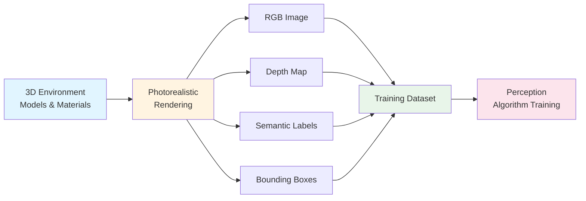

# NVIDIA Isaac Sim: Photorealistic Simulation

NVIDIA Isaac Sim general physics simulation سے آگے leap represent کرتا ہے۔ جبکہ ماڈیول 2 نے simulation fundamentals متعارف کروائے robot behavior test کرنے کے لیے، Isaac Sim **photorealistic rendering** پر focus کرتا ہے جو realistic visual data generate کرتا ہے training کے لیے AI perception algorithms کے لیے۔ یہ capability simulation اور AI development کے درمیان bridge بناتی ہے، robots کو synthetic data سے سیکھنے کے قابل بناتے ہوئے massive real-world data collection درکار کیے بغیر۔

## NVIDIA Isaac Sim کیا ہے؟

**NVIDIA Isaac Sim** ایک photorealistic simulation platform ہے جو highly realistic virtual environments create کرتا ہے accurate lighting، textures، materials، اور physics کے ساتھ۔ General physics simulators کے برعکس جو dynamics اور collision detection پر focus کرتے ہیں، Isaac Sim **visual fidelity** emphasize کرتا ہے—images create کرتے ہوئے جو visually indistinguishable ہیں real-world photographs سے۔

### Key Capabilities

Isaac Sim enable کرتا ہے:

- **Photorealistic rendering**: Environments realistic lighting، shadows، reflections، اور materials کے ساتھ
- **Synthetic data generation**: Automated creation labeled training datasets کی (images، depth maps، annotations)
- **Programmatic control**: Python APIs simulation scenarios scripting اور diverse training data generate کرنے کے لیے
- **Domain randomization**: Automatic variation lighting، textures، object positions، اور camera angles کی

یہ capabilities Isaac Sim کو particularly valuable بناتی ہیں training کے لیے perception algorithms—systems جو visual information process کرتے ہیں environment سمجھنے کے لیے۔

## Photorealistic Simulation vs. General Simulation

Isaac Sim کی photorealistic simulation اور general simulation (ماڈیول 2 سے) کے درمیان difference سمجھنا important ہے:

| Aspect | General Simulation (ماڈیول 2) | Photorealistic Simulation (Isaac Sim) |
|--------|-------------------------------|--------------------------------------|
| **Primary Focus** | Physics accuracy، dynamics، collisions | Visual realism، lighting، textures |
| **Use Case** | Testing robot behavior، validating dynamics | Training AI algorithms، generating datasets |
| **Output** | Robot state، joint angles، forces | Images، depth maps، semantic labels |
| **Fidelity** | Sufficient physics validation کے لیے | Photorealistic visual perception کے لیے |

جبکہ دونوں types کی simulation valuable ہیں، photorealistic simulation different purpose serve کرتی ہے: visual training data create کرنا جو real-world appearance سے match کرتی ہے۔

## Synthetic Data Generation

Isaac Sim کی core value اس کی ability میں ہے **synthetic training data** generate کرنے کی perception algorithms کے لیے۔ یہ process شامل کرتا ہے:

1. **Photorealistic environments create** کرنا: Virtual worlds realistic lighting، materials، اور objects کے ساتھ
2. **Images render** کرنا: Camera views capture کرنا different angles اور positions سے
3. **Ground truth generate** کرنا: Automatically labels create کرنا (object boundaries، depth maps، semantic segmentation)
4. **Variation automate** کرنا: Lighting، textures، اور object configurations randomize کرنا diverse datasets create کرنے کے لیے

### Synthetic Data کیوں اہم ہے

Perception algorithms train کرنا traditionally درکار کرتا ہے:

- **Massive data collection**: Thousands یا millions of real-world images
- **Manual labeling**: Human annotators objects، boundaries، depths mark کرتے ہوئے
- **Controlled conditions**: Specific scenarios set up کرنا needed data capture کرنے کے لیے
- **Time اور cost**: Significant resources data collection اور annotation کے لیے

Isaac Sim اس data کو **programmatically simulation میں** generate کرنے کو ممکن بناتا ہے، physical data collection کی ضرورت eliminate کرتے ہوئے perfect ground truth labels automatically فراہم کرتے ہوئے۔

## Isaac Sim کیسے Training Data Generate کرتا ہے

Isaac Sim training data generate کرتا ہے systematic process کے ذریعے:

### 1. Environment Setup

پہلے، photorealistic virtual environment create کریں:

```python
# Conceptual example: Isaac Sim synthetic data generation
# Demonstrates how photorealistic simulation generates training data

import isaac_sim  # Conceptual import - tool not required for understanding

# Create photorealistic scene with realistic lighting
scene = isaac_sim.create_scene(
    lighting="physically_based",  # Realistic light behavior
    materials="photorealistic",    # Realistic surface properties
    environment="indoor_office"    # Specific environment type
)

# Add objects with realistic textures and materials
scene.add_object("table", position=[1.0, 0.5, 0.8], material="wood")
scene.add_object("chair", position=[1.5, 0.0, 0.8], material="fabric")
```

### 2. Camera Configuration

Virtual cameras set up کریں images capture کرنے کے لیے:

```python
# Configure camera with realistic parameters
camera = scene.add_camera(
    position=[2.0, 1.5, 1.2],  # Camera location
    resolution=(1920, 1080),    # Image resolution
    fov=60                      # Field of view
)
```

### 3. Data Generation Loop

Multiple images generate کریں automatic variation کے ساتھ:

```python
# Generate synthetic training data
training_data = []

for i in range(1000):  # Generate 1000 training images
    # Randomize lighting conditions
    scene.randomize_lighting()
    
    # Randomize object positions
    scene.randomize_object_positions()
    
    # Render image with annotations
    image_data = camera.render(
        annotations=[
            "rgb",              # Color image
            "depth",            # Depth map
            "semantic",         # Object labels
            "bounding_boxes"    # Object boundaries
        ]
    )
    
    training_data.append(image_data)
```

یہ process diverse dataset automatically create کرتا ہے، perfect ground truth labels included کے ساتھ۔

## Synthetic Data Generation Pipeline

Training data generate کرنے کے لیے complete pipeline یہ steps follow کرتا ہے:



*Figure: Synthetic data generation pipeline دکھاتا ہے کہ Isaac Sim کیسے multiple data types simultaneously create کرتا ہے training کے لیے perception algorithms کے لیے۔*

### Data Types Generated

Isaac Sim multiple types کی training data simultaneously generate کر سکتا ہے:

- **RGB Images**: Color images real-world appearance سے match کرتے ہوئے
- **Depth Maps**: Distance information ہر pixel کے لیے
- **Semantic Segmentation**: Object labels ہر pixel کے لیے
- **Instance Segmentation**: Individual object identification
- **Bounding Boxes**: Object boundaries اور classifications
- **Surface Normals**: Surface orientation information

یہ تمام data perfect ground truth labels کے ساتھ automatically آتا ہے—no manual annotation required۔

## Training Perception Algorithms

ایک بار synthetic data generate ہو جائے، یہ استعمال ہوتا ہے perception algorithms train کرنے کے لیے:

1. **Dataset Creation**: Thousands of synthetic images variations کے ساتھ
2. **Algorithm Training**: Neural networks objects recognize کرنا، depth estimate کرنا، images segment کرنا سیکھتے ہیں
3. **Validation**: Algorithms synthetic اور real-world data دونوں پر tested
4. **Deployment**: Trained algorithms real robots پر deployed

یہ workflow synthetic data کی value demonstrate کرتا ہے: algorithms simulation سے سیکھتے ہیں، پھر وہ knowledge apply کرتے ہیں real-world perception tasks پر۔

## ماڈیول 2 Simulation سے Connection

Isaac Sim ماڈیول 2 سے simulation concepts extend کرتا ہے:

- **ماڈیول 2 (General Simulation)**: Physics accuracy پر focus کرتا ہے robot behavior test کرنے اور dynamics validate کرنے کے لیے
- **Isaac Sim (Photorealistic Simulation)**: Visual realism پر focus کرتا ہے AI algorithms train کرنے اور datasets generate کرنے کے لیے

دونوں types کی simulation valuable ہیں، لیکن different purposes serve کرتے ہیں۔ General simulation validate کرتا ہے کہ robots correctly move کر سکتے ہیں؛ photorealistic simulation ensure کرتا ہے کہ perception algorithms سمجھ سکتے ہیں کہ وہ کیا دیکھتے ہیں۔

### Key Differences

- **General simulation** جواب دیتا ہے: "کیا robot safely walk کر سکتا ہے اس terrain پر؟"
- **Photorealistic simulation** جواب دیتا ہے: "کیا robot recognize اور understand کر سکتا ہے objects اس environment میں؟"

دونوں questions important ہیں autonomous robots کے لیے، لیکن different simulation approaches درکار کرتے ہیں۔

## Humanoid Robotics کے لیے Benefits

Isaac Sim کی photorealistic simulation several advantages فراہم کرتی ہے humanoid robotics development کے لیے:

### 1. Safe Training Data Generation

Real-world data collect کرنے کے برعکس جو درکار کر سکتا ہے:

- Expensive robots operate کرنا various environments میں
- Safety concerns handle کرنا
- Unpredictable conditions deal کرنا

Synthetic data generation completely safe اور controlled ہے۔

### 2. Perfect Ground Truth

Real-world images کی manual annotation ہے:

- Time-consuming
- Error-prone
- Expensive

Synthetic data perfect، automatic labels فراہم کرتا ہے—ہر pixel correctly identified ہے۔

### 3. Unlimited Variation

Real-world data collection limited ہے:

- Available environments
- Time اور resources
- Safety constraints

Simulation unlimited variations generate کر سکتا ہے scenarios، lighting conditions، اور object configurations کی۔

### 4. Domain Adaptation

Synthetic data scenarios شامل کر سکتا ہے جو ہیں:

- Real-world میں capture کرنا difficult (extreme lighting، rare objects)
- Test کرنا dangerous (obstacle avoidance، emergency situations)
- Recreate کرنا expensive (multiple environments، weather conditions)

## Summary

NVIDIA Isaac Sim photorealistic simulation enable کرتا ہے جو synthetic training data generate کرتا ہے perception algorithms کے لیے۔ Key points:

- **Photorealistic rendering** visually realistic virtual environments create کرتا ہے
- **Synthetic data generation** labeled training datasets کی creation automate کرتا ہے
- **Python APIs** programmatic control اور automation enable کرتے ہیں
- **Perfect ground truth** manual annotation کی ضرورت eliminate کرتا ہے
- **Unlimited variation** diverse training scenarios enable کرتا ہے

Isaac Sim simulation اور AI development کے درمیان gap bridge کرتا ہے، robots کو synthetic data سے perception capabilities سیکھنے کے قابل بناتے ہوئے massive real-world data collection درکار کیے بغیر۔

## Next Steps

اب جب کہ آپ سمجھ گئے ہیں کہ Isaac Sim کیسے synthetic data generation کے ذریعے training enable کرتا ہے، explore کریں کہ وہ trained perception کیسے deploy ہوتا ہے real-time میں **Isaac ROS** کے ذریعے اگلے section میں۔ Isaac ROS hardware acceleration استعمال کرتا ہے visual information process کرنے کے لیے fast enough real-time robot navigation کے لیے۔
