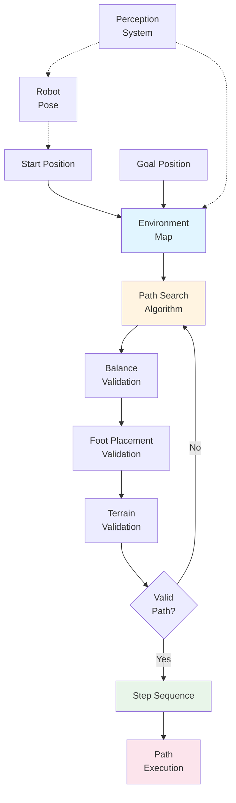

# Nav2: Bipedal Humanoids کے لیے Path Planning

Path planning determine کرتا ہے کہ robot کیسے move کرتا ہے one location سے another تک۔ جبکہ wheeled robots کے لیے navigation algorithms continuous motion اور simple constraints assume کر سکتے ہیں، **bipedal humanoid robots** path planning درکار کرتے ہیں جو unique challenges account کرتے ہیں: balance برقرار رکھنا، feet stable surfaces پر place کرنا، اور terrain adapt کرنا۔ Nav2 (Navigation2) path planning capabilities فراہم کرتا ہے specifically adapted ان humanoid-specific requirements کے لیے۔

## Nav2 کیا ہے؟

**Nav2 (Navigation2)** ایک ROS 2 navigation framework ہے جو path planning، obstacle avoidance، اور navigation capabilities فراہم کرتا ہے۔ جبکہ Nav2 various robot types کے ساتھ کام کر سکتا ہے، یہ specific adaptations شامل کرتا ہے bipedal humanoid robots کے لیے جو ان کی unique movement constraints account کرتے ہیں۔

### Path Planning Basics

Path planning شامل کرتا ہے:
1. **Start اور goal**: Define کرنا کہ robot کہاں ہے اور کہاں جانا چاہتا ہے
2. **Environment representation**: Obstacles، terrain، اور constraints سمجھنا
3. **Path computation**: Safe اور efficient route تلاش کرنا
4. **Path execution**: Computed path follow کرنا جبکہ changes adapt کرنا

Humanoid robots کے لیے، path planning کو robot کیسے move کرتا ہے consider کرنا چاہیے—one step at a time، balance برقرار رکھتے ہوئے throughout۔

## Bipedal Humanoid Movement Constraints

Humanoid robots unique constraints رکھتے ہیں جو path planning affect کرتے ہیں:

### Balance Requirements

Wheeled robots کے برعکس جو always stable ہیں، bipedal robots balance برقرار رکھنا چاہیے:
- **Center of mass**: Support polygon کے اندر رہنا چاہیے (area covered by feet)
- **Stability margin**: Sufficient stability disturbances handle کرنے کے لیے
- **Dynamic balance**: Move کرتے ہوئے balance برقرار رکھنا forward momentum درکار کرتا ہے

Path planning paths compute کرنا چاہیے جو robot کو balanced رکھتے ہیں movement کے دوران۔

### Foot Placement Constraints

Humanoid robots feet one at a time place کر کے move کرتے ہیں:
- **Step size limits**: Maximum distance ہر step cover کر سکتا ہے
- **Surface requirements**: ہر foot flat، stable surface پر land ہونا چاہیے
- **Clearance**: Feet obstacles clear کرنا چاہیے swing phase کے دوران
- **Terrain adaptation**: Uneven terrain کے لیے step height اور angle adjust کرنا

Path planning valid foot placement locations identify کرنا چاہیے path کے ساتھ۔

### Terrain Adaptation

Humanoid robots different terrain types adapt کرنا چاہیے:
- **Slope limits**: Maximum incline robot walk کر سکتا ہے
- **Surface detection**: Walkable vs. non-walkable surfaces identify کرنا
- **Obstacle clearance**: Obstacles over یا around step کرنا
- **Uneven surfaces**: Bumps، dips، اور irregular terrain adapt کرنا

Path planning terrain characteristics account کرنا چاہیے paths compute کرتے ہوئے۔

## Humanoid-Specific Path Planning Considerations

Nav2 general path planning algorithms adapt کرتا ہے humanoid constraints account کرنے کے لیے:

### Balance-Aware Planning

Path planning balance consider کرتا ہے path میں:
- **Support polygon analysis**: یقینی بنانا کہ ہر step stability برقرار رکھتا ہے
- **Center of mass trajectory**: Movement plan کرنا جو center of mass stable رکھتا ہے
- **Recovery strategies**: Recovery steps identify کرنا اگر balance compromised ہے

### Foot Placement Planning

Path planning valid foot placement locations identify کرتا ہے:
- **Surface analysis**: Terrain evaluate کرنا flat، stable foot placement کے لیے
- **Step sequence**: Left-right foot placements کی sequence plan کرنا
- **Clearance planning**: یقینی بنانا کہ feet obstacles clear کرتے ہیں swing phase کے دوران

### Terrain-Aware Routing

Path planning terrain characteristics consider کرتا ہے:
- **Slope analysis**: Paths avoid کرنا جو maximum slope limits exceed کرتے ہیں
- **Surface quality**: Stable surfaces prefer کرنا unstable ones پر
- **Obstacle negotiation**: Paths plan کرنا جو obstacles around یا over navigate کرتے ہیں

## Nav2 Path Planning Configuration

Nav2 configuration files استعمال کرتا ہے humanoid-specific constraints specify کرنے کے لیے:

```yaml
# Conceptual Nav2 configuration for humanoid constraints
# Demonstrates how humanoid-specific parameters are configured

humanoid_navigation:
  balance_requirements:
    center_of_mass_limits:
      x_min: -0.1  # meters
      x_max: 0.1
      y_min: -0.08
      y_max: 0.08
    support_polygon_stability: required
    stability_margin: 0.05  # meters
  
  foot_placement:
    step_size_max: 0.3  # meters - maximum step length
    step_size_min: 0.1  # meters - minimum step length
    surface_flatness: required  # feet must land on flat surfaces
    obstacle_clearance: 0.1  # meters - clearance above obstacles
    step_height_max: 0.15  # meters - maximum step up height
  
  terrain_adaptation:
    max_slope: 15  # degrees - maximum slope angle
    surface_detection: required  # detect walkable surfaces
    uneven_surface_tolerance: 0.02  # meters - acceptable surface variation
  
  path_planning:
    safety_margin: 0.15  # meters - minimum distance from obstacles
    replan_frequency: 2.0  # Hz - how often to recompute path
    dynamic_obstacle_handling: enabled
```

یہ configuration example دکھاتا ہے کہ humanoid constraints کیسے Nav2 میں specified ہیں، path planning algorithms کو enable کرتے ہوئے balance، foot placement، اور terrain requirements account کرنے کے لیے۔

## Perception Systems کے ساتھ Integration

Nav2 perception systems (جیسے Isaac ROS) کے ساتھ integrate ہوتا ہے environmental information حاصل کرنے کے لیے:

### Map Input

Nav2 perception systems سے maps استعمال کرتا ہے:
- **Environment map**: Environment کی 2D یا 3D representation
- **Occupancy grid**: دکھاتا ہے کہ کون سے areas walkable vs. obstacles ہیں
- **Terrain information**: Surface characteristics اور elevation data

### Robot Localization

Nav2 perception سے robot pose استعمال کرتا ہے:
- **Current position**: Robot اب کہاں ہے (VSLAM یا other localization سے)
- **Goal position**: Robot کہاں جانا چاہتا ہے
- **Pose tracking**: Continuous updates جیسے robot move کرتا ہے

### Dynamic Updates

Nav2 changing perception data adapt کرتا ہے:
- **Obstacle updates**: Path adjust کرنا جب new obstacles detected ہوں
- **Map updates**: New areas incorporate کرنا جیسے robot explore کرتا ہے
- **Terrain changes**: Discovered terrain characteristics adapt کرنا

یہ integration demonstrate کرتا ہے کہ perception (Isaac ROS سے) کیسے planning (Nav2) کو inform کرتا ہے، perception → planning connection complete کرتے ہوئے۔

## Humanoid Path Planning Workflow

Nav2 کی path planning humanoids کے لیے یہ workflow follow کرتی ہے:



*Figure: Humanoid path planning workflow دکھاتا ہے کہ Nav2 کیسے balance، foot placement، اور terrain constraints consider کرتا ہے paths compute کرتے ہوئے۔*

### Planning Steps

1. **Goal receive** کریں: Navigation system target location receive کرتا ہے
2. **Map access** کریں: Perception system سے environment map obtain کریں
3. **Path search** کریں: Current سے goal position تک candidate path compute کریں
4. **Constraints validate** کریں: Path check کریں balance، foot placement، terrain requirements کے خلاف
5. **Steps generate** کریں: Path کے ساتھ foot placements کی sequence create کریں
6. **Path execute** کریں: Robot path follow کرتا ہے، dynamic changes adapt کرتے ہوئے

یہ workflow continuously run کرتا ہے، replanning جیسے robot move کرتا ہے اور environment changes کرتا ہے۔

## Humanoid vs. Wheeled Robot Path Planning

یہ سمجھنا کہ humanoid path planning کیسے wheeled robot planning سے مختلف ہے unique challenges clarify کرتا ہے:

| Aspect | Wheeled Robots | Bipedal Humanoids |
|--------|----------------|-------------------|
| **Movement** | Continuous rolling motion | Discrete foot placements |
| **Stability** | Always stable (low center of mass) | Balance dynamically maintain کرنا چاہیے |
| **Constraints** | Obstacles avoid، speed limits respect | Balance، foot placement، terrain adaptation |
| **Path Representation** | Continuous curves | Foot placements کی sequence |
| **Replanning** | Obstacles adjust | Balance، obstacles، terrain adjust |

یہ differences demonstrate کرتے ہیں کہ کیوں humanoid-specific path planning necessary ہے اور کیوں Nav2 bipedal movement کے لیے adaptations شامل کرتا ہے۔

## Perception (Isaac ROS) سے Connection

Nav2 perception systems پر depend کرتا ہے جیسے Isaac ROS environmental understanding کے لیے:

- **Map data**: VSLAM environment map build کرتا ہے جو Nav2 path planning کے لیے استعمال کرتا ہے
- **Robot localization**: VSLAM robot position determine کرتا ہے path computation کے لیے درکار
- **Dynamic obstacles**: Perception systems moving obstacles detect کرتے ہیں جو Nav2 avoid کرنا چاہیے

یہ connection perception → planning workflow complete کرتا ہے: perception environmental understanding فراہم کرتا ہے، اور planning وہ understanding استعمال کرتا ہے movement paths compute کرنے کے لیے۔

## Humanoid Robotics کے لیے Benefits

Nav2 کی humanoid-adapted path planning فراہم کرتی ہے:

### Safe Navigation

Humanoid-specific constraints ensure کرتے ہیں:
- **Balance maintenance**: Paths robot stable رکھتے ہیں movement کے دوران
- **Safe foot placement**: ہر step stable، flat surfaces پر land ہوتا ہے
- **Terrain adaptation**: Paths slopes اور uneven surfaces account کرتے ہیں

### Efficient Movement

Path planning optimize کرتا ہے:

- **Energy efficiency**: Unnecessary movement minimize کرنا
- **Time efficiency**: Goals تک efficient routes تلاش کرنا
- **Smooth motion**: Paths generate کرنا جو fluid robot movement enable کرتے ہیں

### Autonomous Operation

Perception کے ساتھ integration enable کرتا ہے:
- **Real-time adaptation**: Current perception کی بنیاد پر paths adjust کرنا
- **Dynamic obstacle avoidance**: Moving obstacles react کرنا
- **Exploration**: Previously unknown environments navigate کرنا

## Summary

Nav2 path planning capabilities فراہم کرتا ہے specifically adapted bipedal humanoid movement کے لیے۔ Key points:

- **Humanoid constraints** شامل کرتے ہیں balance، foot placement، اور terrain adaptation requirements
- **Balance-aware planning** ensure کرتا ہے کہ robot stability برقرار رکھتا ہے movement کے دوران
- **Foot placement planning** valid locations identify کرتا ہے ہر step کے لیے
- **Terrain adaptation** slopes، obstacles، اور uneven surfaces account کرتا ہے
- **Perception integration** maps اور robot pose استعمال کرتا ہے systems سے جیسے Isaac ROS

Nav2 AI-robot brain workflow complete کرتا ہے: perception data (Isaac ROS سے) استعمال کرتے ہوئے safe، efficient paths compute کرنا bipedal humanoid movement کے لیے۔

## Next Steps

اب جب کہ آپ سمجھ گئے ہیں کہ Nav2 کیسے paths plan کرتا ہے humanoid robots کے لیے، explore کریں کہ تمام تین tools کیسے مل کر کام کرتے ہیں **Integrated Applications** میں complete autonomous navigation capabilities enable کرنے کے لیے۔
