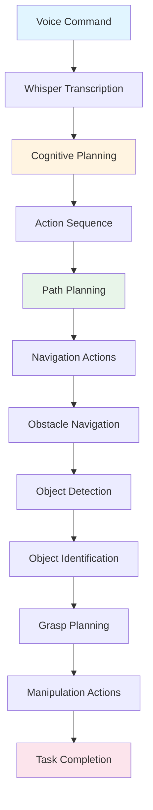

# Capstone Project: The Autonomous Humanoid

یہ capstone project complete Vision-Language-Action (VLA) pipeline demonstrate کرتا ہے action میں۔ آپ دیکھیں گے کہ simulated humanoid robot کیسے voice command receive کرتا ہے، cognitive planning استعمال کرتا ہے path generate کرنے کے لیے، perception استعمال کرتے ہوئے obstacles navigate کرتا ہے، computer vision استعمال کرتے ہوئے objects identify کرتا ہے، اور انہیں manipulate کرتا ہے—all integrated cohesive autonomous behavior میں۔

## Project Overview

Capstone project تمام VLA concepts integrate کرتا ہے single demonstration میں:

- **Voice input**: Spoken command autonomous behavior initiate کرتی ہے
- **Cognitive planning**: Natural language action plan میں translate ہوتا ہے
- **Path planning**: Goal reach کرنے کے لیے navigation path generate ہوتا ہے
- **Obstacle navigation**: Robot perception استعمال کرتے ہوئے obstacles around navigate کرتا ہے
- **Object identification**: Computer vision target objects identify کرتا ہے
- **Object manipulation**: Robot objects grasp اور manipulate کرتا ہے

یہ project دکھاتا ہے کہ voice-to-action، cognitive planning، perception، navigation، اور manipulation کیسے مل کر کام کرتے ہیں complete VLA system میں۔

## Complete VLA Pipeline

Capstone end-to-end flow demonstrate کرتا ہے:

```
Voice Command → Speech Recognition → Cognitive Planning → 
Path Planning → Obstacle Navigation → Object Identification → 
Object Manipulation → Task Completion
```

ہر stage previous پر build کرتا ہے، seamless autonomous behavior بناتے ہوئے۔

## Step-by-Step Flow

### Step 1: Voice Command

User command بولتا ہے: **"table سے سرخ کپ اٹھاؤ"**

- **Audio capture**: Microphones spoken command capture کرتی ہیں
- **Speech recognition**: OpenAI Whisper speech کو text میں transcribe کرتا ہے
- **Text output**: "table سے سرخ کپ اٹھاؤ"

### Step 2: Cognitive Planning

Transcribed text cognitive planning کی طرف سے process ہوتا ہے:

- **Intent understanding**: Robot سمجھتا ہے کہ اسے specific object pick up کرنا ہے
- **Goal decomposition**: Task sub-goals میں break ہوتا ہے:
  1. Table پر navigate کریں
  2. Red cup identify کریں
  3. Cup pick up کریں
  4. Successful grasp verify کریں
- **Action sequence generation**: ہر sub-goal کے لیے ROS 2 actions generate ہوتے ہیں

### Step 3: Path Planning

Cognitive plan table پر navigation شامل کرتی ہے:

- **Target location**: Table location identify ہوتی ہے
- **Path generation**: Current position سے table تک path plan ہوتا ہے
- **Obstacle consideration**: Known obstacles path planning میں consider ہوتے ہیں
- **Path validation**: Path feasibility کے لیے check ہوتا ہے

### Step 4: Obstacle Navigation

Robot table پر navigate کرتا ہے:

- **Perception**: Sensors environment میں obstacles detect کرتے ہیں
- **Path adjustment**: Path adjust ہوتا ہے obstacles avoid کرنے کے لیے
- **Navigation execution**: ROS 2 navigation actions robot move کرتے ہیں
- **Progress monitoring**: Navigation progress monitor اور adjust ہوتا ہے

### Step 5: Object Identification

Table پر، computer vision target identify کرتا ہے:

- **Visual perception**: Cameras table کی images capture کرتی ہیں
- **Object detection**: Computer vision table پر objects detect کرتا ہے
- **Object classification**: Objects classified ہوتے ہیں (cup، bottle، etc.)
- **Target selection**: Red cup identify اور select ہوتا ہے

### Step 6: Object Manipulation

Robot identified object manipulate کرتا ہے:

- **Grasp planning**: Cup کے لیے grasp pose plan ہوتا ہے
- **Arm movement**: Robot کی arm grasp pose پر move کرتی ہے
- **Grasp execution**: Robot cup grasp کرتا ہے
- **Verification**: Successful grasp verify ہوتا ہے

## VLA Components کی Integration

یہ capstone demonstrate کرتا ہے کہ تمام VLA components کیسے integrate ہوتے ہیں:

### Voice Input Integration

Voice commands entire pipeline initiate کرتے ہیں:

```python
# Whisper Integration Pattern in Capstone Context
# This demonstrates how voice input initiates the capstone project

import whisper
import rclpy
from rclpy.node import Node
from std_msgs.msg import String

class CapstoneVoiceInput(Node):
    """
    Voice input component for capstone project.
    Demonstrates Whisper integration in complete VLA pipeline.
    """
    
    def __init__(self):
        super().__init__('capstone_voice_input')
        
        # Initialize Whisper (conceptual pattern)
        self.whisper_model = whisper.load_model("base")
        
        # Publisher for sending commands to cognitive planning
        self.command_publisher = self.create_publisher(
            String,
            'voice_command',
            10
        )
    
    def process_voice_command(self, audio_data):
        """
        Process voice command and publish to cognitive planning.
        This initiates the complete VLA pipeline.
        """
        # Transcribe audio to text using Whisper
        result = self.whisper_model.transcribe(audio_data)
        command_text = result["text"]
        
        # Publish command to cognitive planning system
        msg = String()
        msg.data = command_text
        self.command_publisher.publish(msg)
        
        self.get_logger().info(f'Voice command received: {command_text}')
        return command_text
```

### Cognitive Planning Integration

Cognitive planning commands translate کرتی ہے action sequences میں:

```python
# LLM Cognitive Planning Integration Pattern in Capstone Context
# This demonstrates how cognitive planning generates action sequences

class CapstoneCognitivePlanner:
    """
    Cognitive planning component for capstone project.
    Demonstrates LLM integration in complete VLA pipeline.
    """
    
    def __init__(self, llm_client):
        self.llm_client = llm_client
    
    def plan_capstone_task(self, voice_command, robot_context):
        """
        Generate action plan for capstone task.
        This demonstrates cognitive planning in complete VLA pipeline.
        """
        # Create planning prompt
        prompt = f"""
        Translate this voice command into a robot action plan:
        Command: "{voice_command}"
        
        Robot context: {robot_context}
        
        Generate a sequence of actions:
        1. Navigation to target location
        2. Object identification
        3. Object manipulation
        
        Output the action sequence in ROS 2 action format.
        """
        
        # Generate plan using LLM
        response = self.llm_client.generate(prompt)
        
        # Parse response into action sequence
        action_sequence = self.parse_plan(response)
        
        return action_sequence
    
    def parse_plan(self, llm_response):
        """
        Parse LLM response into ROS 2 action sequence.
        This demonstrates how cognitive plans become executable actions.
        """
        # Parse structured response
        # Extract navigation, perception, and manipulation actions
        actions = []
        # ... parsing logic ...
        return actions
```

### ROS 2 Action Generation Integration

ROS 2 actions cognitive plan execute کرتے ہیں:

```python
# ROS 2 Action Generation Integration Pattern in Capstone Context
# This demonstrates how cognitive plans become ROS 2 actions

from rclpy.action import ActionClient
from navigation_msgs.action import NavigateToPose
from manipulation_msgs.action import PickPlace
from perception_msgs.action import DetectObjects

class CapstoneActionExecutor(Node):
    """
    Action execution component for capstone project.
    Demonstrates ROS 2 action generation in complete VLA pipeline.
    """
    
    def __init__(self):
        super().__init__('capstone_action_executor')
        
        # Action clients for different capabilities
        self.nav_client = ActionClient(self, NavigateToPose, 'navigate_to_pose')
        self.manip_client = ActionClient(self, PickPlace, 'pick_place')
        self.perception_client = ActionClient(self, DetectObjects, 'detect_objects')
    
    def execute_capstone_plan(self, cognitive_plan):
        """
        Execute complete capstone plan.
        This demonstrates ROS 2 action execution in complete VLA pipeline.
        """
        # Execute navigation actions
        for nav_action in cognitive_plan.navigation_actions:
            self.execute_navigation(nav_action)
        
        # Execute perception actions
        for perception_action in cognitive_plan.perception_actions:
            self.execute_perception(perception_action)
        
        # Execute manipulation actions
        for manip_action in cognitive_plan.manipulation_actions:
            self.execute_manipulation(manip_action)
    
    def execute_navigation(self, action):
        """Execute navigation action."""
        goal = NavigateToPose.Goal()
        goal.pose = action.target_pose
        self.nav_client.send_goal_async(goal)
    
    def execute_manipulation(self, action):
        """Execute manipulation action."""
        goal = PickPlace.Goal()
        goal.object_id = action.object_id
        goal.pick_pose = action.pick_pose
        self.manip_client.send_goal_async(goal)
```

## Previous Modules سے Cross-References

یہ capstone project previous modules سے concepts پر build کرتا ہے:

### ماڈیول 2: Simulation

Capstone project simulated environment میں run ہوتا ہے، demonstrating کرتے ہوئے کہ [ماڈیول 2: Digital Twins - Simulation & Sensors](/ur/modules/module-2-digital-twins-simulation/simulation-fundamentals) کیسے safe testing اور development enable کرتا ہے VLA systems کی۔ Simulation allow کرتا ہے:

- **Safe testing**: VLA systems test کرنا physical risk کے بغیر
- **Rapid iteration**: Quickly different scenarios test کرنا
- **Environment control**: Consistent test conditions create کرنا

### ماڈیول 3: Perception اور Navigation

Capstone project perception اور navigation capabilities استعمال کرتا ہے [ماڈیول 3: The AI-Robot Brain (NVIDIA Isaac™)](/ur/modules/module-3-ai-robot-brain/nav2-path-planning) سے، including:

- **Computer vision**: Object identification اور classification
- **Path planning**: Navigation path generation
- **Obstacle avoidance**: Dynamic obstacle navigation
- **Sensor integration**: Perception کے لیے cameras اور sensors استعمال کرنا

## Complete Integration Flow Diagram

درج ذیل diagram complete capstone project flow illustrate کرتا ہے:



یہ diagram دکھاتا ہے کہ تمام VLA components کیسے integrate ہوتے ہیں complete autonomous behavior میں۔

## Summary

Capstone project complete VLA pipeline demonstrate کرتا ہے، voice input، cognitive planning، path planning، obstacle navigation، object identification، اور manipulation integrate کرتے ہوئے cohesive autonomous behavior میں۔ یہ project دکھاتا ہے کہ تمام VLA concepts کیسے مل کر کام کرتے ہیں، simple voice command سے complex robot behavior تک۔ یہ integration سمجھنا essential ہے comprehending کے لیے کہ VLA systems کیسے natural language robot control enable کرتے ہیں۔

## Next Steps

اب جب کہ آپ capstone project کے ذریعے complete VLA pipeline سمجھ گئے ہیں، [Module Integration](/ur/modules/module-4-vision-language-action/module-integration) پر جائیں سیکھنے کے لیے کہ VLA concepts کیسے connect ہوتے ہیں اور build کرتے ہیں previous modules پر۔
