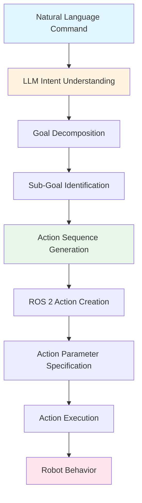

# LLMs کے ساتھ Cognitive Planning

Cognitive planning VLA systems کی intelligence layer ہے، جہاں Large Language Models natural language commands translate کرتے ہیں executable robot action sequences میں۔ یہ section explore کرتا ہے کہ LLMs کیسے یہ transformation perform کرتے ہیں اور کیسے high-level instructions robot behaviors بن جاتے ہیں۔

## LLMs کیسے Cognitive Planning Perform کرتے ہیں

Large Language Models natural language سمجھنے اور structured outputs generate کرنے میں excel کرتے ہیں۔ Cognitive planning میں، LLMs:

1. **Intent interpret** کرتے ہیں: سمجھتے ہیں کہ user کیا چاہتا ہے robot accomplish کرے
2. **Goals decompose** کرتے ہیں: Complex commands کو manageable sub-tasks میں break کرتے ہیں
3. **Actions generate** کرتے ہیں: Robot actions کی sequences create کرتے ہیں جو goal achieve کرتے ہیں
4. **Output structure** کرتے ہیں: Actions format کرتے ہیں way میں جو robots execute کر سکتے ہیں

### Provider-Agnostic Cognitive Planning

Cognitive planning patterns provider-agnostic ہیں، meaning concepts apply ہوتے ہیں regardless کہ کون سا LLM provider یا model استعمال ہوتا ہے۔ Key principles ہیں:

- **Natural language understanding**: User commands interpreting
- **Goal decomposition**: Complex tasks کو steps میں break کرنا
- **Action sequence generation**: Executable robot behaviors create کرنا
- **Context awareness**: Robot capabilities اور constraints سمجھنا

## Natural Language سے ROS 2 Action Translation

Cognitive planning process natural language commands translate کرتا ہے ROS 2 action sequences میں several stages کے ذریعے:

### Stage 1: Intent Understanding

LLM natural language command analyze کرتا ہے سمجھنے کے لیے:
- **Primary goal**: User کیا چاہتا ہے accomplished ہو
- **Implicit requirements**: Unstated لیکن necessary steps
- **Constraints**: Limitations یا preferences mentioned

### Stage 2: Goal Decomposition

Complex commands sub-goals میں break ہوتے ہیں:

- **Task identification**: تمام required tasks identify کرنا
- **Dependency analysis**: سمجھنا کہ کون سے tasks دوسروں پر depend کرتے ہیں
- **Sequencing**: Execution کا order determine کرنا

### Stage 3: Action Generation

ہر sub-goal ROS 2 actions میں translate ہوتا ہے:

- **Action selection**: Appropriate ROS 2 actions choose کرنا
- **Parameter specification**: Action parameters set کرنا
- **Sequence construction**: Actions correctly order کرنا

## High-Level Command Decomposition

Examining کریں کہ high-level command جیسے "کمرہ صاف کرو" کیسے decompose ہوتا ہے:

### Example: "کمرہ صاف کرو"

یہ command multiple steps درکار کرتی ہے:

1. **Room پر navigate** کریں: Target location پر move کریں
2. **Objects identify** کریں: Items تلاش کریں جنہیں clean یا organize کرنا ہے
3. **Objects pick up** کریں: Items grasp اور manipulate کریں
4. **Objects place** کریں: Items appropriate locations پر put کریں
5. **Completion verify** کریں: Check کریں کہ task complete ہے

ہر step ایک یا زیادہ ROS 2 actions بن جاتا ہے:

- Movement کے لیے navigation actions
- Object identification کے لیے perception actions
- Picking اور placing کے لیے manipulation actions
- Task completion کے لیے verification actions

### Decomposition Process

LLM decomposition perform کرتا ہے:

- **Context سمجھنا**: "clean" کا مطلب کیا ہے اس context میں
- **Sub-tasks identify** کرنا: Goal کو actionable steps میں break کرنا
- **Dependencies consider** کرنا: کچھ steps دوسروں سے پہلے ہونے چاہئیں
- **Ambiguity handle** کرنا: Reasonable assumptions بنانا جب commands vague ہوں

## Natural Language Intent سے Action Plan Relationship

Natural language intent اور action plans کے درمیان relationship یہ structure follow کرتی ہے:

### Intent Layer

User کی natural language command express کرتی ہے:
- **Goal**: کیا accomplished ہونا چاہیے
- **Context**: Situation یا environment
- **Constraints**: Limitations یا preferences

### Planning Layer

LLM cognitive plan generate کرتا ہے contain کرتے ہوئے:
- **High-level plan**: Overall strategy
- **Sub-goals**: Individual tasks accomplish کرنے کے لیے
- **Action sequence**: Robot actions کی ordered list
- **Execution parameters**: Settings ہر action کے لیے

### Execution Layer

ROS 2 actions plan execute کرتے ہیں:
- **Action messages**: Standard ROS 2 action format
- **Parameter values**: Specific values ہر action کے لیے
- **Feedback handling**: Action progress monitor کرنا
- **Error recovery**: Failures gracefully handle کرنا

## Python Code Example: Provider-Agnostic LLM Prompt Structure

درج ذیل example demonstrate کرتا ہے provider-agnostic pattern cognitive planning کے لیے۔ یہ prompts اور responses کی structure دکھاتا ہے، specific LLM provider APIs نہیں:

```python
# Provider-Agnostic Cognitive Planning Pattern
# This example shows the structure of LLM prompts for cognitive planning

class CognitivePlanner:
    """
    Cognitive planning system that uses LLMs to translate natural language
    to ROS 2 action sequences. This demonstrates provider-agnostic patterns.
    """
    
    def __init__(self, llm_client):
        """
        Initialize with an LLM client (provider-agnostic interface).
        The actual client could be from any LLM provider.
        """
        self.llm_client = llm_client
    
    def create_planning_prompt(self, natural_language_command, robot_context):
        """
        Create a prompt for cognitive planning.
        This pattern works with any LLM provider.
        """
        prompt = f"""
        You are a cognitive planning system for a humanoid robot.
        
        User Command: "{natural_language_command}"
        
        Robot Context:
        - Current location: {robot_context['location']}
        - Available capabilities: {robot_context['capabilities']}
        - Environment: {robot_context['environment']}
        
        Task: Translate this command into a sequence of ROS 2 actions.
        
        Output format:
        1. Decompose the command into sub-goals
        2. For each sub-goal, specify:
           - Action type (navigation, manipulation, perception)
           - Action parameters
           - Dependencies on other actions
        
        Generate the action sequence:
        """
        return prompt
    
    def plan_actions(self, command, context):
        """
        Generate ROS 2 action sequence from natural language command.
        This demonstrates the cognitive planning process.
        """
        # Create planning prompt
        prompt = self.create_planning_prompt(command, context)
        
        # Call LLM (provider-agnostic - works with any LLM)
        response = self.llm_client.generate(prompt)
        
        # Parse response into action sequence
        action_sequence = self.parse_llm_response(response)
        
        return action_sequence
    
    def parse_llm_response(self, llm_response):
        """
        Parse LLM response into structured action sequence.
        This converts natural language output to ROS 2 actions.
        """
        # Parse the LLM's structured response
        # Extract action types, parameters, and sequence
        # This is a simplified example
        actions = []
        
        # In practice, you would parse the LLM's structured output
        # and convert it to ROS 2 action format
        
        return actions
```

### Key Pattern Elements

یہ example demonstrate کرتا ہے:

1. **Provider-agnostic interface**: کسی بھی LLM provider کے ساتھ کام کرتا ہے
2. **Prompt structure**: Cognitive planning کے لیے prompts structure کیسے کریں
3. **Context integration**: Robot state اور capabilities شامل کرنا
4. **Response parsing**: LLM output کو action sequences میں convert کرنا

## Python Code Example: ROS 2 Action Generation

درج ذیل example دکھاتا ہے کہ cognitive plans کیسے ROS 2 actions میں convert ہوتے ہیں:

```python
# ROS 2 Action Generation from Cognitive Plans
# This example shows how cognitive plans become executable ROS 2 actions

import rclpy
from rclpy.node import Node
from rclpy.action import ActionClient
from geometry_msgs.msg import PoseStamped
from manipulation_msgs.action import PickPlace  # Example action type

class ActionExecutor(Node):
    """
    ROS 2 node that executes action sequences generated by cognitive planning.
    This demonstrates how cognitive plans become ROS 2 actions.
    """
    
    def __init__(self):
        super().__init__('action_executor')
        
        # Action clients for different robot capabilities
        self.navigation_client = ActionClient(self, NavigateToPose, 'navigate_to_pose')
        self.manipulation_client = ActionClient(self, PickPlace, 'pick_place')
        self.perception_client = ActionClient(self, DetectObjects, 'detect_objects')
    
    def execute_cognitive_plan(self, cognitive_plan):
        """
        Execute a cognitive plan by converting it to ROS 2 actions.
        This demonstrates the translation from cognitive plan to execution.
        """
        action_sequence = []
        
        # Convert each step in the cognitive plan to ROS 2 actions
        for step in cognitive_plan.steps:
            if step.action_type == 'navigate':
                action = self.create_navigation_action(step)
            elif step.action_type == 'manipulate':
                action = self.create_manipulation_action(step)
            elif step.action_type == 'perceive':
                action = self.create_perception_action(step)
            
            action_sequence.append(action)
        
        # Execute actions in sequence
        for action in action_sequence:
            self.execute_action(action)
    
    def create_navigation_action(self, step):
        """
        Create a ROS 2 navigation action from cognitive plan step.
        """
        goal_msg = NavigateToPose.Goal()
        goal_msg.pose = step.target_pose
        goal_msg.behavior_tree = step.behavior_tree
        
        return {
            'client': self.navigation_client,
            'goal': goal_msg,
            'action_type': 'navigate'
        }
    
    def create_manipulation_action(self, step):
        """
        Create a ROS 2 manipulation action from cognitive plan step.
        """
        goal_msg = PickPlace.Goal()
        goal_msg.object_id = step.object_id
        goal_msg.pick_pose = step.pick_pose
        goal_msg.place_pose = step.place_pose
        
        return {
            'client': self.manipulation_client,
            'goal': goal_msg,
            'action_type': 'manipulate'
        }
    
    def execute_action(self, action):
        """
        Execute a single ROS 2 action.
        This demonstrates action execution from cognitive plans.
        """
        client = action['client']
        goal = action['goal']
        
        # Send goal and wait for result
        client.wait_for_server()
        send_goal_future = client.send_goal_async(goal)
        # Handle feedback and completion...
```

### Key Integration Points

یہ example demonstrate کرتا ہے:

1. **Action client setup**: Different capabilities کے لیے ROS 2 action clients
2. **Plan conversion**: Cognitive plan steps کو ROS 2 actions میں convert کرنا
3. **Action execution**: Actions execute کرنا correct sequence میں
4. **Feedback handling**: Action progress monitor کرنا (example میں simplified)

## Cross-Reference: ماڈیول 1 ROS 2 Actions

Cognitive planning ROS 2 actions generate کرتی ہے جو patterns follow کرتے ہیں [ماڈیول 1: The Robotic Nervous System (ROS 2)](/ur/modules/module-1-ros2-nervous-system/ros2-fundamentals) میں established۔ Cognitive planning سے generated actions استعمال کرتے ہیں:

- **ROS 2 action format**: Standard action message types
- **Action clients**: ROS 2 action client patterns
- **Feedback mechanisms**: Progress monitor کرنے کے لیے action feedback
- **Result handling**: Action completion اور results process کرنا

ماڈیول 1 سے ROS 2 actions سمجھنا essential ہے comprehending کے لیے کہ cognitive plans کیسے executable robot behaviors بن جاتے ہیں۔

## Cognitive Planning Process Diagram

درج ذیل diagram complete cognitive planning process illustrate کرتا ہے:



یہ diagram دکھاتا ہے کہ natural language کیسے cognitive planning کے ذریعے flow کرتا ہے robot actions بننے کے لیے۔

## Summary

Cognitive planning LLMs کو enable کرتی ہے natural language commands translate کرنے کے لیے ROS 2 action sequences میں۔ Process شامل کرتا ہے intent understanding، goal decomposition، اور action generation۔ High-level commands جیسے "کمرہ صاف کرو" decompose ہوتے ہیں executable robot behaviors میں provider-agnostic LLM patterns کے ذریعے۔ Cognitive planning سمجھنا essential ہے comprehending کے لیے کہ VLA systems کیسے natural language robot control enable کرتے ہیں۔

## Next Steps

اب جب کہ آپ cognitive planning سمجھ گئے ہیں، [Safety & Validation](/ur/modules/module-4-vision-language-action/safety-validation) پر جائیں سیکھنے کے لیے کہ LLM-generated action plans کیسے validated اور safely executed ہوتے ہیں۔
