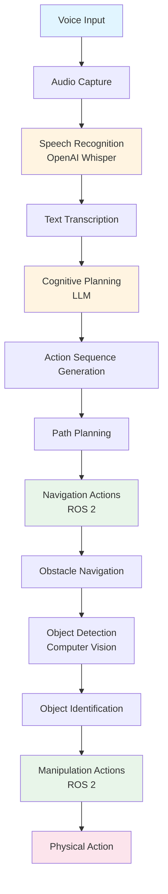

# LLM-Robotics Convergence

Large Language Models (LLMs) اور robotics کا convergence modern robotics میں most significant developments میں سے ایک represent کرتا ہے۔ یہ integration robots کو enable کرتا ہے natural language commands سمجھنے اور respond کرنے کے لیے، transform کرتے ہوئے کہ humans کیسے interact کرتے ہیں robotic systems کے ساتھ۔

## Vision-Language-Action (VLA) کیا ہے؟

**Vision-Language-Action (VLA)** ایک unified framework ہے جو تین critical capabilities combine کرتا ہے:

1. **Vision**: Robot کی ability perceive اور understand کرنے کی اپنے environment کو visual sensors کے ذریعے
2. **Language**: Robot کی ability process اور understand کرنے کی natural language commands
3. **Action**: Robot کی ability execute کرنے کی physical behaviors language instructions کی بنیاد پر

VLA systems end-to-end natural language robot control enable کرتے ہیں، جہاں simple spoken command جیسے "کمرہ صاف کرو" complete sequence میں translate ہو سکتا ہے robot actions کی۔

### Humanoid Robotics میں VLA کی Significance

Humanoid robots uniquely positioned ہیں benefit کرنے کے لیے VLA systems سے کیونکہ:

- **Natural interaction**: Humans naturally language کے ذریعے communicate کرتے ہیں، VLA systems intuitive بناتے ہوئے
- **Complex task decomposition**: Humanoid robots complex، multi-step tasks perform کرتے ہیں جو language-driven planning سے benefit کرتے ہیں
- **Contextual understanding**: VLA systems context سمجھ سکتے ہیں اور different scenarios adapt کر سکتے ہیں
- **Reduced programming burden**: ہر possible behavior program کرنے کے بجائے، robots natural language instructions سمجھ اور execute کر سکتے ہیں

## LLMs اور Robotics کا Convergence

Large Language Models نے natural language processing میں revolution لایا ہے، remarkable capabilities demonstrate کرتے ہوئے understanding، generating، اور reasoning about language میں۔ جب robotics کے ساتھ integrate ہوتے ہیں، LLMs enable کرتے ہیں:

### Natural Language Understanding

LLMs spoken یا written commands interpret کر سکتے ہیں، سمجھتے ہوئے:
- **Intent**: User کیا چاہتا ہے robot accomplish کرے
- **Context**: Situation اور environment جس میں command دی گئی ہے
- **Constraints**: Implicit یا explicit limitations کہ task کیسے perform ہونا چاہیے

### Cognitive Planning

LLMs high-level instructions decompose کر سکتے ہیں executable action sequences میں:

- **Goal decomposition**: Complex tasks کو manageable sub-tasks میں break کرنا
- **Action sequencing**: Order determine کرنا جس میں actions execute ہونے چاہئیں
- **Dependency management**: سمجھنا کہ کون سے actions دوسروں پر depend کرتے ہیں

### Contextual Reasoning

LLMs reason کر سکتے ہیں:
- **Robot capabilities**: Robot کیا کر سکتا ہے اور کیا نہیں
- **Environmental constraints**: Physical limitations اور obstacles
- **Task feasibility**: کیا command possible ہے current conditions دیے گئے

## VLA کیسے Robot Interaction Paradigms Transform کرتا ہے

Traditional robot programming درکار کرتی ہے:
- Explicit code ہر behavior کے لیے
- Detailed specification ہر action کی
- Programming expertise robot behavior modify کرنے کے لیے
- Recompilation اور redeployment changes کے لیے

VLA systems enable کرتے ہیں:
- **Natural language commands**: "کمرہ صاف کرو" navigation اور manipulation code لکھنے کے بجائے
- **Dynamic behavior generation**: Robots نئے commands سمجھ اور execute کر سکتے ہیں reprogramming کے بغیر
- **Intuitive interaction**: Non-programmers robots کو control کر سکتے ہیں natural language کے ذریعے
- **Adaptive behavior**: Robots language understanding کی بنیاد پر نئے scenarios adapt کر سکتے ہیں

### Key Benefits

1. **Accessibility**: Non-technical users robots کے ساتھ naturally interact کر سکتے ہیں
2. **Flexibility**: Robots نئے tasks handle کر سکتے ہیں explicit programming کے بغیر
3. **Efficiency**: Complex behaviors concisely specify کیے جا سکتے ہیں language کے ذریعے
4. **Scalability**: نئی capabilities language understanding کے ذریعے add کی جا سکتی ہیں code کے بجائے

## LLM-Robotics Integration کی Applications

VLA systems numerous applications enable کرتے ہیں humanoid robotics میں:

- **Domestic assistance**: Robots جو commands سمجھتے ہیں جیسے "table set کرو" یا "مجھے کھانا پکانے میں مدد کرو"
- **Healthcare support**: Robots جو instructions follow کر سکتے ہیں جیسے "patient check کرو" یا "medicine لاؤ"
- **Educational robots**: Robots جو student questions سمجھ اور respond کر سکتے ہیں
- **Industrial assistance**: Robots جو complex assembly instructions سمجھ سکتے ہیں

## Voice-to-Action اور Cognitive Planning کے لیے Foundation

LLM-robotics convergence سمجھنا foundation فراہم کرتا ہے:

- **Voice-to-action systems**: کیسے speech recognition robot control سے connect ہوتا ہے
- **Cognitive planning**: کیسے natural language executable robot behaviors بن جاتا ہے
- **Complete VLA pipelines**: کیسے تمام components مل کر کام کرتے ہیں

یہ convergence صرف technical integration نہیں ہے—یہ fundamental shift represent کرتا ہے more intuitive، accessible، اور capable robotic systems کی طرف۔

## VLA Pipeline Overview

درج ذیل diagram complete VLA pipeline illustrate کرتا ہے، دکھاتے ہوئے کہ vision، language، اور action کیسے integrate ہوتے ہیں:

یہ diagram complete flow دکھاتا ہے voice input سے physical action تک، demonstrating کرتے ہوئے کہ LLM-robotics convergence کیسے end-to-end natural language robot control enable کرتا ہے۔

## Summary

Vision-Language-Action (VLA) systems LLMs اور robotics کا convergence represent کرتے ہیں، natural language interaction enable کرتے ہوئے humanoid robots کے ساتھ۔ یہ convergence robot interaction transform کرتا ہے explicit programming سے intuitive، conversational control تک۔ یہ foundation سمجھنا essential ہے comprehending کے لیے کہ voice-to-action اور cognitive planning کیسے complete VLA pipelines enable کرتے ہیں۔

## Next Steps

اب جب کہ آپ سمجھ گئے ہیں کہ LLMs اور robotics کیسے converge ہوتے ہیں، [Voice-to-Action](/ur/modules/module-4-vision-language-action/voice-to-action) پر جائیں سیکھنے کے لیے کہ speech recognition technology کیسے natural language input enable کرتی ہے robots کے لیے۔
