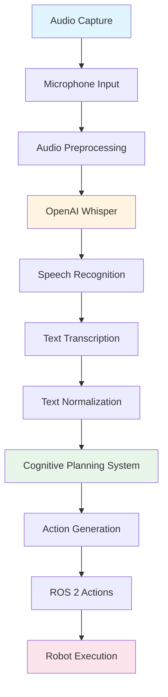

# OpenAI Whisper استعمال کرتے ہوئے Voice-to-Action

Voice-to-action systems humans کو enable کرتے ہیں robots کو control کرنے کے لیے natural speech کے ذریعے، robot interaction کو intuitive بناتے ہوئے جیسے کسی دوسرے person سے بات کرنا۔ یہ section explore کرتا ہے کہ OpenAI Whisper کیسے یہ capability enable کرتا ہے اور complete pipeline voice input سے robot action تک۔

## OpenAI Whisper کیسے Voice-to-Action Enable کرتا ہے

**OpenAI Whisper** ایک state-of-the-art speech recognition system ہے جو spoken language کو text میں convert کرتا ہے۔ Humanoid robots کے لیے، Whisper bridge کے طور پر کام کرتا ہے human speech اور robot understanding کے درمیان، enable کرتے ہوئے:

- **High-accuracy transcription**: Speech کو text میں convert کرنا remarkable accuracy کے ساتھ languages اور accents میں
- **Real-time processing**: Audio streams process کرنا quickly enough interactive robot control کے لیے
- **Robust performance**: Noisy environments اور varying audio quality handle کرنا
- **Language flexibility**: Multiple languages اور dialects support کرنا

### VLA Systems میں Whisper کا Role

VLA systems میں، Whisper critical first step perform کرتا ہے audio input کو text میں convert کرنے کا جو language models process کر سکتے ہیں:

1. **Audio capture**: Microphones spoken commands capture کرتے ہیں
2. **Speech recognition**: Whisper audio کو text میں transcribe کرتا ہے
3. **Text processing**: Transcribed text cognitive planning کے لیے input بن جاتا ہے
4. **Action generation**: Cognitive planning text کو robot actions میں translate کرتی ہے

## Voice-to-Action Pipeline

Complete voice-to-action pipeline چار main stages پر مشتمل ہے:

### Stage 1: Audio Capture

Robot کی microphones spoken commands capture کرتی ہیں audio waveforms کے طور پر۔ یہ stage شامل کرتا ہے:

- **Audio acquisition**: Microphones کے ذریعے sound waves capture کرنا
- **Preprocessing**: Noise filter کرنا اور audio levels normalize کرنا
- **Format conversion**: Audio prepare کرنا format میں suitable speech recognition کے لیے

### Stage 2: Speech Recognition

OpenAI Whisper audio process کرتا ہے اور اسے text میں convert کرتا ہے:

- **Audio analysis**: Speech patterns کے لیے audio waveform analyze کرنا
- **Language detection**: Language identify کرنا جو spoken ہو رہی ہے
- **Text transcription**: Speech کو written text میں convert کرنا
- **Confidence scoring**: Transcription accuracy کے لیے confidence levels فراہم کرنا

### Stage 3: Text Transcription

Transcribed text further processing کے لیے prepare کی جاتی ہے:

- **Text normalization**: Formatting اور punctuation standardize کرنا
- **Intent extraction**: Core command یا request identify کرنا
- **Context preservation**: Conversation سے relevant context برقرار رکھنا

### Stage 4: Action Generation

Transcribed text cognitive planning systems کو pass کی جاتی ہے:

- **Intent understanding**: Determine کرنا کہ user کیا چاہتا ہے robot کرے
- **Plan generation**: Robot actions کی sequence create کرنا
- **Action execution**: ROS 2 کے ذریعے generated actions execute کرنا

## Python Code Example: Whisper Integration Pattern

درج ذیل example demonstrate کرتا ہے کہ Whisper کیسے integrate ہو سکتا ہے voice-to-action system میں۔ یہ conceptual pattern ہے key integration points دکھاتے ہوئے:

```python
# Voice-to-Action Integration Pattern
# This example shows how Whisper API calls integrate with VLA systems

import whisper
import rclpy
from rclpy.node import Node
from std_msgs.msg import String

class VoiceToActionNode(Node):
    """
    ROS 2 node that integrates Whisper for voice-to-action capabilities.
    This demonstrates the integration pattern, not a full implementation.
    """
    
    def __init__(self):
        super().__init__('voice_to_action_node')
        
        # Initialize Whisper model (conceptual - actual initialization varies)
        # In practice, you would load the Whisper model or connect to API
        self.whisper_model = whisper.load_model("base")  # Example model loading
        
        # ROS 2 publisher for sending transcribed text to cognitive planning
        self.text_publisher = self.create_publisher(
            String, 
            'voice_transcription', 
            10
        )
        
        # ROS 2 subscriber for receiving audio data
        self.audio_subscriber = self.create_subscription(
            AudioData,  # Audio message type (conceptual)
            'audio_input',
            self.process_audio_callback,
            10
        )
    
    def process_audio_callback(self, audio_msg):
        """
        Process incoming audio and transcribe using Whisper.
        This demonstrates the voice-to-action pipeline integration.
        """
        # Stage 1: Audio capture (already received via ROS 2)
        audio_data = audio_msg.data
        
        # Stage 2: Speech recognition using Whisper
        # Whisper transcribes audio to text
        result = self.whisper_model.transcribe(audio_data)
        transcribed_text = result["text"]
        
        # Stage 3: Text transcription (normalization)
        normalized_text = self.normalize_text(transcribed_text)
        
        # Stage 4: Publish to cognitive planning system
        # The cognitive planning node will receive this and generate actions
        text_msg = String()
        text_msg.data = normalized_text
        self.text_publisher.publish(text_msg)
        
        self.get_logger().info(f'Transcribed: {transcribed_text}')
    
    def normalize_text(self, text):
        """
        Normalize transcribed text for cognitive planning.
        This is a simplified example of text preprocessing.
        """
        # Remove extra whitespace, normalize capitalization, etc.
        normalized = text.strip().lower()
        return normalized

def main():
    rclpy.init()
    node = VoiceToActionNode()
    rclpy.spin(node)
    rclpy.shutdown()

if __name__ == '__main__':
    main()
```

### Key Integration Points

یہ example demonstrate کرتا ہے:

1. **Whisper model loading**: Whisper کیسے initialized ہوتا ہے (conceptual pattern)
2. **Audio processing**: Audio کیسے system کے ذریعے flow کرتا ہے
3. **Text transcription**: Whisper کیسے speech کو text میں convert کرتا ہے
4. **ROS 2 integration**: Transcribed text کیسے cognitive planning کے لیے published ہوتا ہے
5. **Pipeline flow**: تمام stages کیسے connect ہوتے ہیں voice-to-action pipeline میں

## Voice-to-Action کو Cognitive Planning سے Connect کرنا

Voice-to-action pipeline seamlessly cognitive planning سے connect ہوتا ہے:

- **Text output**: Whisper کی transcribed text cognitive planning کے لیے input بن جاتی ہے
- **Intent preservation**: Spoken commands کا meaning اور intent text میں preserved ہوتا ہے
- **Context continuity**: Conversation context multiple voice commands میں برقرار رکھا جا سکتا ہے
- **Error handling**: Transcription errors cognitive planning سے پہلے detect اور handle کیے جا سکتے ہیں

یہ connection complete flow enable کرتا ہے: **Voice → Text → Cognitive Plan → Robot Actions**۔

## Voice-to-Action Pipeline Diagram

درج ذیل diagram complete voice-to-action pipeline illustrate کرتا ہے:



یہ diagram دکھاتا ہے کہ audio کیسے system کے ذریعے flow کرتا ہے، capture سے robot execution تک، Whisper critical speech-to-text conversion perform کرتے ہوئے۔

## Summary

OpenAI Whisper voice-to-action capabilities enable کرتا ہے spoken commands کو text میں convert کر کے جو cognitive planning systems process کر سکتے ہیں۔ Complete pipeline flow کرتا ہے audio capture سے speech recognition، text transcription، اور action generation تک۔ یہ pipeline سمجھنا essential ہے comprehending کے لیے کہ natural language input کیسے robot behavior بن جاتا ہے۔

## Next Steps

اب جب کہ آپ voice-to-action systems سمجھ گئے ہیں، [Cognitive Planning](/ur/modules/module-4-vision-language-action/cognitive-planning) پر جائیں سیکھنے کے لیے کہ LLMs کیسے natural language commands translate کرتے ہیں ROS 2 action sequences میں۔
