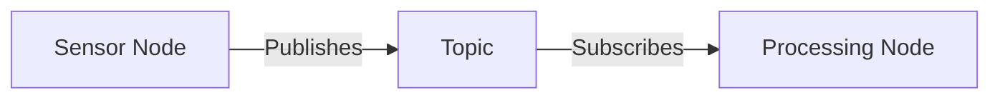

# Content Structure Contract: Module 1

**Feature**: Module 1 - The Robotic Nervous System (ROS 2)  
**Date**: 2025-12-01

## Content Organization Standard

### File Structure
```
module-1-ros2-nervous-system/
├── index.md                    # Module landing page
├── introduction.md             # Introduction and learning objectives
├── ros2-fundamentals.md        # Core ROS 2 concepts
├── communication-patterns.md   # Topics, services, actions
├── humanoid-applications.md    # ROS 2 in humanoid robotics context
├── workspace-overview.md       # Brief workspace structure overview
└── _assets/                    # Images, diagrams
    ├── ros2-architecture.mmd
    ├── publish-subscribe.mmd
    └── humanoid-integration.mmd
```

### Markdown Frontmatter Standard

Every content file MUST include frontmatter:

```yaml
---
id: section-identifier
title: "Section Title"
sidebar_position: 1
tags: [concept-tag1, concept-tag2]
learning_objectives: [lo-001, lo-002]
---
```

**Required Fields**:
- `id`: Unique section identifier (kebab-case)
- `title`: Human-readable section title
- `sidebar_position`: Order in navigation (integer)

**Optional Fields**:
- `tags`: Concept tags for filtering and embedding
- `learning_objectives`: Learning objective IDs addressed
- `description`: Brief description for SEO and previews

### Section Content Structure

Each section MUST follow this structure:

```markdown
## Section Title

[Introduction paragraph establishing context]

### Subsection 1: [Concept Name]

[Concept explanation]

#### Key Points
- Point 1
- Point 2

#### Example: [Brief Description]

```python
# Python code example
```

[Explanation of example]

### Subsection 2: [Next Concept]

[Content continues...]

## Summary

[Section summary reinforcing key concepts]

## Next Steps

[Forward reference or transition to next section]
```

### Code Example Standard

**Format**:
- Use triple backticks with `python` language tag
- Include brief comment explaining purpose
- Keep examples focused on single concept
- Use humanoid robotics context where possible

**Example**:
````markdown
```python
# Example: Creating a ROS 2 node for sensor data processing
import rclpy
from rclpy.node import Node

class SensorNode(Node):
    def __init__(self):
        super().__init__('sensor_node')
        # Node initialization code
```
````

### Visual Aid Standard

**Mermaid Diagrams**:
- Use Mermaid syntax for architecture and flow diagrams
- Embed directly in markdown with code fence
- Include descriptive caption

**Example**:
````markdown


*Figure 1: ROS 2 publish-subscribe communication pattern*
````

### Cross-Reference Standard

**Internal References**:
```markdown
[Link text](./target-section.md)
```

**Forward References (Future Modules)**:
```markdown
[Link text](../module-2-identifier/index.md) *(Coming in Module 2)*
```

**Concept References**:
```markdown
As discussed in the [nodes section](./ros2-fundamentals.md#nodes), ROS 2 nodes...
```

### Terminology Standard

**First Use**:
- Define term on first use: "A **ROS 2 node** is a process that performs computation..."
- Use bold for emphasis on first definition

**Subsequent Use**:
- Use standard term consistently
- Link to definition if term defined in different section

**Glossary Entry Format**:
```markdown
### Term Name
**Definition**: [Clear definition]
**Context**: [Where/how used]
**Related**: [Related terms]
```

## Content Quality Standards

### Readability Requirements
- Average sentence length: 15-20 words
- Paragraph length: 3-5 sentences
- Use active voice where possible
- Avoid jargon without explanation

### Educational Content Requirements
- Each major concept must have: definition, context, example
- Examples must use humanoid robotics context where applicable
- Analogies must be clear and memorable
- Common misconceptions must be addressed

### Python Code Requirements
- All code must be valid Python 3.x syntax
- Use ROS 2 Python API (rclpy) exclusively
- Code must be executable conceptually (may require ROS 2 setup)
- Follow PEP 8 style guide
- Include necessary imports

### Visual Aid Requirements
- Diagrams required for: ROS 2 architecture, communication patterns
- Illustrations required for: complex concepts (SC-010)
- All visuals must have descriptive captions
- Visuals must enhance, not replace, text explanations

## Embedding Compatibility Requirements

### Chunking Boundaries
- Major section breaks = chunk boundaries
- Subsection breaks = optional chunk boundaries (if subsection > 300 words)
- Code examples included in chunk with surrounding context
- Visual aid references included in chunk metadata

### Metadata Requirements
Each chunk MUST include:
- Module ID
- Section ID
- Concept tags
- Learning objective tags
- Chunk type (introduction, concept, example, application)
- Reading order

### Citation Support
- Each chunk must be traceable to source section
- Section titles must be included in chunk context
- Chunk metadata must support citation generation

## Navigation Requirements

### Table of Contents
- Auto-generated by Docusaurus from file structure
- Must reflect logical learning progression
- All sections accessible within 3 clicks (SC-008)

### Cross-Reference Validation
- All internal links must resolve to existing sections
- Forward references must be clearly marked
- Broken links must be caught in review process

## Compliance Checklist

Before content is considered complete:

- [ ] All sections follow file structure standard
- [ ] All files include required frontmatter
- [ ] All code examples use Python exclusively
- [ ] All visual aids have captions
- [ ] All concepts defined before use
- [ ] All cross-references valid
- [ ] Content readable in 1-2 hours (SC-001)
- [ ] All learning objectives addressed
- [ ] Content supports semantic chunking
- [ ] Metadata complete for embedding

