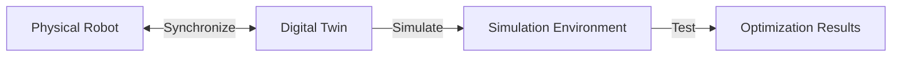

# Content Structure Contract: Module 2

**Feature**: Module 2 - Digital Twins - Simulation & Sensors  
**Date**: 2025-12-01

## Content Organization Standard

### File Structure
```
module-2-digital-twins-simulation/
├── index.md                    # Module landing page
├── introduction.md             # Introduction and learning objectives
├── digital-twins.md            # Digital twins concept and applications
├── simulation-fundamentals.md  # Simulation environments, physics engines
├── sensor-integration.md       # Sensor types and ROS 2 integration
├── humanoid-applications.md    # Practical use cases
├── simulation-to-deployment.md # Workflow from simulation to deployment
├── glossary.md                 # Key terminology definitions
└── _assets/                    # Images, diagrams
    ├── digital-twin-architecture.mmd
    ├── sensor-data-flow.mmd
    └── simulation-components.mmd
```

### Markdown Frontmatter Standard

Every content file MUST include frontmatter:

```yaml
---
id: section-identifier
title: "Section Title"
sidebar_position: 1
description: "Brief description for SEO and previews"
tags: [concept-tag1, concept-tag2, topic-category]
learning_objectives: [lo-001, lo-002]
topic_category: digital-twin | simulation | sensor | application
---
```

**Required Fields**:
- `id`: Unique section identifier (kebab-case)
- `title`: Human-readable section title
- `sidebar_position`: Order in navigation (integer)

**Optional Fields**:
- `tags`: Concept tags for filtering and embedding
- `learning_objectives`: Learning objective IDs addressed
- `description`: Brief description for SEO and previews
- `topic_category`: "digital-twin" | "simulation" | "sensor" | "application" (for filtering)

### Section Content Structure

Each section MUST follow this structure:

```markdown
## Section Title

[Introduction paragraph establishing context]

### Subsection 1: [Concept Name]

[Concept explanation]

#### Key Points
- Point 1
- Point 2

#### Example: [Brief Description]

```python
# Python code example
```

[Explanation of example]

### Subsection 2: [Next Concept]

[Content continues...]

## Summary

[Section summary reinforcing key concepts]

## Next Steps

[Forward reference or transition to next section]
```

### Code Example Standard

**Format**:
- Use triple backticks with `python` language tag
- Include brief comment explaining purpose
- Keep examples focused on single concept
- Use humanoid robotics context where possible
- Use ROS 2 Python API (rclpy) for sensor integration examples

**Example**:
````markdown
```python
# Example: Publishing sensor data to ROS 2 topic
import rclpy
from rclpy.node import Node
from sensor_msgs.msg import Image

class CameraNode(Node):
    def __init__(self):
        super().__init__('camera_node')
        self.publisher = self.create_publisher(Image, '/camera/image_raw', 10)
        # Sensor data publishing code
```
````

### Visual Aid Standard

**Mermaid Diagrams**:
- Use Mermaid syntax for architecture and flow diagrams
- Embed directly in markdown with code fence
- Include descriptive caption
- Required diagrams: digital twin architecture, sensor data flow, simulation components

**Example**:
````markdown


*Figure 1: Digital twin architecture showing bidirectional synchronization*
````

### Cross-Reference Standard

**Internal References**:
```markdown
[Link text](./target-section.md)
```

**Backward References (Module 1)**:
```markdown
As discussed in [Module 1's topics section](../module-1-ros2-nervous-system/communication-patterns.md#topics), ROS 2 topics...
```

**Forward References (Future Modules)**:
```markdown
[Link text](../module-3-identifier/index.md) *(Coming in Module 3)*
```

**Concept References**:
```markdown
As discussed in the [digital twins section](./digital-twins.md#definition), digital twins...
```

### Terminology Standard

**First Use**:
- Define term on first use: "A **digital twin** is a virtual replica of a physical system..."
- Use bold for emphasis on first definition
- Link to glossary if term defined elsewhere

**Subsequent Use**:
- Use standard term consistently
- Link to definition if term defined in different section

**Glossary Entry Format**:
```markdown
### Term Name
**Definition**: [Clear definition]
**Context**: [Where/how used]
**Related**: [Related terms]
**Module Reference**: [Link to Module 1 if applicable]
```

## Content Quality Standards

### Readability Requirements
- Average sentence length: 15-20 words
- Paragraph length: 3-5 sentences
- Use active voice where possible
- Avoid jargon without explanation

### Educational Content Requirements
- Each major concept must have: definition, context, example
- Examples must use humanoid robotics context where applicable
- Analogies must be clear and memorable
- Common misconceptions must be addressed
- Digital twin vs simulation distinction must be very clear

### Python Code Requirements
- All code must be valid Python 3.x syntax
- Use ROS 2 Python API (rclpy) for sensor integration examples
- Code must be executable conceptually (may require ROS 2 setup)
- Follow PEP 8 style guide
- Include necessary imports
- Use humanoid robotics scenarios

### Visual Aid Requirements
- Diagrams required for: digital twin architecture, sensor data flow, simulation components (FR-017)
- Illustrations required for: complex concepts
- All visuals must have descriptive captions
- Visuals must enhance, not replace, text explanations
- Use Mermaid for maintainability

## Embedding Compatibility Requirements

### Chunking Boundaries
- Major section breaks = chunk boundaries
- Subsection breaks = optional chunk boundaries (if subsection > 300 words)
- Code examples included in chunk with surrounding context
- Visual aid references included in chunk metadata
- Topic category preserved in chunk metadata

### Metadata Requirements
Each chunk MUST include:
- Module ID
- Section ID
- Topic category (digital-twin, simulation, sensor, application)
- Concept tags
- Learning objective tags
- Chunk type (introduction, concept, example, application)
- Reading order

### Citation Support
- Each chunk must be traceable to source section
- Section titles must be included in chunk context
- Chunk metadata must support citation generation
- Topic category enables filtering by topic

## Navigation Requirements

### Table of Contents
- Auto-generated by Docusaurus from file structure
- Must reflect logical learning progression: Digital Twins → Simulation → Sensors → Applications
- All sections accessible within 3 clicks (SC-006)

### Cross-Reference Validation
- All internal links must resolve to existing sections
- Backward references to Module 1 must be valid
- Forward references must be clearly marked
- Broken links must be caught in review process

## Topic Organization

### Digital Twins Topic
- Sections: introduction, digital-twins
- Concepts: digital-twin, synchronization, virtual-replica
- Visuals: digital-twin-architecture diagram

### Simulation Topic
- Sections: simulation-fundamentals
- Concepts: physics-engine, sensor-simulation, environment-modeling
- Visuals: simulation-components diagram

### Sensors Topic
- Sections: sensor-integration
- Concepts: sensor-types, sensor-data-flow, ros2-integration
- Visuals: sensor-data-flow diagram
- Must cover at least 3 sensor types (SC-002)

### Applications Topic
- Sections: humanoid-applications, simulation-to-deployment
- Concepts: gait-optimization, manipulation-planning, safety-testing
- Must explain at least 2 use cases (SC-005)

## Compliance Checklist

Before content is considered complete:

- [ ] All sections follow file structure standard
- [ ] All files include required frontmatter
- [ ] All code examples use Python exclusively
- [ ] All visual aids have captions
- [ ] All concepts defined before use
- [ ] All cross-references valid (including Module 1 references)
- [ ] Content readable in 1-2 hours
- [ ] All learning objectives addressed
- [ ] Content supports semantic chunking
- [ ] Metadata complete for embedding (including topic categories)
- [ ] At least 3 sensor types covered (SC-002)
- [ ] At least 2 use cases explained (SC-005)
- [ ] All required diagrams included (FR-017)
- [ ] Digital twin vs simulation distinction clear (FR-002)
