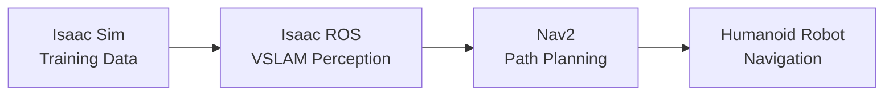

# Content Structure Contract: Module 3

**Feature**: Module 3 - The AI-Robot Brain (NVIDIA Isaac™)  
**Date**: 2025-12-01

## Content Organization Standard

### File Structure
```
module-3-ai-robot-brain/
├── index.md                    # Module landing page
├── introduction.md             # Introduction and learning objectives
├── ai-robot-brain-concept.md   # AI-robot brain introduction
├── isaac-sim.md                # NVIDIA Isaac Sim section
├── isaac-ros.md                # Isaac ROS VSLAM section
├── nav2-path-planning.md       # Nav2 path planning section
├── integrated-applications.md  # How tools work together
├── glossary.md                 # Key terminology definitions
└── _assets/                    # Images, diagrams
    ├── ai-robot-brain-architecture.mmd
    ├── isaac-sim-pipeline.mmd
    ├── vslam-system.mmd
    └── nav2-humanoid-planning.mmd
```

### Markdown Frontmatter Standard

Every content file MUST include frontmatter:

```yaml
---
id: section-identifier
title: "Section Title"
sidebar_position: 1
tags: [concept-tag1, concept-tag2]
learning_objectives: [lo-007, lo-008]
description: "Brief description for SEO and previews"
---
```

**Required Fields**:
- `id`: Unique section identifier (kebab-case)
- `title`: Human-readable section title
- `sidebar_position`: Order in navigation (integer)

**Optional Fields**:
- `tags`: Concept tags for filtering and embedding
- `learning_objectives`: Learning objective IDs addressed
- `description`: Brief description for SEO and previews

### Section Content Structure

Each section MUST follow this structure:

```markdown
## Section Title

[Introduction paragraph establishing context]

### Subsection 1: [Concept Name]

[Concept explanation]

#### Key Points
- Point 1
- Point 2

#### Example: [Brief Description]

```python
# Python code example (for Isaac Sim)
# or conceptual/configuration example (for Isaac ROS/Nav2)
```

[Explanation of example]

### Subsection 2: [Next Concept]

[Content continues...]

## Summary

[Section summary reinforcing key concepts]

## Next Steps

[Forward reference or transition to next section]
```

### Code Example Standard

**Format**:
- **Python examples** (Isaac Sim): Use Python code blocks with ````python`
- **Conceptual examples** (Isaac ROS/Nav2): Use markdown formatting or code blocks with ````text` or ````yaml` for configuration snippets
- Include descriptive comments explaining educational purpose
- Keep examples focused and concise (not full implementations)

**Standards**:
- Python examples for Isaac Sim where tool supports Python APIs (per FR-012 clarification)
- Conceptual examples and configuration snippets for Isaac ROS and Nav2 (per FR-012 clarification)
- Examples must demonstrate concepts, not provide production code
- Examples should be understandable without tool installation

**Example - Python (Isaac Sim)**:
````markdown
#### Example: Generating Synthetic Training Data

```python
# Conceptual example: Isaac Sim synthetic data generation
# Demonstrates how photorealistic simulation generates training data

import isaac_sim  # Conceptual import - tool not required for understanding

# Setup photorealistic environment
scene = isaac_sim.create_scene(
    lighting="realistic",
    materials="photorealistic"
)

# Generate synthetic images with annotations
training_data = scene.render_images(
    camera_positions=camera_poses,
    annotations=["depth", "semantic", "bounding_boxes"]
)
```
````

**Example - Conceptual (Isaac ROS)**:
````markdown
#### Example: VSLAM Workflow

Visual SLAM (VSLAM) processes camera images to:

1. **Extract visual features** from images (corners, edges, textures)
2. **Track features** across multiple frames to estimate robot movement
3. **Build map** of environment using tracked features
4. **Localize robot** within the map using current camera view

Hardware acceleration (GPU) enables real-time processing of this computationally intensive workflow.
````

**Example - Configuration (Nav2)**:
````markdown
#### Example: Humanoid Path Planning Configuration

```yaml
# Conceptual Nav2 configuration for humanoid constraints
humanoid_navigation:
  balance_requirements:
    center_of_mass_limits: [x_min, x_max, y_min, y_max]
    support_polygon_stability: required
  
  foot_placement:
    step_size_max: 0.3  # meters
    surface_flatness: required
    obstacle_clearance: 0.1  # meters
  
  terrain_adaptation:
    max_slope: 15  # degrees
    surface_detection: required
```
````

### Visual Aid Standard

**Types**:
- Mermaid diagrams for architecture, workflows, and system relationships
- Illustrations for complex concepts (optional, but recommended for SC-011)

**Format**:
- Store in `_assets/` directory
- Use descriptive filenames (e.g., `ai-robot-brain-architecture.mmd`)
- Include alt text and captions in markdown

**Mermaid Example**:
````markdown

````

### Cross-Reference Standard

**Format**:
- Use relative markdown links: `[text](./path.md)` for same module
- Use relative links to other modules: `[text](../../module-1-ros2-nervous-system/section.md)`
- Include descriptive link text that indicates relationship

**Patterns**:
- **Prerequisite references**: "As covered in [Module 1: ROS 2 Fundamentals](../../module-1-ros2-nervous-system/ros2-fundamentals.md), topics enable..."
- **Related concept references**: "Similar to [Module 2: Simulation Fundamentals](../../module-2-digital-twins-simulation/simulation-fundamentals.md), photorealistic simulation..."
- **Builds-on references**: "Building on [Module 2: Sensor Integration](../../module-2-digital-twins-simulation/sensor-integration.md), VSLAM uses visual sensors to..."

**Validation**:
- All cross-references must point to existing files
- Link text must indicate relationship type
- Cross-references must enhance learning progression (FR-019)

### Glossary Entry Standard

**Format**:
```markdown
### Term Name

**Definition**: [Clear, concise definition]

**Context**: [Where/how term is used in Module 3]

**Related Terms**: [Links to related glossary entries]

**Example**: [Brief example or use case]
```

**Requirements**:
- All key concepts must have glossary entries (FR-018)
- Definitions must be clear and accessible
- Context must connect to Module 3 content
- Related terms help students explore connections

## Section-Specific Requirements

### index.md (Module Landing Page)

**Required Content**:
- Module title and overview
- Learning objectives summary
- Prerequisites statement
- Module structure overview
- Navigation to sections

**Structure**:
```markdown
# Module 3: The AI-Robot Brain (NVIDIA Isaac™)

## Overview
[Module overview paragraph]

## Learning Objectives
[Bulleted list of learning objectives]

## Prerequisites
[Prerequisites from Modules 1 and 2]

## Module Structure
[Links to all sections with brief descriptions]

## Getting Started
[Link to introduction section]
```

### introduction.md

**Required Content**:
- Detailed learning objectives (FR-010)
- Prerequisites explanation
- Module structure overview
- Reading time estimate

**Structure**: Follows standard section structure with learning objectives prominently featured.

### ai-robot-brain-concept.md

**Required Content**:
- AI-robot brain framework introduction
- Training → Perception → Planning progression
- How Isaac Sim, Isaac ROS, and Nav2 fit into framework
- Sets context for tool sections

**Visual Aids**: Architecture diagram showing tool relationships (recommended).

### isaac-sim.md

**Required Content**:
- What NVIDIA Isaac Sim is
- Photorealistic simulation capabilities
- Synthetic data generation for perception training
- Python code examples (where applicable, per FR-012)
- Connection to Module 2 simulation concepts

**Visual Aids**: Data generation pipeline diagram (recommended).

### isaac-ros.md

**Required Content**:
- What Visual SLAM (VSLAM) is
- How hardware acceleration improves VSLAM
- Isaac ROS's role in hardware-accelerated perception
- Conceptual examples and workflow descriptions (per FR-012)
- Connection to navigation

**Visual Aids**: VSLAM system components diagram (recommended).

### nav2-path-planning.md

**Required Content**:
- What Nav2 is and its path planning capabilities
- Bipedal humanoid movement constraints
- Humanoid-specific planning considerations
- Conceptual examples and configuration snippets (per FR-012)
- Integration with perception systems (Isaac ROS)

**Visual Aids**: Humanoid path planning diagram (recommended).

### integrated-applications.md

**Required Content**:
- How Isaac Sim, Isaac ROS, and Nav2 work together
- Practical humanoid robot application scenarios
- Training → Perception → Planning workflow
- Real-world value demonstration

**Visual Aids**: Integrated workflow diagram (recommended).

### glossary.md

**Required Content**:
- All key terminology from Module 3 (FR-018)
- Clear definitions with context
- Related term links
- Alphabetical or categorized organization

## Semantic Chunking Strategy

**Chunk Level**: Section-level chunks (each section is primary chunk unit)

**Chunk Boundaries**:
- Primary chunks: Each major section (isaac-sim.md, isaac-ros.md, nav2-path-planning.md)
- Sub-chunks: Major subsections within sections if section exceeds optimal size

**Chunk Metadata**:
- Section title
- Concepts covered in chunk
- Chunk type (introduction, concept-explanation, example, summary)
- Related sections (for context)

**Optimal Chunk Size**: 200-500 words for educational content

**Validation**: All key concepts must be retrievable in RAG queries (SC-006)

## Navigation Integration

**Sidebar Structure**:
- Module 3 appears as category in sidebars.ts
- Sections listed in logical order (introduction → concepts → tools → integration)
- All sections accessible within 3 clicks from landing page (SC-009)

**Link Patterns**:
- Relative links within module
- Cross-module links using relative paths
- Consistent navigation structure with Modules 1 and 2

