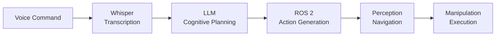

# Content Structure Contract: Module 4

**Feature**: Module 4 - Vision-Language-Action (VLA)  
**Date**: 2025-01-27

## Content Organization Standard

### File Structure
```
module-4-vision-language-action/
├── index.md                    # Module landing page
├── introduction.md             # Introduction and learning objectives
├── llm-robotics-convergence.md # LLM-robotics convergence concepts
├── voice-to-action.md          # OpenAI Whisper and voice-to-action pipeline
├── cognitive-planning.md        # LLM cognitive planning and ROS 2 action generation
├── safety-validation.md        # Safety and validation of LLM-generated plans
├── capstone-project.md         # Complete VLA pipeline demonstration
├── module-integration.md        # Connecting VLA to previous modules
├── glossary.md                 # Key terminology definitions
└── _assets/                    # Images, diagrams
    ├── vla-pipeline.mmd
    ├── voice-to-action-flow.mmd
    ├── cognitive-planning-process.mmd
    └── capstone-project-flow.mmd
```

### Markdown Frontmatter Standard

Every content file MUST include frontmatter:

```yaml
---
id: section-identifier
title: "Section Title"
sidebar_position: 1
tags: [concept-tag1, concept-tag2]
learning_objectives: [lo-010, lo-011]
description: "Brief description for SEO and previews"
---
```

**Required Fields**:
- `id`: Unique section identifier (kebab-case)
- `title`: Human-readable section title
- `sidebar_position`: Order in navigation (integer)

**Optional Fields**:
- `tags`: Concept tags for filtering and embedding
- `learning_objectives`: Learning objective IDs addressed
- `description`: Brief description for SEO and previews

### Section Content Structure

Each section MUST follow this structure:

```markdown
## Section Title

[Introduction paragraph establishing context]

### Subsection 1: [Concept Name]

[Concept explanation]

#### Key Points
- Point 1
- Point 2

#### Example: [Brief Description]

```python
# Python code example showing integration pattern
# Provider-agnostic LLM patterns or Whisper/ROS 2 integration
```

[Explanation of example]

### Subsection 2: [Next Concept]

[Content continues...]

## Summary

[Section summary reinforcing key concepts]

## Next Steps

[Forward reference or transition to next section]
```

### Code Example Standard

**Format**:
- **Python examples**: Use Python code blocks with ````python`
- Include descriptive comments explaining educational purpose
- Keep examples focused on integration patterns (not full implementations)
- Show key integration points: Whisper API calls, LLM prompt structures, ROS 2 action generation

**Standards**:
- Python exclusively (FR-015)
- Show integration patterns (Whisper, LLM prompts, ROS 2 actions) - per clarification
- Provider-agnostic LLM patterns (no specific provider focus) - per clarification
- Examples must demonstrate concepts, not provide production code
- Examples should be understandable without tool installation

**Example - Whisper Integration Pattern**:
````markdown
#### Example: Voice Command Transcription

```python
# Integration pattern: OpenAI Whisper for voice-to-action
# Demonstrates how voice commands are transcribed to text

import whisper  # Conceptual import - tool not required for understanding

# Initialize Whisper model
model = whisper.load_model("base")

# Transcribe voice command
audio_file = "voice_command.wav"
transcription = model.transcribe(audio_file)

# Extract text for cognitive planning
command_text = transcription["text"]
print(f"Transcribed command: {command_text}")
```
````

**Example - LLM Cognitive Planning Pattern**:
````markdown
#### Example: Natural Language to Action Plan

```python
# Integration pattern: Provider-agnostic LLM cognitive planning
# Demonstrates how natural language commands become action plans

# Provider-agnostic prompt structure
prompt = f"""
Translate this natural language command into a sequence of ROS 2 actions:
Command: "{command_text}"

Generate a structured action plan with:
1. High-level goal
2. Decomposed sub-tasks
3. ROS 2 action sequence
"""

# LLM generates action plan (provider-agnostic pattern)
action_plan = llm.generate(prompt)

# Action plan contains ROS 2 actions
ros2_actions = parse_action_plan(action_plan)
```
````

**Example - ROS 2 Action Generation**:
````markdown
#### Example: ROS 2 Action Execution

```python
# Integration pattern: ROS 2 action generation from cognitive plan
# Demonstrates how action plans become ROS 2 actions

import rclpy
from rclpy.action import ActionClient
from geometry_msgs.msg import PoseStamped

# Create ROS 2 action client
action_client = ActionClient(node, 'navigate_to_pose', NavigateToPose)

# Convert cognitive plan action to ROS 2 action
goal_msg = NavigateToPose.Goal()
goal_msg.pose = create_pose_from_plan(action_plan.navigation_goal)

# Send action goal
action_client.send_goal_async(goal_msg)
```
````

### Visual Aid Standard

**Types**:
- Mermaid diagrams for architecture, workflows, and system relationships
- Illustrations for complex concepts (optional, but recommended for SC-012)

**Format**:
- Store in `_assets/` directory
- Use descriptive filenames (e.g., `vla-pipeline.mmd`)
- Include alt text and captions in markdown

**Mermaid Example - VLA Pipeline**:
````markdown

````

### Cross-Reference Standard

**Format**:
- Use relative markdown links: `[text](./path.md)` for same module
- Use relative links to other modules: `[text](../../module-1-ros2-nervous-system/section.md)`
- Include descriptive link text that indicates relationship

**Patterns**:
- **Prerequisite references**: "As covered in [Module 1: ROS 2 Actions](../../module-1-ros2-nervous-system/communication-patterns.md), actions enable..."
- **Related concept references**: "Similar to [Module 2: Simulation Fundamentals](../../module-2-digital-twins-simulation/simulation-fundamentals.md), simulation supports..."
- **Builds-on references**: "Building on [Module 3: Perception](../../module-3-ai-robot-brain/isaac-ros.md), computer vision enables..."

**Validation**:
- All cross-references must point to existing files
- Link text must indicate relationship type
- Cross-references must enhance learning progression (FR-022)

### Glossary Entry Standard

**Format**:
```markdown
### Term Name

**Definition**: [Clear, concise definition]

**Context**: [Where/how term is used in Module 4]

**Related Terms**: [Links to related glossary entries]

**Example**: [Brief example or use case]
```

**Requirements**:
- All key concepts must have glossary entries (FR-021)
- Definitions must be clear and accessible
- Context must connect to Module 4 content
- Related terms help students explore connections

## Section-Specific Requirements

### index.md (Module Landing Page)

**Required Content**:
- Module title and overview
- Learning objectives summary
- Prerequisites statement
- Module structure overview
- Navigation to sections

**Structure**:
```markdown
# Module 4: Vision-Language-Action (VLA)

## Overview
[Module overview paragraph]

## Learning Objectives
[Bulleted list of learning objectives]

## Prerequisites
[Prerequisites from Modules 1, 2, and 3]

## Module Structure
[Links to all sections with brief descriptions]

## Getting Started
[Link to introduction section]
```

### introduction.md

**Required Content**:
- Detailed learning objectives (FR-013)
- Prerequisites explanation (Modules 1, 2, 3)
- Module structure overview
- Reading time estimate (1.5-2.5 hours, SC-001)
- Brief context setting

**Structure**: Follows standard section structure with learning objectives prominently featured.

### llm-robotics-convergence.md

**Required Content**:
- What Vision-Language-Action (VLA) means (FR-001)
- LLM-robotics convergence explanation (FR-002)
- Benefits and applications of LLM-robotics integration
- How VLA transforms robot interaction paradigms
- Sets foundation for voice-to-action and cognitive planning

**Visual Aids**: VLA concept diagram (recommended).

### voice-to-action.md

**Required Content**:
- How OpenAI Whisper enables voice-to-action (FR-003)
- Voice-to-action pipeline stages (FR-004): audio capture → speech recognition → text transcription → action generation
- Python code examples showing Whisper integration patterns
- Connection to cognitive planning
- Visual aids (voice-to-action flow, required per FR-020)

**Code Example Guidelines**:
- Show Whisper API call patterns
- Demonstrate transcription workflow
- Connect to cognitive planning input

### cognitive-planning.md

**Required Content**:
- How LLMs perform cognitive planning (FR-005)
- Natural language to ROS 2 action translation (FR-005, FR-006)
- High-level command decomposition (FR-006)
- Natural language intent to action plan relationship (FR-007)
- Provider-agnostic LLM patterns (per clarification)
- Python code examples showing prompt structures and action generation
- Visual aids (cognitive planning process, required per FR-020)

**Code Example Guidelines**:
- Show provider-agnostic LLM prompt structures
- Demonstrate action plan generation
- Show ROS 2 action conversion patterns
- No specific LLM provider focus

### safety-validation.md

**Required Content**:
- How LLM-generated action plans are validated (FR-024)
- High-level safety concepts with brief examples
- Plan verification approaches (brief examples)
- Constraint checking approaches (brief examples)
- Error handling and fallback strategies (FR-025)
- No detailed implementation frameworks (per clarification)

**Content Guidelines**:
- High-level concepts only
- Brief examples of validation approaches
- Focus on awareness, not implementation

### capstone-project.md

**Required Content**:
- Complete VLA pipeline demonstration (FR-008)
- Integration of all components: voice → planning → navigation → vision → manipulation (FR-009)
- Python code examples showing key integration patterns (per clarification)
- Step-by-step flow demonstration
- Visual aids (capstone project flow, required per FR-020, SC-012)

**Code Example Guidelines**:
- Show integration patterns across all stages
- Demonstrate complete pipeline flow
- Include Whisper, LLM, and ROS 2 integration examples
- Conceptual demonstration, not full executable

### module-integration.md

**Required Content**:
- How VLA integrates with ROS 2 (Module 1 connection) (FR-010)
- How simulation supports VLA development (Module 2 connection) (FR-011)
- How perception enables object identification (Module 3 connection) (FR-012)
- Cross-module concept connections
- Complete system integration understanding

**Cross-References**: Explicit links to Modules 1, 2, and 3 sections.

### glossary.md

**Required Content**:
- All key terminology from Module 4 (FR-021)
- Clear definitions with context
- Related term links
- Alphabetical or categorized organization

**Key Terms to Include**:
- Vision-Language-Action (VLA)
- Voice-to-action
- Cognitive planning
- Natural language intent
- Action sequence
- VLA pipeline
- And other concepts introduced in Module 4

## Semantic Chunking Strategy

**Chunk Level**: Section-level chunks (each section is primary chunk unit)

**Chunk Boundaries**:
- Primary chunks: Each major section
- Sub-chunks: Major subsections within sections if section exceeds optimal size

**Chunk Metadata**:
- Section title
- Concepts covered in chunk
- Chunk type (introduction, concept-explanation, example, summary, integration)
- Related sections (for context)

**Optimal Chunk Size**: 200-500 words for educational content

**Validation**: All key concepts must be retrievable in RAG queries (SC-007)

## Navigation Integration

**Sidebar Structure**:
- Module 4 appears as category in sidebars.ts
- Sections listed in logical order (introduction → concepts → tools → project → integration)
- All sections accessible within 3 clicks from landing page (SC-010)

**Link Patterns**:
- Relative links within module
- Cross-module links using relative paths
- Consistent navigation structure with Modules 1, 2, and 3

